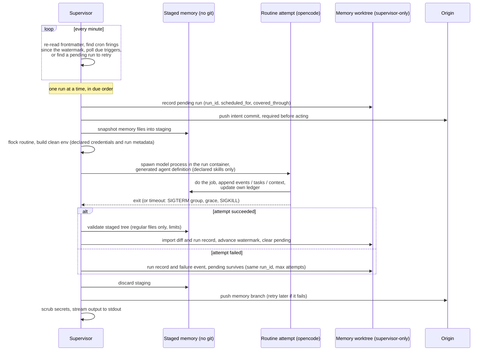

# Design

The decisions behind openroutines, and why we made them. The [README](README.md) says what the framework does; this document says why it works the way it does.

## One agent, one job description, one runtime

**Decision.** An openroutines-generated agent (ORA) is a single agent with a single mandate, defined in `agent.yaml`. There is no fleet management, no orchestration graph, no agent-to-agent protocol.

**Why.** Most of the complexity -- and most of the failure modes -- in agent frameworks comes from coordination between agents. A single agent with a clear job description is easy to reason about, easy to secure, and easy to hold accountable: "what did it do?" is one log and one memory. If you need two jobs done, deploy two agents. It also makes the security model tractable: exactly one runtime means exactly one writer to memory, one credential set, one blast radius.

## The repository is the agent

**Decision.** Everything the agent is -- configuration, routines, skills, structured memory, encrypted credentials -- lives in one git repository. `openroutines scaffold` stamps out a new agent repo from the template embedded in the CLI binary (`template/` in this repo is its source, compiled in via Go's `embed`). The reviewed repository is trusted source code: whoever can change its routines, skills, configuration, or image can change the agent's behavior and authority. The security boundary isolates model-directed execution and external content from supervisor authority; it does not isolate an agent from its own source code or administrators. [SECURITY.md](SECURITY.md) defines that threat model precisely.

**Why.** Agents-as-platform-accounts hold your agent's identity and memory hostage. Agents-as-repos get the entire mature software lifecycle for free: versioning, review, rollback, CI/CD, forking, diffing. Switching deployment platforms is `git push` and `docker run`. Changing your agent's behavior is a reviewable diff, not a click in someone's dashboard.

## Routines are markdown files

**Decision.** Each routine is one markdown file in `routines/`. Frontmatter declares the scope -- `schedule`, `trigger` (an event-driven wake-up; see Triggers below), `timeout`, `active`, `skills`, `credentials`, `model`, `effort` (provider-specific reasoning effort, passed to opencode as `--variant`), `events`, `consumes` -- and the body is the prompt. Every field is optional except that at least one of `schedule` and `trigger` must be present: `active` defaults to true, `model` and `timeout` fall back to the `agent.yaml` defaults, and `skills` and `credentials` default to empty -- no grants. Deactivating a routine is therefore always an explicit `active: false`, visible in the diff. **The filename is the routine's identity** -- scheduling state, ledgers, and run records all key on it. The consequence is documented rather than engineered around: renaming a routine is retiring one routine and starting another (fresh watermark, orphaned state for the old name). We tried a generated frontmatter `id` for rename-safety and removed it: one more field in every file wasn't worth insuring an occasional, understandable event.

**Why.** Prompts are the program; they belong in files, under version control, in a format both humans and models read natively. Frontmatter makes every grant explicit and greppable: what a routine can touch is declared at the top of the file that defines it, not assembled at runtime. Agent-level defaults live in `agent.yaml`; frontmatter overrides them.

## Scheduling: a tick loop with catch-up, not cron

**Decision.** A supervisor process in the container wakes every minute, re-reads routine frontmatter, and dispatches whatever is due. Scheduling state is durable and per-routine (keyed by the routine's filename): a **watermark** -- the latest cron occurrence fully accounted for -- plus at most one **pending run**.

Each tick, per routine: if a pending run exists, retry it -- same `run_id`, new attempt. Otherwise, find cron occurrences in `(watermark, now]`; if any exist, create a logical run with a fresh `run_id`, `scheduled_for` (earliest missed occurrence), and `covered_through` (latest -- multiple missed firings collapse into one catch-up run; an agent down for a week owes one run per routine, not seven). **The pending record is committed and pushed before the routine executes: a logical run exists durably before it is allowed to act.** On success, the watermark advances to `covered_through` and pending clears. On failure -- crash, timeout, shutdown -- pending survives, and the same logical run retries on a later tick under the same `run_id` with a new attempt id. After a bounded number of failed attempts (default 5), the supervisor abandons the run: human-owned task recorded, watermark advanced, pending cleared -- an unattended agent must not burn model spend retrying forever. If origin is unreachable, no *new* logical run starts (an identity that isn't durable is how duplicates happen); the supervisor records the condition (an event, plus a human-owned task) and waits, and catch-up absorbs the pause.

Abandonment has a second tier: a **circuit breaker** per routine. Per-run abandonment caps one logical run at five attempts, but the schedule keeps minting new runs, so a routine failing *persistently* (dead model, revoked credential) would otherwise grind attempts -- and spend -- indefinitely. After three consecutive abandonments, the routine enters a cool-down: no new logical runs until it elapses (one hour, doubling per further abandonment, capped at 24h), with an event recorded at each trip. Any successful run resets the breaker. The watermark mechanics make recovery natural: firings missed during cool-down collapse into one catch-up run when it ends. (Found by the first production soak: an eight-hour model outage produced sixteen abandoned runs of continuous retry grind.)

Every attempt runs with framework metadata in its environment: `OPENROUTINES_RUN_ID` (stable across attempts -- the idempotency key), `OPENROUTINES_ATTEMPT_ID` (diagnostics only), `OPENROUTINES_SCHEDULED_FOR`, and `OPENROUTINES_COVERED_THROUGH`.

**Why.** Re-reading frontmatter every tick means there is no registration or compilation step anywhere -- the files are the schedule. (In production the files change only via redeploy, since they're baked into the image; the payoff of re-reading is that the supervisor carries zero derived state to invalidate, and local runs pick up edits instantly.) Catch-up semantics mean a routine whose moment passes during a redeploy or downtime fires late instead of never; for an unattended agent, "late" is recoverable and "silently skipped" is not. The consequence is **at-least-once** execution -- and at-least-once applies to *external side effects* too: discarding a failed attempt's memory writes does not unsend an email or un-open a PR.

Persist-before-act is what makes the run ID an idempotency key worth having. Without it, a container can act, crash before recording anything, restart with no knowledge of the old run, and repeat the action under a fresh identity -- the exact duplicate the key was meant to prevent. With the pending record pushed first, every retry carries the same `run_id`; routines that act on the world should use it (send it as an idempotency key where the API accepts one, or stamp it into created objects and search before acting) and record completed external actions in their ledger. Be precise about the guarantee: the run ID makes deduplication *possible*, not automatic -- an external API with no idempotency support can still see a duplicate in the window between acting and recording.

## Triggers: outbound wake-ups, not ingress and not deliveries

**Decision.** A routine can declare a `trigger` alongside or instead of its `schedule`: a cheap, outbound change-detection poll that makes the routine due. `poll` names the URL; an optional `credential` (which must also appear in the routine's `credentials`, and must be raw -- a typed credential's stored value is a root secret, and both `check` and the supervisor refuse to send one as a bearer token) is sent verbatim as a bearer token; an optional `select` extracts one value from a JSON response by RFC 6901 pointer; `interval` sets the poll cadence (default 5m, floor one tick). A trigger carries no payload: when it fires, the routine runs exactly as it would from a schedule firing and pulls its actual work through its own skills. The guarantee, stated plainly: **triggers are best-effort latency reduction; the schedule remains the correctness backstop** (`check` warns on a trigger-only routine with no heartbeat schedule).

Change detection needs two declarative mechanisms and no more. Conditional GET -- the supervisor stores and replays `ETag`/`Last-Modified`; a 304 means no news -- covers services that support the web's own change-detection protocol (GitHub's notifications API is the canonical case). `select` covers the rest: nearly every API has a "latest item" query whose full response isn't byte-stable but contains one monotonic value (Slack's `conversations.history?limit=1` → `/messages/0/ts`; a Steady cursor endpoint). Without `select`, the raw body is reduced to a digest and compared. A JSON pointer is deliberately the ceiling of the power level: a static path, not a query language -- no predicates, no code execution. The framework never learns any service's schema; service-specific knowledge stays in skills, inside the sandbox. Webhook-only services with no pollable read surface are out of scope by design -- the answer there is a user-owned bridge (anything that can flip a byte at a pollable URL), never webhook ingestion in the framework.

Mechanically, triggers reuse the run machinery whole. The tick evaluates a routine's trigger only when no cron firing is due and the interval has elapsed; on change it mints a logical run through the existing pipeline -- pending record, persist-before-act intent commit (which also carries the newly observed value), retries under the same run id, abandonment, the circuit breaker, coalescing. Durable trigger state (`state/triggers/<routine>.json`: last value plus conditional-request validators) lives with the rest of supervisor-owned scheduling state; the last-poll clock is supervisor memory only, since persisting it would dirty the memory worktree on every poll. The first observation establishes a baseline and never fires -- a new trigger starts at the present, mirroring how a new consumer starts at the current commit. When a cron firing mints a run for a routine that also declares a trigger, the baseline refreshes so the same news doesn't fire a second, redundant run.

One `interval` governs polls, fires, and reply latency alike -- a poll is the only fire opportunity, so a single knob bounds request rate (courtesy to the polled service), model spend (a flapping or malicious endpoint fires at most once per interval), and responsiveness. An earlier draft split the last concern into a separate `cooldown`; it was redundant and produced inconsistent reply latency -- an agent that answers within a minute once and within five the next reads as broken, where "replies within N" is a contract someone can feel.

**Why.** Scheduled-only routines cap responsiveness: an inbox-style routine must either poll on a tight schedule (a model run per interval to mostly find nothing) or accept the interval as reply latency -- our own dogfooding paid ~96 runs a day for 15-minute replies. The trap in fixing that is letting the trigger become a message channel: payloads, signatures, ordering, replay. Defining it as a bare wake-up dissolves all of it -- a spurious fire is harmless (the routine finds nothing and exits), a missed fire is covered by the heartbeat, and no external payload can ever cross into model context via the trigger path, because there is no payload. Correctness continues to rest on the routine's own pull and ledger; the trigger only buys latency.

The genuinely new surface is that the supervisor makes an outbound call with a routine's credential -- the one place it uses one itself. It is bounded the way the rest of the design bounds things: the URL is a frontmatter grant (versioned, reviewed, greppable, no dynamic destinations), the request is a bare stdlib GET (no shell, no redirects, short timeout, capped reads), and the response is never logged raw, never interpreted beyond the bounded parse-and-extract, never shown to the model -- an opaque value, compared and stored. There is no injection surface because there is no interpretation.

A **webhook receiver** was rejected -- not because receivers can't be secured, but on cost accounting. Webhooks are lossy by contract (senders retry on a budget and give up; Slack disables endpoints that fail repeatedly), and an ORA is deliberately allowed to be down -- so polling reconciliation is required anyway and the receiver is only a latency layer on top. That layer's sole purchase, sub-minute latency, doesn't cover its costs: an HTTP listener, TLS stack, and per-service signature schemes inside the process that holds the master and deploy keys; a standing untrusted payload one step from model context; and deployment prerequisites (public ingress, DNS, certificates) that break "runs anywhere a container runs" -- half our targets are NAT'd. Zero ingress is also an asset in itself: "the container listens on nothing" is a one-sentence trust story. When latency pressure genuinely arrives, the escape hatch is an **outbound stream** (`trigger: {stream: ...}`, SSE), not a port: push latency, zero ingress. It stays deferred because a tuned-down interval already covers agent-reply latency, SSE-native services are rare, and the tempting cases (Slack Socket Mode) would put proprietary protocol knowledge in the trusted binary -- if ever built, it is generic SSE only, with proprietary streams bridged outside the framework. Nothing shipped forecloses it: `trigger` taking `poll` today and `stream` someday is why it's a sub-key, and a service's poll cursor doubles as the stream's resume token.

## Overlap: kernel locks, skip-don't-queue

**Decision.** Runs are serial across routines: the tick loop marks routines due; a single executor runs them one at a time, in due order -- there is no thread pool. A routine with an attempt in flight or a pending run awaiting retry is never dispatched again in parallel -- later firings collapse into `covered_through`, per the scheduling rule above. Before spawning, the executor takes a non-blocking `flock` on a per-routine lock file; a held lock means skip and log.

**Why.** Hand-rolled lock files go stale when a process dies uncleanly, silently deadlocking the routine forever -- the worst failure mode for unattended software. `flock` locks are released by the kernel when the holder dies, however it dies; staleness is structurally impossible. Skipping (rather than queueing) keeps semantics simple: a routine that is still running *is* the current run. Serial execution extends the single-writer principle from the memory branch down to individual files: the shared memory primitives are append-only, and one-run-at-a-time makes races on them impossible by construction rather than managed. Scheduled work at minute granularity has no real need for parallelism, and catch-up semantics absorb any queuing delay a slow routine causes. The `flock` remains necessary even so -- it protects against a manual `openroutines routines run` colliding with the supervisor's own run.

## Timeouts kill the process group

**Decision.** Every run has a timeout (`agent.yaml` default, frontmatter override). On expiry the supervisor signals the routine's entire process group -- SIGTERM, a grace period, then SIGKILL -- and records the outcome.

**Why.** A routine run spawns children (tools, shells); signalling only the direct child leaks grandchildren. Recording outcomes (`completed` / `timeout` / `crashed`, duration) into memory gives run history that survives redeploys and reads as a git log.

## Execution: headless opencode, fresh session per run

**Decision.** Routines execute via `opencode run` -- headless, model from frontmatter, a fresh session every run. `routines test` is a **dry run**: the generated definition denies every tool by default and allows only the tools needed to inspect the workspace and edit the disposable staged copy; the routine's credentials are withheld (only the model provider key is injected), the standing instruction says to narrate intended external actions instead of taking them, and memory writes are discarded. A dry run is a behavioral rehearsal, not an offline sandbox: it starts the trusted runtime and contacts the model provider, and network egress is not independently blocked. `run` is the real thing. Session continuation is never used. Permissions are layered: a committed `opencode.json` provides the deny-by-default baseline policy, and the generated per-routine agent definitions (see "Skills are Agent Skills") grant each routine exactly what its frontmatter declares -- per-agent rules override the baseline, and nothing uses blanket auto-approval.

The run workspace excludes the repo's `AGENTS.md` (and `CLAUDE.md`): opencode loads a project-root rules file into any session's context, and that file is written for a different audience -- humans' coding agents in development sessions. A routine's instructions come only from the generated definition and its own body, so runtime behavior never silently depends on dev-session guidance. The runtime-critical rules that once lived in both places (full facts with real links, no secrets in memory) are injected by the standing instruction.

**Why.** opencode already does the hard part -- the agentic loop, tool use, model wrangling -- and ships as a self-contained binary. Fresh sessions keep all continuity in the repo's memory directory: if it's not in the repo, the agent doesn't know it. That's what makes memory portable, inspectable, and git-backed rather than state held hostage in a session store. A committed permission policy means the agent's tool surface is reviewed like code.

## Memory: a dedicated directory on its own branch

**Decision.** Agent memory lives in a dedicated directory, synced to an orphan `memory` branch that the running agent -- the branch's sole writer -- pushes with a read/write deploy key. Scheduling state and run records live there too. If the branch doesn't exist at boot, the supervisor creates and pushes it -- first boot self-heals; there is no setup step. All of this presumes a git origin: deploying an ORA requires one (any git host -- GitHub, GitLab, Gitea, a bare repo on a VPS), since that's the only durable home for memory. Local development needs no origin; `openroutines check` verifies one exists before you deploy.

**Why.** The analogy is Docker's own: `main` is the image (immutable, what you deploy), the `memory` branch is the volume (mutable, survives redeploys). Keeping memory off `main` means agent commits never trigger CI/CD, never race human pushes, and never pollute the history of human intent. One agent, one runtime → one writer → pushes fast-forward in the normal case; the rare exceptions (human curation racing a run) are handled by the defensive sync rules below, never silently. Code rolls back; memory persists -- like a database. Reviewing what your agent has learned is `git log memory`. Humans may curate the branch (pruning bad learnings is part of maintaining an agent); the agent pulls before each run. By convention -- stated in the standing instruction injected into every run -- each routine keeps a ledger file named after itself (`memory/ledgers/<routine>.md`) recording what it examined and decided, and prunes that ledger as part of its own prompt. Memory hygiene is part of the job description, not a framework feature.

Mechanically, `memory/` is a **git worktree** of the `memory` branch, ignored by `main` and created lazily by the CLI (locally) or the supervisor (in the container) -- one directory, two histories. Routine edits and memory curation are separate commits on separate branches by construction: `git status` on `main` never shows memory churn, and a human curates by committing inside the directory (`git -C memory commit && git -C memory push`). Local runs and production runs touch memory through the identical path, which is what makes local testing faithful. `openroutines status` surfaces uncommitted memory-worktree changes, since root `git status` won't. At run time the worktree is supervisor-only: routines work against a disposable staged copy (see "Memory syncs per run"), so a run can never clobber uncommitted human curation -- `routines run` imports results into the worktree and asks only that it be clean at import time, while `routines test` discards the staged copy entirely.

Because humans can push to the branch and the agent reads it as model context, **memory is an untrusted input channel** and is handled that way. The injected standing instruction frames the primitives as *records to consult*, never instructions to obey. Sync is defensive: the supervisor pulls fast-forward-only and refuses to adopt rewritten history when the last accepted tip remains available and trustworthy (a force-pushed `memory` branch stops sync -- and dispatch -- rather than silently feeding the agent altered context); pushes are fast-forward-only, and a rejected push triggers fetch-and-rebase of the local commits -- append-only files rebase cleanly -- with conflicts stopping sync, never resolving silently. The last accepted tip is recorded as a ref on origin (`refs/openroutines/accepted`), so refusal survives repeated sync cycles and container replacement while that ref remains intact. This is defensive rewrite detection, not an integrity guarantee against an administrator or deploy-key holder able to alter both refs. Accepting a deliberate rewrite (surgical history repair) is an explicit human act: move the accepted ref to the new tip. And "one writer" is enforced for deployed supervisors, not assumed: at boot the supervisor takes a lease (a heartbeat ref pushed to origin), and an instance that sees a live foreign lease -- a rolling deploy's overlap, an accidental second replica -- waits or exits instead of running routines. Release is ownership-checked (compare-and-swap, like renewal), so a stale instance shutting down cannot delete the new holder's live lease.

## Memory records events, tasks, and context

**Decision.** One semantic rule routes everything a run wants to remember. It happened → an **event** (`memory/events.md`, append-only history, including explicit NO-OPs). Someone must do it → a **task** (`memory/tasks.md`, owned by the agent or a human). It may inform future decisions but requires no action → **context** (`memory/context.md`). Only one routine needs it → that routine's private **ledger** (`memory/ledgers/<routine>.md`) -- working state, not a run log: a run that changes nothing writes nothing there. Records hold full facts, never polished prose -- "reviewed PR #482, no doc update needed" -- compression, selection, and voice are a reader's job at read time. The standing instruction carrying the rule is injected by the runtime into every run's generated agent definition, not left to routine authors; a routine opts out of recording events entirely with `events: false` frontmatter (reporting routines: checking in is not work). The opt-out is enforced at import: a staged change to `events.md` is discarded -- the worktree copy wins, the rest imports, and the discard is logged rather than failing a run whose real work already happened. Supervisor-written events about the routine (failures, abandonment) are unaffected.

A task is **one canonical record from discovery to resolution**: a stable id (`` `task-YYYYMMDD-<n>` ``), a section that names the owner (`## Agent-owned` / `## Human-owned`), and in-place transitions -- complete, cancel, transfer -- that show up as diffs on one entry. Tasks are state; events are history; a task transition is itself an observable change, so nothing gets double-recorded to make it reportable. There is no blockers file: a human handoff is a human-owned task, an undelivered notification is an unconsumed change (see Delivery below), and a genuinely blocked task names the dependency it waits on. The supervisor writes memory too, mechanically and always as single-line entries (raw multi-line tool output is flattened): a failure it observed is an event, and giving up -- an abandoned run, a tripped breaker, blocked sync -- is a human-owned task, because a run that falls over never gets to explain itself and a person is the only one who can act. A blocker is the task alone -- its creation is already an observable change, so a companion event would record the same fact twice. Recovery is symmetric: when the condition a supervisor blocker reported heals -- a later push or sync succeeds -- the supervisor completes its own stale task in place, and that transition is the record, so a three-minute outage never reads as an open blocker days later. Ids are convention, not schema: `openroutines check` warns on task entries without one, and the supervisor never rewrites model-authored memory.

**Why.** Any autonomous agent beyond the trivial invents these streams eventually; blessing them means nobody reinvents that wheel, and every consumer -- a check-in routine, a digest, a human reading the memory branch -- finds the same shape in every ORA. The previous model (worklog/intentions/blockers) worked but let physical layout leak into meaning: a human ask started life as a blocker, got reported, then was rewritten into intentions -- the same obligation with two representations and no stable identity, and "blocker" conflating a handoff, an undelivered notification, and an actual impediment. Separating what a record *means* (event, task, context) from whether anyone has *seen* it (delivery, below) dissolves all three conflations at once. Raw-facts-only keeps the division of labor clean (the same activity-stream model Steady uses): recording stays cheap and mechanical, judgment happens at read time.

The working set has a **retention window** (`memory.retention` in `agent.yaml`, default 30 days): once a day the supervisor trims entries older than the window from the record streams -- `events.md`, `context.md`, and the run records. Nothing is lost: git history is the unlimited archive; the working files are the recent window a routine actually loads into context. Entry age comes from `git blame`, not timestamp parsing, so routines aren't forced into a date format; headers, blank lines, and uncommitted lines always survive. `tasks.md` is exempt -- it's a living list, and age doesn't make a task done -- as are the per-routine ledgers, which their routines already prune as part of the job. A still-relevant long-lived fact gets refreshed when a run reaffirms it; an untouched one ages out of the working view without leaving history.

## Delivery: the memory branch is the change feed

**Decision.** Reporting is a per-destination view over changes to memory, and the memory branch's own commits are the change stream -- no report queues, no draining. A routine that reports declares `consumes: memory` in frontmatter. Before its run, the runtime fixes a boundary at the memory branch's current commit, walks every commit between the consumer's **cursor** and that boundary, and injects the additions and transitions as a read-only `inbox.md` in the run workspace. When the routine's work has covered the whole inbox, it creates a `CONSUMED` marker file inside its staged memory directory -- the one workspace path the filesystem sandbox leaves writable. The marker is a receipt for the runtime, never memory content: import strips it, and after a successful import the runtime advances the cursor through the fixed boundary, in the same completion commit that carries the run's results. No marker, no advance: completing a run never implies consuming its inbox, so a check-in that finds nothing due exits normally and the same changes return next time. Consumption is all-or-nothing -- selective delivery would need item-level receipts, deliberately out of scope.

Cursors are per-consumer and framework-managed: JSON under the supervisor-owned `state/` directory on the memory branch -- inspectable and repairable like the rest of scheduling state, never staged into a run (a consumer cannot edit its own bookkeeping, and never reacts to cursor commits). A new consumer starts at the current commit: replaying an agent's entire past into a fresh adapter would be a surprise, not a feature. The feed walks **commit by commit, never a net endpoint diff**: an event added and later pruned by retention still reaches a consumer that hasn't seen it, which is what lets retention keep the working files small without a second grooming policy. Framework bookkeeping (`state/`, run records) and routine-private ledgers are excluded from the feed. The marker is a file, not a CLI command, by necessity as much as taste: the model process runs in the runtime container, which carries no openroutines binary -- and a file in the discarded workspace fits the staging invariant (models write files; the supervisor does git).

**Why.** The old check-in drained the shared files destructively, which quietly gave the queues exactly one consumer: Steady could be *replaced* by Slack, but the two could not independently report the same facts. Cursor-per-consumer fixes that with machinery the design already had -- every run already leaves an intent commit and a completion commit, so the transaction boundaries exist; delivery just reads them. The failure mode is honest: cursor advancement and an external post are not atomic, so a crash between posting and consuming re-presents the change set -- at-least-once, same as run execution, and the same answer applies (destinations with idempotency keys or searchable artifacts dedupe; others tolerate a rare duplicate). What openroutines promises is only that an unconsumed change remains available. Duplicate prevention belongs to the adapter that knows its destination. (Model and problem statement: Adam's work-primitives brief, product-pal repo.)

## Every agent checks in

**Decision.** The template ships a check-in routine, active by default, scheduled twice daily -- 6am and 6pm agent time. It is the first delivery consumer (`consumes: memory`): it reads its injected inbox plus the routine schedules, composes a plain check-in -- what I did, what I intend to do, where I need a human -- writes it to the logs, and consumes the change set. It declares no skills and no credentials; pointing it at Steady, Slack, or anywhere else is a frontmatter diff that adds a skill and a credential. It carries `events: false`: checking in is reporting, not work.

**Why.** An unattended agent whose only interface is logs needs a heartbeat a human can read on a human cadence -- morning and evening. Shipping it default-on makes every ORA observable from day one with zero configuration and zero external dependencies, exercises the memory primitives immediately (so their value is visible in the very first deploy), and makes the upgrade to a real reporting destination a two-line diff instead of a design exercise.

## Credentials: encrypted in the repo, scoped per routine

**Decision.** Secrets ship encrypted in the repository, Rails-style: one encrypted file, one master key kept out of the repo (a gitignored file locally, preferably a mounted file in production). Environment delivery remains available for platforms that cannot mount secrets, with a weaker process-exposure posture. A routine's process environment receives only the credentials its frontmatter declares (`slack_webhook` → `SLACK_WEBHOOK`), decrypted in memory at spawn time -- never written to disk. Three rules make the scoping real:

1. **Routine environments are built from scratch, never inherited.** The supervisor holds the master and deploy keys (as file paths, preferably -- see "Runs are sandboxed"); children get a minimal constructed env (PATH, HOME, TZ, declared credentials, and framework-injected metadata like `OPENROUTINES_RUN_ID`) and nothing else. The `OPENROUTINES_*` prefix is reserved for that framework metadata -- never for secrets, and `openroutines check` rejects credential names that collide.
2. **Model provider keys auto-inject by provider.** They live in the same encrypted file under reserved names; a routine declaring `model: anthropic/...` receives `ANTHROPIC_API_KEY` and no other provider's key, with no frontmatter boilerplate.
3. **Injected secrets are scrubbed from logs.** The supervisor knows every value it injected and redacts them from the routine's log stream (the GitHub Actions trick). This is defense in depth, not a guarantee -- exact-value matching can't catch an encoded or split secret -- but it turns the common accident (a routine echoing `$SLACK_WEBHOOK`) into a non-event. The real protections are the scoping rules above: a secret that was never injected can't leak by any encoding.

**Why.** The Rails model is battle-tested and requires no secrets platform -- the repo stays self-contained without containing a usable secret on its own. Per-routine scoping is the substantive security claim: most frameworks hand every tool every secret; here a routine does not receive the deploy key or undeclared routine credentials, and the grant is visible in the diff that adds it. The clean-env rule is what makes that claim true rather than decorative -- an inherited environment would hand every routine the master key, which unlocks everything. Log scrubbing is defense in depth: it turns the common accident of echoing an exact injected value into a non-event, but it is not a data-loss-prevention boundary.

## Credentials have types: derived, not just injected

**Decision.** A `credentials:` entry in `agent.yaml` may declare how a stored credential is materialized into a run. No entry means `raw` -- injected verbatim under its uppercase name, the default and the entire behavior until now. A typed entry (`github_app_private_key: { type: github_app, app_id: "..." }`) makes the trusted runner transform the stored root secret at spawn: the routine's frontmatter grant is unchanged, but its environment receives the type's derived surface and never the root secret. A derived type defines its injected environment, its scrub values, and its cleanup; it is minted fresh per attempt, revoked at attempt end, and never minted for dry runs (which receive no credentials at all). Providers are built into the framework -- agent repositories cannot supply derivation code, which would be a privileged plugin boundary on the trusted side. The first type is `github_app`: sign the App JWT, discover the App's single installation (plurality is refused), mint an unscoped installation token that inherits the installation's repository selection and permissions, resolve the bot identity, and inject `GITHUB_TOKEN`/`GH_TOKEN`, `GITHUB_APP_SLUG`, and Git author/committer identity. Access is per-agent, not per-routine: the App installation states the agent's whole GitHub reach, exactly as a person's own access does. There is no narrowing vocabulary; an agent whose access feels too broad should be two agents.

**Why.** Injecting an App private key as an ordinary credential hands every declaring routine a long-lived, installation-wide signing key that unrestricted egress cannot keep in the box -- exfiltrated once, it mints tokens until rotated. Deriving supervisor-side makes the routine's authority what it actually needs: a scoped token that expires in an hour and is revoked when the attempt ends -- and the supervisor finally knows the token, so scrubbing covers it. Modeling this as a credential *type* rather than a parallel grant system keeps the vocabulary small: frontmatter is untouched, `check` keeps one namespace, and absence-of-metadata *is* the migration story. Per-routine narrowing is rejected deliberately -- agents are modeled after people, whose access is also not re-scoped per task -- and one installation per App is required because, with no configured installation ID, plurality would make the grant ambiguous.

## Variables: non-secret configuration in agent.yaml

**Decision.** Non-secret configuration lives in a `variables:` map in `agent.yaml` -- the GitHub secrets-vs-variables split. Every run receives every variable in its environment under the same name mapping credentials use (`product_repo` → `PRODUCT_REPO`), dry runs included, and the standing instruction lists the available names so the model uses them instead of hardcoding values. There is no per-routine scoping and no CLI: `agent.yaml` is hand-edited, versioned, and reviewed like any other config. Names follow the credential rules (lowercase snake_case, no reserved `openroutines` prefix) plus one more: they must not shadow the env vars the framework constructs (`TZ`, `PATH`, `HOME`, `TMPDIR`). On a name collision with a stored credential the credential wins, and `openroutines check` fails the repo until one is renamed.

**Why.** The interface is deliberately identical to credentials -- a prompt or skill says `$STEADY_TOKEN` and `$PRODUCT_REPO` the same way -- so the only question a value ever raises is "is this secret?", and the answer decides where it lives. Scoping would be ceremony rather than security: `agent.yaml` travels into every run workspace, so a routine can already read every variable; withholding them from the environment would protect nothing. And a CLI would be ceremony too -- the whole point of plaintext config in a versioned file is that editing the file *is* the interface. Dry runs keep variables because narrated actions should name real targets; they withhold routine credentials to prevent authenticated actions through those grants, while retaining the provider credential needed for the rehearsal.

## No application ingress

**Decision.** The shipped ORA runtime listens on no network port. There is no admin UI, webhook receiver, or chat gateway. Routines may reach *out* to networked services through their skills. Operators still control the agent through its repository, Git origin, container host, and deployment platform.

**Why.** An agent that holds credentials and acts unattended should add no application-level inbound attack surface. Anything that needs to supply work or context does so through systems the routines call or through trusted repository changes, not an openroutines network service -- and anything the agent needs to hear about, it polls for (see Triggers, including why a webhook receiver was rejected). Interactive development happens locally, with your own coding agent, against `AGENTS.md`. Normal host, Git, and deployment access controls remain the operator's responsibility.

## The supervisor is a small Go binary

**Decision.** The supervisor -- tick loop, locks, timeouts, spawn, git sync -- is written in Go, with a dependency tree you can list from memory: a cron-expression parser, a YAML parser, terminal input for credential prompts, and Landlock bindings.

**Why.** The supervisor is the trusted component: it holds the master key and the deploy key, so its dependency tree is its attack surface. Go's stdlib covers processes, signals, and locking natively, compiles to a static binary, and keeps the image minimal (supervisor + opencode + git, distroless-friendly). It is also the lingua franca of exactly this genre of infrastructure -- the audience that runs containers expects the runner to be a small static binary they can read in one sitting. TypeScript would have meant an npm tree inside the trust boundary; Rust buys safety this program doesn't need at a contribution cost it would feel.

## Framework code is versioned out of the agent repo

**Decision.** All framework logic lives in one released Go binary -- `openroutines` -- whose subcommands include the supervisor (`openroutines supervise`, the container entrypoint) as well as `scaffold`, `configure`, `status`, `routines`, `skills`, `credentials`, and `update`. An agent repo carries only a version pin (`.openroutines-version`) and a Dockerfile that installs the pinned release. Locally you install `openroutines` once (installer script or Homebrew); the binary reads the repo's pin and warns on mismatch (Bundler-style re-exec of the pinned version is a possible later upgrade). There are no `bin/` shims. `openroutines update` bumps the pin, applies template changes to framework-owned files interactively (`rails app:update`-style), and leaves a single reviewable commit. Framework-owned means files users shouldn't hand-edit (the Dockerfile, ignore files, `AGENTS.md`). `opencode.json` is not among them and update never rewrites it (an early update offered to clobber a user's provider config). The config boundary follows interpretation: `opencode.json` holds what only the harness reads -- permissions and custom provider endpoints -- while model *choice* stays in `agent.yaml` and frontmatter, which the framework resolves per routine and keys credential injection off. `check` warns on model config in `opencode.json` and on a provider no model references.

Deployment distributes the framework as a **base image**: `bin/release` publishes `ghcr.io/steadyspacecorp/openroutines:<version>` (binary + pinned opencode + git/ssh, supervisor as entrypoint), and an agent's Dockerfile is `FROM` that image plus `COPY . /agent`. The registry reference replaces the earlier checksum-download plan -- digest pinning does the same integrity job with standard tooling, works against a private registry today, and `openroutines update` keeps the `FROM` tag in sync with the version pin.

**Why.** Template repos rot: agent repos are born from `template/` and immediately diverge, so shipping framework *code* into them strands every existing agent on the version it was scaffolded with -- and fork-and-merge from upstream conflicts the moment a user touches anything. Shipping a version *pin* instead makes drift structurally impossible for the whole binary surface; only the Dockerfile (a file users rarely edit) ever needs a guided merge. The container is where the pin is enforced -- the Dockerfile installs that exact release, so deployed behavior is reproducible; locally the binary checks the pin and complains about skew. Updating is one commit; rolling back an update is `git revert`. The costs: a one-time local install step (no clone-and-run), and maintaining tagged releases with prebuilt binaries, which a small release script makes cheap.

## Skills are Agent Skills, enforced by opencode

**Decision.** Skills follow the open [Agent Skills](https://agentskills.io/) standard -- a folder with a `SKILL.md` (name + description frontmatter, instructions in the body, optional scripts and references) -- living in the agent repo's `skills/` directory, exposed to opencode through its skill-discovery paths. Scoping is enforced by opencode, not the supervisor: for each routine, `openroutines` generates an opencode agent definition whose permission block denies all skills by default and allows exactly the ones the routine's `skills:` frontmatter declares (same for tool permissions), and the supervisor spawns `opencode run --agent <routine>`. Generated definitions are derived from routine frontmatter and gitignored -- frontmatter stays the single reviewable source of truth. Permission values are only ever `allow` or `deny`, never `ask`: an unattended agent has no one to ask.

**Why.** Adopting the standard means any skill written for Claude Code, Cursor, opencode, or the rest of the ecosystem drops into an ORA unchanged -- skills are the part of an agent worth sharing, and a proprietary format would orphan them. The flip side: a skill is an executable dependency -- instructions and sometimes scripts your agent will follow unattended. Vendoring one into `skills/` is importing code; review it like code, and pin where it came from. Enforcement belongs in the layer that executes tools: only opencode can actually stop a run from using bash or loading a skill, and its `deny` semantics *hide* undeclared skills from the model rather than merely refusing them -- no context leak, no supervisor code to write. The supervisor stays what it should be: a dumb, auditable scheduler.

Verified by spike against opencode 1.17.12: per-agent permission blocks compose with skill patterns -- a denied skill is absent from the model's system-prompt skill listing, refused on a by-name load, and the wildcard deny also suppresses machine-global skills (`~/.claude/skills/` etc.), making local runs reproducible. Implementation notes: rule order is significant (emit `"*": deny` before specific allows -- last match wins), and `opencode agent list` statically validates a generated definition, which `openroutines check` uses.

Be honest about the boundary: skill permissions gate the skill *tool*, not the filesystem -- a routine with read or bash access can still open an undeclared skill's `SKILL.md` directly. Skill scoping is context and capability hygiene, not a sandbox. The hard security boundary is credentials: an undeclared secret isn't hidden from a routine, it does not exist in its process environment.

## Plugins: copy-in bundles of what you'd add by hand

**Decision.** A plugin is a git repository (or a subdirectory of one, `--path`) whose layout mirrors the agent's: a `PLUGIN.md` manifest plus any non-empty subset of `routines/`, `skills/`, and `memory/ledgers/` stubs. The manifest's frontmatter declares `name`, `description`, and a `credentials:` block naming the credentials the bundle needs -- names and, for typed credentials, the `agent.yaml` metadata to add; never values. The body is the plugin's README, shown at install. `openroutines plugin add <repo>` clones with the same hardening as `skills add` (no ext transport, argument-terminated URL, shallow, regular files only, no `.git`), validates the whole payload before touching anything, prints a **grant summary** -- every routine with its schedule, trigger poll URL, model, credentials, and skills -- and on confirmation copies routines and skills in. The payload is allow-listed, and violation is refusal, not a skipped file: a plugin shipping `opencode.json`, `agent.yaml`, a Dockerfile, or executable install hooks of any kind is rejected outright. Install writes nothing outside `routines/` and `skills/` -- ledger stubs are copied only when the memory worktree already exists, otherwise listed as follow-up, and credential values and `agent.yaml` metadata entries are printed as next steps, never written. Internal consistency is required: a skill a plugin routine declares must ship in the plugin or already exist in the agent. Routine filenames are kept as-is (the filename is the routine's identity), any existing target path is an error, and provenance lives in the install commit message. Copy-first, deliberately: there is no lockfile, no `plugin update`, and after install the files are indistinguishable from hand-written ones.

**Why.** The capabilities worth sharing between agents -- a Steady check-in, a Slack reporter -- are exactly one or more routines, their skills, and the names of the credentials to fill in; without a bundle format that trio gets copy-pasted between agent repos and drifts. Copy-first is what makes the trust story one sentence: a plugin has zero special authority, because installing one produces the same files you'd have written by hand, reviewed in the same diff, enforced by the same `check`, frontmatter grants, and sandbox as everything else. The grant summary exists because review is the *only* gate: a plugin author names where the supervisor sends a bearer credential (a trigger's poll URL) and which secrets a routine holds, so that authority must be stated before anything is copied, not discovered after. The refusals carry the boundaries already drawn elsewhere: config files stay out because each config file belongs to the system that interprets it (and `plugin add` writing `opencode.json` would let a plugin grant itself permissions); derivation code stays out because credential types are framework code on the trusted side -- plugins may only *reference* a type; install hooks stay out because install-time code execution would make `plugin add` itself the attack surface, and a bundle that needs a hook is a bundle hiding work the diff should show. Versioning is deferred, not rejected -- provenance in the commit message leaves room for an `update` later -- because the first job is ending the copy-pasta, and a lockfile would reintroduce the dependency-manager complexity the copy-first model exists to avoid. A plugin without routines is legitimate (a skills pack whose routines you write yourself); the value over `skills add` is the bundle, the credential wiring, and the grant summary, not the routine count.

## Memory syncs per run, atomically -- through staging, never the worktree

**Decision.** Routines never touch the real memory worktree. Before each attempt, the supervisor snapshots the memory files into a plain, disposable **staging directory** -- no git metadata anywhere in it -- and that staging copy is what the routine sees and writes as `memory/`. After a successful attempt, the supervisor validates the staged tree and imports the diff into the supervisor-only worktree, adds the run record, commits, and pushes. A failed attempt's staging is discarded whole -- cleanup is deleting a directory, not surgery on a worktree.

Validation rejects the entire run if staged memory contains anything but regular files under the expected layout: no symlinks or hard links, no git control files (`.git`, `.gitattributes`, `.gitmodules`, hooks), no edits to supervisor-owned state (run records, scheduling state), and enforced limits on file sizes, counts, and path depth. The supervisor invokes git with pinned, hermetic configuration (`GIT_CONFIG_NOSYSTEM=1`, global config disabled, hooks path empty, the `file` transport confined to same-user paths) and argument-safe invocation -- never through a shell.

Import has one precondition, enforced: the human-curated memory files must be clean in the worktree. Uncommitted curation has no reflog to recover from, so a run that would import over it fails instead, keeping its staging -- commit or discard the edits and re-run. (Supervisor-owned paths are exempt: they carry the attempt's own in-flight bookkeeping.)

Each logical run therefore produces two commits: a small **intent commit** before execution (the pending-run record) and a **completion commit** after (imported writes plus run record on success; run record plus failure event on failure). A failed push never blocks the agent: commits accumulate locally and the next successful push carries them, subject to the origin rule in Scheduling (no *new* logical runs while origin is unreachable). Be precise about the durability boundary: locally accumulated commits survive process restarts but **not container replacement** -- which is exactly why a *blocked* sync (rewritten history, conflict) halts dispatch entirely rather than letting routines act on identities that exist only in the local container, waiting to be lost and re-run as duplicates.

**Why.** One invariant carries this whole section: **model-directed processes never write to a git worktree or git metadata -- they write to disposable staging that the supervisor validates and imports.** That buys memory atomicity (the branch only ever contains validated output of completed runs, so a half-finished attempt can never corrupt the context future runs read), crash safety (recovery is always "discard staging, retry the pending run"), a collapsed attack surface (a routine cannot plant hooks, attributes, or symlinks in a tree where the deploy-key-holding supervisor runs git), and safe curation (the model can never clobber a human's uncommitted memory edits, because it never sees the real worktree). Two commits per run is less tidy than one; correct crash recovery beats an aesthetically pure log.

## Shutdown: terminate fast, lean on at-least-once

**Decision.** On SIGTERM the supervisor stops launching routines, signals in-flight routine process groups (the same SIGTERM → grace → SIGKILL as a timeout), discards their staged memory copies, records the interrupted attempts, makes a final memory commit-and-push, and exits. There is no drain mode. Recommended `docker stop` timeout: 30 seconds.

**Why.** Draining would hold every deploy hostage to the longest in-flight routine for a benefit the design already provides two other ways: an interrupted attempt leaves its pending run intact, so the same logical run retries on the next boot under the same run ID, and staged memory means it left nothing half-written behind. Fast shutdown keeps redeploys boring -- seconds, not routine-timeout minutes -- at the cost of occasionally redoing work, which at-least-once semantics already told routine authors to tolerate.

## Runs are sandboxed -- and local runs use the production container

**Decision.** In production, every model process is filesystem-sandboxed with Landlock (Linux kernel 5.13+, V2 preferred with V1 fallback): the supervisor spawns it through a re-exec shim (`openroutines sandbox-exec`) that applies the rules to itself and then execs opencode -- rules bind to a process and its descendants, which is exactly what exec preserves. The ruleset grants read on the run workspace, the OS paths needed by the runtime (including `/proc`), and the opencode installation; write on staged memory, the run tmp dir, a **disposable per-attempt HOME** inside the workspace, and `/dev`. Landlock rules are additive -- a grant on a parent subsumes everything beneath it -- so the rule set must never contain an ancestor of the workspace: an early version granted `/tmp` wholesale, which silently made the entire workspace (the run's temp directory lives there) writable. The per-attempt HOME exists because a *shared* writable opencode home is a cross-routine channel: opencode persists session state and auto-loads global plugins from its config dir, so one prompt-injected routine could plant state a later, more privileged routine would execute. Each attempt now starts with a fresh HOME that dies with its workspace. `/proc` stays readable -- `/dev/fd` resolves through it and node reads its own cgroup files -- while the supervisor marks itself **non-dumpable** at boot, so same-UID reads of its `/proc/<pid>/environ` and ptrace attach fail the kernel's access check. The recommended file-based production key delivery (`OPENROUTINES_MASTER_KEY_FILE` / `OPENROUTINES_DEPLOY_KEY_FILE`) keeps key values out of the process environment and points to files outside the sandbox rule set. **The sandbox fails closed at boot, not mid-run**: `supervise` probes Landlock at startup (via `openroutines sandbox-probe`) and refuses to start on a host that can't confine -- the deliberately ugly `OPENROUTINES_UNSAFE_NO_SANDBOX=1` overrides. The rule set is verified by a Linux-gated integration test that applies the production rules on a real kernel and asserts each boundary from a confined child, workspace-not-writable and supervisor-environ-not-readable included. Outside production the shim is unnecessary: local runs confine the model process in the per-run container, and `OPENROUTINES_NATIVE=1` dev mode is an explicit unconfined opt-in. (A `check`-side pre-deploy probe of the image remains on the hardening backlog.)

Locally, the container boundary separates the model-directed process from the host. opencode and everything it spawns execute inside the image's *runtime stage* (debian + git + pinned opencode; no openroutines binary needed) with the git-free run workspace mounted, and the container is discarded after the run. In production the topology is different, and it's worth being precise: the model process is a *child of the supervisor in the same container*, and the barriers between them are Landlock, the non-dumpable supervisor, file-based key delivery, and clean-env construction -- not a container boundary. Running the production model process under its own UID is the remaining step that would make the separation structural rather than layered; it is tracked in the hardening backlog. In both topologies, repository content outside the assembled workspace is absent or filesystem-denied, and undeclared skills are not merely permission-denied -- only declared skills are copied into the workspace, so they do not exist there. These properties assume the documented deployment and trusted-repository boundary in SECURITY.md. Docker is therefore a prerequisite for `routines run` and `routines test` -- but not for `scaffold`, `configure`, `check`, or `routines new`, which stay native and instant. Contributors with opencode installed can bypass the container with `OPENROUTINES_NATIVE=1`.

**Why.** Skill-permission gating (see above) is context hygiene, not a wall -- a routine with bash can `cat` any file it can reach. Landlock turns the declare-or-it-doesn't-exist principle into kernel enforcement, the same way clean-env construction does for credentials: a third enforcement point, built from scratch per run. Local container execution supplies the same runtime image, opencode version, constructed run environment, and assembled workspace used in production, while the outer isolation mechanism differs: a disposable container locally, Landlock inside the deployed container. The volume mount keeps the dev loop fast (no rebuild per routine edit) and writes memory into the local worktree, where it stays until pushed. What sandboxing still doesn't cover: network egress. Be precise about the consequence: a prompt-injected routine can exfiltrate anything it *legitimately holds* -- its declared credentials, the memory it can read, the files in its sandbox -- to any host it can reach. Scoping caps what a routine holds; nothing yet caps where it can send. That's why grants are **authority, not configuration**: declaring a skill or credential is handing the routine power to act and to leak, and should be reviewed with exactly that gravity. Per-routine egress control (Landlock's TCP scoping landed in kernel 6.7; a proxy-based allowlist is the fuller answer) is the highest-value future tier -- see open questions.

## The name is lowercase: openroutines

**Decision.** The project is **openroutines** -- one word, all lowercase, in prose, headings, and code alike, even at the start of a sentence. Never "Open Routines" or "OpenRoutines". The name, the repo, the domain, the Homebrew formula, and the binary are all the same token.

**Why.** Lowercase is the tool-not-platform ethos rendered in typography -- opencode set the precedent, and the two names sit side by side throughout these docs, where matching styles read as kinship. One token means the thing you type is the thing it's called: no brand-to-binary mapping to remember. The spaced form also collided with the product's own domain language ("routines" are the files; "open routines" mid-sentence is ambiguous). And yes, we know about OpenRouter -- the names share a prefix and an audience. We're keeping ours anyway, deliberately: different layer entirely (they route model requests; we run agents), and the all-lowercase styling keeps the two visually distinct where they'll inevitably appear near each other.

## Appendix: one run, end to end

## Open questions

Hardening backlog -- known gaps between the design above and a fully defensible production posture, roughly in priority order. (This section holds the reasoning; execution is tracked in the repo's GitHub issues.)

- **Threat model document.** A trust-boundary inventory: what we trust (the `main` branch, the container host, opencode, the model provider) versus what we don't (memory content, skill content, model output, fetched web content), and what each enforcement layer is responsible for.
- **Per-routine network egress control.** The largest remaining exfiltration channel. Candidates: Landlock TCP scoping (kernel 6.7+) for port-level rules, or an in-container proxy with per-routine destination allowlists for host-level ones.
- **Container hardening contract.** The template Dockerfile and docs should specify: non-root user, read-only root filesystem, dropped capabilities, no-new-privileges, memory/CPU/disk limits, and an explicit prohibition on mounting the Docker socket.
- **Secret lifecycle specifics.** Cipher and format for the credentials file (authenticated encryption, versioned header), master-key generation entropy, rotation story for both master key and individual credentials, and deploy-key delivery (file-based secret preferred over env var where the platform allows).
- **Supply-chain posture.** Signed releases and checksums for the binary and install script, pinned opencode version and base-image digest in the template Dockerfile, and provenance guidance for vendored skills.
- **Schema versioning.** A version marker in `agent.yaml`, frontmatter, the credentials file, and run records, so `openroutines update` can migrate them deliberately.
- **Scheduling edge cases.** DST gaps and repeats, timezone changes, clock rollback, garbage-collecting deleted routines' scheduling state, and validation rules for names (case-folding, env-var collisions, path traversal).
- **Observability contract.** A stable log schema (run IDs, outcomes, durations, token/cost figures where opencode reports them) so log-scraping monitors have something dependable to scrape.
