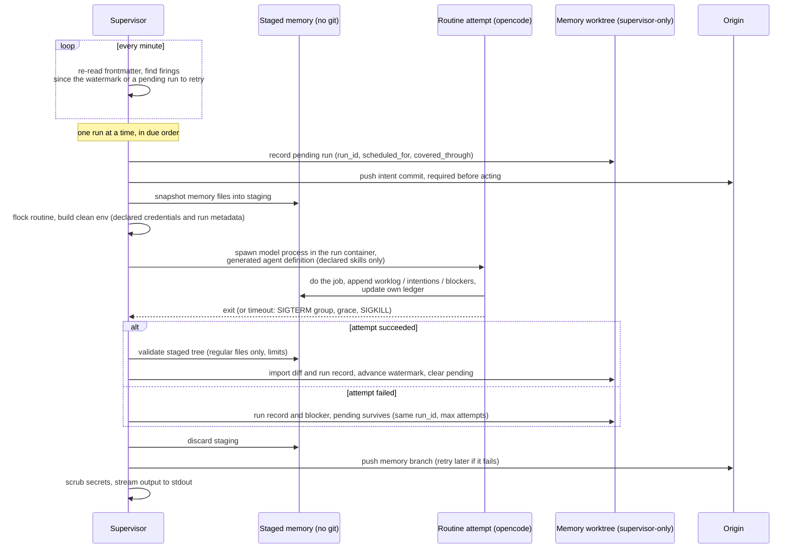

# Design

The decisions behind openroutines, and why we made them. The [README](README.md) says what the framework does; this document says why it works the way it does.

## One agent, one job description, one runtime

**Decision.** An openroutines-generated agent (ORA) is a single agent with a single mandate, defined in `agent.yaml`. There is no fleet management, no orchestration graph, no agent-to-agent protocol.

**Why.** Most of the complexity -- and most of the failure modes -- in agent frameworks comes from coordination between agents. A single agent with a clear job description is easy to reason about, easy to secure, and easy to hold accountable ("what did it do?" is one log and one memory). If you need two jobs done, deploy two agents. This also makes the security model tractable: exactly one runtime means exactly one writer to memory, one credential set, one blast radius.

## The repository is the agent

**Decision.** Everything the agent is -- configuration, routines, skills, structured memory, encrypted credentials -- lives in one git repository. `openroutines scaffold` stamps out a new agent repo from the template embedded in the CLI binary (`template/` in this repo is its source, compiled in via Go's `embed`).

**Why.** Agents-as-platform-accounts hold your agent's identity and memory hostage. Agents-as-repos get the entire mature software lifecycle for free: versioning, review, rollback, CI/CD, forking, diffing. Switching deployment platforms is `git push` and `docker run`. It also means changing your agent's behavior is a reviewable diff, not a click in someone's dashboard.

## Routines are markdown files

**Decision.** Each routine is one markdown file in `routines/`. Frontmatter declares the scope -- `schedule`, `timeout`, `active`, `skills`, `credentials`, `model`, `worklog` -- and the body is the prompt. Every field but `schedule` and `id` is optional: `active` defaults to true, `model` and `timeout` fall back to the `agent.yaml` defaults, and `skills` and `credentials` default to empty -- no grants. Deactivating a routine is therefore always an explicit `active: false`, visible in the diff. The `id` is an immutable generated identifier stamped by `routines new` (short and greppable, e.g. `r_7f3k2m9q`): scheduling state keys on it, not the filename, so renaming a routine never strands its history (`check` rejects duplicates -- copying a routine file means minting a new id).

**Why.** Prompts are the program; they belong in files, under version control, in a format both humans and models read natively. Frontmatter makes every grant explicit and greppable: what a routine can touch is declared at the top of the file that defines it, not assembled at runtime. Agent-level defaults live in `agent.yaml`; frontmatter overrides them.

## Scheduling: a tick loop with catch-up, not cron

**Decision.** A supervisor process in the container wakes every minute, re-reads routine frontmatter, and dispatches whatever is due. Scheduling state is durable and per-routine (keyed by the routine's `id`): a **watermark** -- the latest cron occurrence fully accounted for -- plus at most one **pending run**.

Each tick, per routine: if a pending run exists, retry it -- same `run_id`, new attempt. Otherwise, find cron occurrences in `(watermark, now]`; if any exist, create a logical run with a fresh `run_id`, `scheduled_for` (earliest missed occurrence), and `covered_through` (latest -- multiple missed firings collapse into one catch-up run; an agent down for a week owes one run per routine, not seven). **The pending record is committed and pushed before the routine executes: a logical run exists durably before it is allowed to act.** On success, the watermark advances to `covered_through` and pending clears. On failure -- crash, timeout, shutdown -- pending survives, and the same logical run retries on a later tick under the same `run_id` with a new attempt id. After a bounded number of failed attempts (default 5), the supervisor abandons the run: blocker recorded, watermark advanced, pending cleared -- an unattended agent must not burn model spend retrying forever. If origin is unreachable, no *new* logical run starts (an identity that isn't durable is how duplicates happen); the supervisor raises a blocker and waits, and catch-up absorbs the pause.

Abandonment has a second tier: a **circuit breaker** per routine. Per-run abandonment caps one logical run at five attempts, but the schedule keeps minting new runs, so a routine that is failing *persistently* (dead model, revoked credential) would otherwise grind attempts -- and spend -- indefinitely. After three consecutive abandonments, the routine enters a cool-down: no new logical runs until it elapses (one hour, doubling per further abandonment, capped at 24h), with a blocker recorded at each trip. Any successful run resets the breaker. The watermark mechanics make recovery natural: firings missed during cool-down collapse into one catch-up run when it ends. (Found by the first production soak: an eight-hour model outage produced sixteen abandoned runs of continuous retry grind.)

Every attempt runs with framework metadata in its environment: `OPENROUTINES_RUN_ID` (stable across attempts -- the idempotency key), `OPENROUTINES_ATTEMPT_ID` (diagnostics only), `OPENROUTINES_SCHEDULED_FOR`, and `OPENROUTINES_COVERED_THROUGH`.

**Why.** Re-reading frontmatter every tick means there is no registration or compilation step anywhere -- the files are the schedule. (In production the files change only via redeploy, since they're baked into the image; the payoff of re-reading is that the supervisor carries zero derived state to invalidate, and local runs pick up edits instantly.) Catch-up semantics mean a routine whose moment passes during a redeploy or downtime fires late instead of never; for an unattended agent, "late" is recoverable and "silently skipped" is not. The consequence is **at-least-once** execution -- and at-least-once applies to *external side effects* too: discarding a failed attempt's memory writes does not unsend an email or un-open a PR.

Persist-before-act is what makes the run ID an idempotency key worth having. Without it, a container can act, crash before recording anything, restart with no knowledge of the old run, and repeat the action under a fresh identity -- the exact duplicate the key was meant to prevent. With the pending record pushed first, every retry carries the same `run_id`; routines that act on the world should use it (send it as an idempotency key where the API accepts one, or stamp it into created objects and search before acting) and record completed external actions in their ledger. Be precise about the guarantee: the run ID makes deduplication *possible*, not automatic -- an external API with no idempotency support can still see a duplicate in the window between acting and recording.

## Overlap: kernel locks, skip-don't-queue

**Decision.** Runs are serial across routines: the tick loop marks routines due; a single executor runs them one at a time, in due order -- there is no thread pool. A routine with an attempt in flight or a pending run awaiting retry is never dispatched again in parallel -- later firings collapse into `covered_through`, per the scheduling rule above. Before spawning, the executor takes a non-blocking `flock` on a per-routine lock file; a held lock means skip and log.

**Why.** Hand-rolled lock files go stale when a process dies uncleanly, silently deadlocking the routine forever -- the worst failure mode for unattended software. `flock` locks are released by the kernel when the holder dies, however it dies; staleness is structurally impossible. Skipping (rather than queueing) keeps semantics simple: a routine that is still running *is* the current run. Serial execution extends the single-writer principle from the memory branch down to individual files: the shared memory primitives are append-only files, and one-run-at-a-time makes races on them impossible by construction rather than managed. Scheduled work at minute granularity has no real need for parallelism, and catch-up semantics absorb any queuing delay a slow routine causes. The `flock` remains necessary even so -- it protects against a manual `openroutines routines run` colliding with the supervisor's own run.

## Timeouts kill the process group

**Decision.** Every run has a timeout (`agent.yaml` default, frontmatter override). On expiry the supervisor signals the routine's entire process group -- SIGTERM, a grace period, then SIGKILL -- and records the outcome.

**Why.** A routine run spawns children (tools, shells); signalling only the direct child leaks grandchildren. Recording outcomes (`completed` / `timeout` / `crashed`, duration) into memory gives run history that survives redeploys and reads as a git log.

## Execution: headless opencode, fresh session per run

**Decision.** Routines execute via `opencode run` -- headless, `--format json`, model from frontmatter, a fresh session every run. Session continuation is never used. Permissions are layered: a committed `opencode.json` provides the deny-by-default baseline policy, and the generated per-routine agent definitions (see "Skills are Agent Skills") grant each routine exactly what its frontmatter declares -- per-agent rules override the baseline, and nothing uses blanket auto-approval.

**Why.** opencode already does the hard part -- the agentic loop, tool use, model wrangling -- and ships as a self-contained binary. Fresh sessions keep all continuity in the repo's memory directory: if it's not in the repo, the agent doesn't know it. That's what makes memory portable, inspectable, and git-backed rather than state held hostage in a session store. A committed permission policy means the agent's tool surface is reviewed like code.

## Memory: a dedicated directory on its own branch

**Decision.** Agent memory lives in a dedicated directory, synced to an orphan `memory` branch that the running agent -- the branch's sole writer -- pushes with a read/write deploy key. `last_run` state and run records live there too. If the branch doesn't exist at boot, the supervisor creates and pushes the empty orphan branch -- first boot self-heals; there is no setup step. All of this presumes the repo has a git origin: deploying an ORA requires one (any git host -- GitHub, GitLab, Gitea, a bare repo on a VPS), because without an origin, memory has nowhere durable to live. Local development needs no origin; `openroutines check` verifies one exists before you deploy.

**Why.** The analogy is Docker's own: `main` is the image (immutable, what you deploy), the `memory` branch is the volume (mutable, survives redeploys). Keeping memory off `main` means agent commits never trigger CI/CD, never race human pushes, and never pollute the history of human intent. One agent, one runtime → one writer → pushes fast-forward in the normal case; the rare exceptions (human curation racing a run) are handled by the defensive sync rules below, never silently. Code rolls back; memory persists -- like a database. Reviewing what your agent has learned is `git log memory`. Humans may curate the branch (pruning bad learnings is part of maintaining an agent); the agent pulls before each run. By convention -- taught by the template's `AGENTS.md`, not enforced by the framework -- each routine keeps a ledger file named after itself (`memory/ledgers/<routine>.md`) recording what it examined and decided, and prunes that ledger as part of its own prompt. Memory hygiene is part of the job description, not a framework feature.

Mechanically, `memory/` is a **git worktree** of the `memory` branch, ignored by `main` and created lazily by the CLI (locally) or the supervisor (in the container) -- one directory, two histories. Routine edits and memory curation are separate commits on separate branches by construction: `git status` on `main` never shows memory churn, and a human curates by committing inside the directory (`git -C memory commit && git -C memory push`). Local runs and production runs touch memory through the identical path, which is what makes local testing faithful. `openroutines status` should surface uncommitted memory-worktree changes, since root `git status` won't. At run time the worktree is supervisor-only: routines work against a disposable staged copy (see "Memory syncs per run"), so a run can never clobber uncommitted human curation -- `routines run` imports results into the worktree and asks only that it be clean at import time, while `routines test` discards the staged copy entirely.

Because humans can push to the branch and the agent reads it as model context, **memory is an untrusted input channel** and is handled that way. The injected standing instruction frames the primitives as *records to consult*, never instructions to obey. Sync is defensive: the supervisor pulls fast-forward-only and refuses to adopt rewritten history (a force-pushed `memory` branch stops sync and raises a blocker rather than silently feeding the agent altered context); pushes are fast-forward-only, and a rejected push triggers fetch-and-rebase of the local commits -- append-only files rebase cleanly -- with conflicts stopping sync and raising a blocker, never resolving silently. And "one writer" is enforced, not assumed: at boot the supervisor takes a lease (a heartbeat ref pushed to origin), and an instance that sees a live foreign lease -- a rolling deploy's overlap, an accidental second replica -- waits or exits instead of running routines.

## Memory has three shared primitives: worklog, intentions, blockers

**Decision.** Every agent's memory contains three append-only files the framework blesses: `memory/worklog.md` (accomplishments -- raw facts of what runs did), `memory/intentions.md` (open items the agent means to act on, split between actionable and waiting-on-a-human), and `memory/blockers.md` (impediments). Per-routine private state lives in `memory/ledgers/<routine>.md`. Primitives hold full facts, never polished prose -- "reviewed PR #482, no doc update needed" -- compression, selection, and voice are a consumer's job at read time. The standing instruction to record facts is injected by the runtime into every run's generated agent definition, not left to routine authors; a routine opts out with `worklog: false` frontmatter (for reporting and maintenance routines whose runs are noise). Blockers have two writers: routines self-report what they can't do, and the supervisor mechanically appends a blocker when a run fails -- timeout, crash, repeated auth error -- because a run that falls over never gets to explain itself.

**Why.** Any autonomous agent beyond the trivial invents these three streams eventually; blessing them means nobody reinvents that wheel, and every consumer -- a check-in routine, a digest, a human reading the memory branch -- finds the same shape in every ORA. Raw-facts-only keeps the division of labor clean (the same activity-stream model Steady uses): recording stays cheap and mechanical, judgment happens at read time. Supervisor-written blockers are the piece prompts cannot provide: the most important failures are precisely the ones the model isn't around to narrate.

## Every agent checks in

**Decision.** The template ships a check-in routine, active by default, scheduled twice daily -- 6am and 6pm agent time. It reads the three primitives since its last run (high-water mark in its own ledger) plus the routine schedules, and composes a plain check-in -- what I did, what I intend to do, where I'm blocked -- written to the logs. It declares no skills and no credentials; pointing it at Steady, Slack, or anywhere else is a frontmatter diff that adds a skill and a credential. It carries `worklog: false`: checking in is reporting, not work.

**Why.** An unattended agent whose only interface is logs needs a heartbeat a human can read on a human cadence -- morning and evening. Shipping it default-on makes every ORA observable from day one with zero configuration and zero external dependencies, exercises the memory primitives immediately (so their value is visible in the very first deploy), and makes the upgrade to a real reporting destination a two-line diff instead of a design exercise.

## Credentials: encrypted in the repo, scoped per routine

**Decision.** Secrets ship encrypted in the repository, Rails-style: one encrypted file, one master key kept out of the repo (a gitignored file locally, an environment variable in production). A routine's process environment receives only the credentials its frontmatter declares (`slack_webhook` → `SLACK_WEBHOOK`), decrypted in memory at spawn time -- never written to disk. Three rules make the scoping real:

1. **Routine environments are built from scratch, never inherited.** The supervisor's own env holds `OPENROUTINES_MASTER_KEY` and `OPENROUTINES_DEPLOY_KEY`; children get a minimal constructed env (PATH, HOME, TZ, declared credentials, and framework-injected metadata like `OPENROUTINES_RUN_ID`) and nothing else. The `OPENROUTINES_*` prefix is reserved for that framework metadata -- never for secrets, and `openroutines check` rejects credential names that collide.
2. **Model provider keys auto-inject by provider.** They live in the same encrypted file under reserved names; a routine declaring `model: anthropic/...` receives `ANTHROPIC_API_KEY` and no other provider's key, with no frontmatter boilerplate.
3. **Injected secrets are scrubbed from logs.** The supervisor knows every value it injected and redacts them from the routine's log stream (the GitHub Actions trick). This is defense in depth, not a guarantee -- exact-value matching can't catch an encoded or split secret -- but it turns the common accident (a routine echoing `$SLACK_WEBHOOK`) into a non-event. The real protections are the scoping rules above: a secret that was never injected can't leak by any encoding.

**Why.** The Rails model is battle-tested and requires no secrets platform -- the repo stays self-contained without ever containing a usable secret. Per-routine scoping is the substantive security claim: most frameworks hand every tool every secret; here the daily-digest routine cannot read the deploy token, and the grant is visible in the diff that adds it. The clean-env rule is what makes that claim true rather than decorative -- an inherited environment would hand every routine the master key, which unlocks everything. And because logs are the only way into a deployed agent, scrubbing is the difference between "a routine echoed a secret" being a non-event and being an incident.

## No open ports

**Decision.** A deployed ORA listens on nothing. There is no admin UI, no webhook receiver, no chat gateway. Routines may reach *out* to networked services through their skills; logs are the only way in.

**Why.** An agent that holds credentials and acts unattended should have the smallest possible inbound attack surface, and the smallest possible surface is zero. Anything that needs to talk to the agent does so through the repo (routines, memory) or not at all. Interactive development happens locally, with your own coding agent, against `AGENTS.md`.

## The supervisor is a small Go binary

**Decision.** The supervisor -- tick loop, locks, timeouts, spawn, git sync -- is written in Go, targeting a dependency tree of roughly one (a cron-expression parser).

**Why.** The supervisor is the trusted component: it holds the master key and the deploy key, so its dependency tree is its attack surface. Go's stdlib covers processes, signals, and locking natively, compiles to a static binary, and keeps the image minimal (supervisor + opencode + git, distroless-friendly). It is also the lingua franca of exactly this genre of infrastructure -- the audience that runs containers expects the runner to be a small static binary they can read in one sitting. TypeScript would have meant an npm tree inside the trust boundary; Rust buys safety this program doesn't need at a contribution cost it would feel.

## Framework code is versioned out of the agent repo

**Decision.** All framework logic lives in one released Go binary -- `openroutines` -- whose subcommands include the supervisor (`openroutines supervise`, the container entrypoint) as well as `scaffold`, `configure`, `status`, `routines`, and `skills`. An agent repo carries only a version pin (`.openroutines-version`) and a Dockerfile that installs the pinned binary by checksum. Locally you install `openroutines` once (installer script or Homebrew); the binary reads the repo's pin and warns on mismatch (Bundler-style re-exec of the pinned version is a possible later upgrade). There are no `bin/` shims. `openroutines update` bumps the pin, applies any template-file changes interactively (`rails app:update`-style), and leaves a single reviewable commit.

Deployment distributes the framework as a **base image**: `bin/release` publishes `ghcr.io/steadyspacecorp/openroutines:<version>` (binary + pinned opencode + git/ssh, supervisor as entrypoint), and an agent's Dockerfile is `FROM` that image plus `COPY . /agent`. The registry reference replaces the earlier checksum-download plan -- digest pinning does the same integrity job with standard tooling, works against a private registry today, and `openroutines update` keeps the `FROM` tag in sync with the version pin.

**Why.** Template repos rot: agent repos are born from `template/` and immediately diverge, so shipping framework *code* into them strands every existing agent on the version it was scaffolded with -- and fork-and-merge from upstream conflicts the moment a user touches anything. Shipping a version *pin* instead makes drift structurally impossible for the whole binary surface; only the Dockerfile (a file users rarely edit) ever needs a guided merge. The container is where the pin is enforced -- the Dockerfile installs that exact release by checksum, so deployed behavior is reproducible; locally the binary checks the pin and complains about skew. Updating is one commit; rolling back an update is `git revert`. The costs: a one-time local install step (no clone-and-run), and maintaining tagged releases with prebuilt binaries, which GoReleaser makes cheap.

## Skills are Agent Skills, enforced by opencode

**Decision.** Skills follow the open [Agent Skills](https://agentskills.io/) standard -- a folder with a `SKILL.md` (name + description frontmatter, instructions in the body, optional scripts and references) -- living in the agent repo's `skills/` directory, exposed to opencode through its skill-discovery paths. Scoping is enforced by opencode, not the supervisor: for each routine, `openroutines` generates an opencode agent definition whose permission block denies all skills by default and allows exactly the ones the routine's `skills:` frontmatter declares (same for tool permissions), and the supervisor spawns `opencode run --agent <routine>`. Generated definitions are derived from routine frontmatter and gitignored -- frontmatter stays the single reviewable source of truth. Permission values are only ever `allow` or `deny`, never `ask`: an unattended agent has no one to ask.

**Why.** Adopting the standard means any skill written for Claude Code, Cursor, opencode, or the rest of the ecosystem drops into an ORA unchanged -- skills are the part of an agent worth sharing, and a proprietary format would orphan them. The flip side: a skill is an executable dependency -- instructions and sometimes scripts your agent will follow unattended. Vendoring one into `skills/` is importing code; review it like code, and pin where it came from. Enforcement belongs in the layer that executes tools: only opencode can actually stop a run from using bash or loading a skill, and its `deny` semantics *hide* undeclared skills from the model rather than merely refusing them -- no context leak, no supervisor code to write. The supervisor stays what it should be: a dumb, auditable scheduler.

Verified by spike against opencode 1.17.12: per-agent permission blocks compose with skill patterns -- a denied skill is absent from the model's system-prompt skill listing, refused on a by-name load, and the wildcard deny also suppresses machine-global skills (`~/.claude/skills/` etc.), making local runs reproducible. Implementation notes: rule order is significant (emit `"*": deny` before specific allows -- last match wins), and `opencode agent list` statically validates a generated definition, which `openroutines check` uses.

Be honest about the boundary: skill permissions gate the skill *tool*, not the filesystem -- a routine with read or bash access can still open an undeclared skill's `SKILL.md` directly. Skill scoping is context and capability hygiene, not a sandbox. The hard security boundary is credentials: an undeclared secret isn't hidden from a routine, it does not exist in its process environment.

## Memory syncs per run, atomically -- through staging, never the worktree

**Decision.** Routines never touch the real memory worktree. Before each attempt, the supervisor snapshots the memory files into a plain, disposable **staging directory** -- no git metadata anywhere in it -- and that staging copy is what the routine sees and writes as `memory/`. After a successful attempt, the supervisor validates the staged tree and imports the diff into the supervisor-only worktree, adds the run record, commits, and pushes. A failed attempt's staging is discarded whole -- cleanup is deleting a directory, not surgery on a worktree.

Validation rejects the entire run if staged memory contains anything but regular files under the expected layout: no symlinks or hard links, no git control files (`.git`, `.gitattributes`, `.gitmodules`, hooks), no edits to supervisor-owned state (run records, scheduling state), and enforced limits on file sizes, counts, and path depth. The supervisor invokes git with pinned, hermetic configuration (`GIT_CONFIG_NOSYSTEM=1`, global config disabled, hooks path empty, `protocol.file.allow=never`) and argument-safe invocation -- never through a shell.

Each logical run therefore produces two commits: a small **intent commit** before execution (the pending-run record) and a **completion commit** after (imported writes plus run record on success; run record plus blocker on failure). A failed push never blocks the agent: commits accumulate locally and the next successful push carries them, subject to the origin rule in Scheduling (no *new* logical runs while origin is unreachable).

**Why.** One invariant carries this whole section: **model-directed processes never write to a git worktree or git metadata -- they write to disposable staging that the supervisor validates and imports.** That buys memory atomicity (the branch only ever contains validated output of completed runs, so a half-finished attempt can never corrupt the context future runs read), crash safety (recovery is always "discard staging, retry the pending run"), a collapsed attack surface (a routine cannot plant hooks, attributes, or symlinks in a tree where the deploy-key-holding supervisor runs git), and safe curation (the model can never clobber a human's uncommitted memory edits, because it never sees the real worktree). Two commits per run is less tidy than one; correct crash recovery beats an aesthetically pure log.

## Shutdown: terminate fast, lean on at-least-once

**Decision.** On SIGTERM the supervisor stops launching routines, signals in-flight routine process groups (the same SIGTERM → grace → SIGKILL as a timeout), discards their staged memory copies, records the interrupted attempts, makes a final memory commit-and-push, and exits. There is no drain mode. Recommended `docker stop` timeout: 30 seconds.

**Why.** Draining would hold every deploy hostage to the longest in-flight routine for a benefit the design already provides two other ways: an interrupted attempt leaves its pending run intact, so the same logical run retries on the next boot under the same run ID, and staged memory means it left nothing half-written behind. Fast shutdown keeps redeploys boring -- seconds, not routine-timeout minutes -- at the cost of occasionally redoing work, which at-least-once semantics already told routine authors to tolerate.

## Runs are sandboxed -- and local runs use the production container

**Decision.** In production, every model process is filesystem-sandboxed with Landlock (Linux kernel 5.13+, V2 preferred with V1 fallback): the supervisor spawns it through a re-exec shim (`openroutines sandbox-exec`) that applies the rules to itself and then execs opencode -- rules bind to a process and its descendants, which is exactly what exec preserves. The ruleset grants read on the run workspace and the OS, write on staged memory, the run tmp dir, and opencode's own state dirs -- and nothing else: not the repo, not `.git`, and pointedly not the supervisor's `~/.ssh`, where the deploy key lives. **The sandbox fails closed at boot, not mid-run**: `supervise` probes Landlock at startup (via `openroutines sandbox-probe`) and refuses to start on a host that can't confine -- the deliberately ugly `OPENROUTINES_UNSAFE_NO_SANDBOX=1` overrides. Outside production the shim is unnecessary: local runs confine the model process in the per-run container, and `OPENROUTINES_NATIVE=1` dev mode is an explicit unconfined opt-in. (A `check`-side pre-deploy probe of the image remains on the hardening backlog.) The generated opencode agent definitions additionally carry `read` permission patterns denying undeclared skill paths.

And the container boundary matches the trust boundary. The model-directed process -- opencode and everything it spawns -- executes inside the image's *runtime stage* (debian + git + pinned opencode; no openroutines binary needed) with exactly one thing mounted: the git-free run workspace. The supervisor-side pipeline (staging, validation, git, import) is trusted code and runs outside that boundary -- on your machine locally, as the container's entrypoint in production. Same Go code path in both places; only who spawns whom differs. Two properties fall out: the model process cannot see anything but its workspace (your homedir, opencode auth, and the rest of the repo simply are not there), and undeclared skills are not merely permission-denied -- only declared skills are copied into the workspace, so they do not exist in the container at all. Docker is therefore a prerequisite for `routines run`/`test` -- but not for `scaffold`, `configure`, `check`, or `routines new`, which stay native and instant (`check` uses Docker for exactly one optional probe: verifying the sandbox inside the image). Contributors with opencode installed can bypass the container with `OPENROUTINES_NATIVE=1`.

**Why.** Skill-permission gating (see above) is context hygiene, not a wall -- a routine with bash can `cat` any file it can reach. Landlock turns the declare-or-it-doesn't-exist principle into kernel enforcement, the same way clean-env construction does for credentials: a third enforcement point, built from scratch per run. Running locally through the container is what makes the sandbox -- and everything else -- identical in both places: same image, same opencode version, same env construction, same kernel-level restrictions (Docker Desktop's VM kernel supports Landlock). "Test locally exactly as it runs in production" becomes mechanically true rather than approximately true, and the works-locally-breaks-in-prod bug class is structurally gone. The volume mount keeps the dev loop fast (no rebuild per routine edit) and writes memory into the local worktree, where it stays until pushed. What sandboxing still doesn't cover: network egress. Be precise about the consequence: a prompt-injected routine can exfiltrate anything it *legitimately holds* -- its declared credentials, the memory it can read, the files in its sandbox -- to any host it can reach. Scoping caps what a routine holds; nothing yet caps where it can send. That's why grants are **authority, not configuration**: declaring a skill or credential is handing the routine power to act and to leak, and should be reviewed with exactly that gravity. Per-routine egress control (Landlock's TCP scoping landed in kernel 6.7; a proxy-based allowlist is the fuller answer) is the highest-value future tier -- see open questions.

## The name is lowercase: openroutines

**Decision.** The project is **openroutines** -- one word, all lowercase, in prose, headings, and code alike, even at the start of a sentence. Never "Open Routines" or "OpenRoutines". The name, the repo, the domain, the Homebrew formula, and the binary are all the same token.

**Why.** Lowercase is the tool-not-platform ethos rendered in typography -- opencode set the precedent, and the two names sit side by side throughout these docs, where matching styles read as kinship. One token means the thing you type is the thing it's called: no brand-to-binary mapping to remember. The spaced form also collided with the product's own domain language ("routines" are the files; "open routines" mid-sentence is ambiguous). And yes, we know about OpenRouter -- the names share a prefix and an audience. We're keeping ours anyway, deliberately: different layer entirely (they route model requests; we run agents), and the all-lowercase styling keeps the two visually distinct where they'll inevitably appear near each other.

## Appendix: one run, end to end

## Open questions

Hardening backlog -- known gaps between the design above and a fully defensible production posture, roughly in priority order. (This section holds the reasoning; execution is tracked in the repo's GitHub issues.)

- **Threat model document.** A trust-boundary inventory: what we trust (the `main` branch, the container host, opencode, the model provider) versus what we don't (memory content, skill content, model output, fetched web content), and what each enforcement layer is responsible for.
- **Per-routine network egress control.** The largest remaining exfiltration channel. Candidates: Landlock TCP scoping (kernel 6.7+) for port-level rules, or an in-container proxy with per-routine destination allowlists for host-level ones.
- **Container hardening contract.** The template Dockerfile and docs should specify: non-root user, read-only root filesystem, dropped capabilities, no-new-privileges, memory/CPU/disk limits, and an explicit prohibition on mounting the Docker socket.
- **Secret lifecycle specifics.** Cipher and format for the credentials file (authenticated encryption, versioned header), master-key generation entropy, rotation story for both master key and individual credentials, and deploy-key delivery (file-based secret preferred over env var where the platform allows).
- **Supply-chain posture.** Signed releases and checksums for the binary and install script, pinned opencode version and base-image digest in the template Dockerfile, and provenance guidance for vendored skills.
- **Schema versioning.** A version marker in `agent.yaml`, frontmatter, the credentials file, and run records, so `openroutines update` can migrate them deliberately.
- **Scheduling edge cases.** DST gaps and repeats, timezone changes, clock rollback, garbage-collecting deleted routines' scheduling state, and validation rules for names (case-folding, env-var collisions, path traversal).
- **Observability contract.** A stable log schema (run IDs, outcomes, durations, token/cost figures where opencode reports them) so log-scraping monitors have something dependable to scrape.
