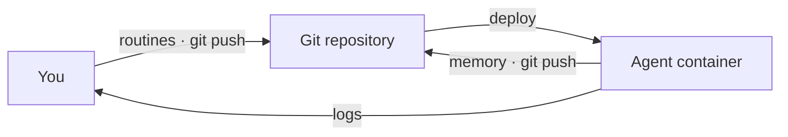

# openroutines

[](https://github.com/steadyspacecorp/openroutines/actions/workflows/ci.yml)

The framework for running simple, secure, and durable autonomous AI agents.

> **Status: alpha.** The full lifecycle works -- local development, production deployment, updates, the filesystem sandbox -- and a deployed test agent exercises it daily. Remaining work is in [issues](../../issues); known limitations are in [SECURITY.md](SECURITY.md). While the repo is private there is no brew/curl install -- collaborators grab a binary from [Releases](../../releases).

## Background

An autonomous AI agent is software that uses AI models to fulfill a job description. It works from context, runs routines on its own, and gets better at the job over time by folding the memory of what worked back into that context.

For example: a product management agent that gathers user research into themes, updates specifications against technical constraints, and checks that documentation hasn't drifted from what shipped. Or an IT ops agent that triages tickets, monitors licenses, and surfaces compliance issues.

**openroutines** is an opinionated way to build and run one such agent -- one job description, one runtime, a handful of routines -- and to treat it like any other deployed software: versioned, operationalized, and secure.

## What it does

**openroutines** generates an agent as a git repository that deploys as a Docker container. The repository holds configuration, skills, structured memory, encrypted credentials, and a set of routines as markdown files. [opencode](https://opencode.ai) talks to the AI models you choose.

You work on an openroutines-generated agent (ORA) like any software project: build and test locally, deploy with git and Docker, wire up standard CI/CD if your origin is GitHub, GitLab, or the like.

The heart of the agent is its routines. Frontmatter scopes the schedule, skills, credentials, model, and optionally the reasoning effort. The body is the prompt.

```markdown
---
schedule: "0 9 * * 1"
timeout: 15m
active: true
skills:
  - steady-updates
credentials:
  - steady_token
  - github_token
model: anthropic/claude-sonnet-5
---
Check that our product documentation hasn't drifted from what we've actually shipped. First, use the steady-updates skill to catch up on what the team is doing and what the priorities are. Then compare the docs against what has shipped since your last run -- your memory has where you left off. Record anything that's now wrong or missing in memory, and print a short drift report; it goes to the container logs.
```

The memory an agent builds as it works travels through git too, on its own branch -- backed up with every push, kept separate from your routines.



Every part of this design is deliberate. [DESIGN.md](DESIGN.md) records each decision and the reasoning behind it.

### Special sauce: versioned memory primitives

One rule routes everything an agent wants to remember, into files any autonomous agent ends up needing -- so you never have to invent them:

- It happened → an event in **events.md** -- raw facts, including NO-OPs ("checked 5 PRs, no doc drift")
- Someone must do it → a task in **tasks.md**, owned by the agent or a human -- one canonical record with a stable id, from discovery to resolution. The supervisor writes here too: a run it had to give up on becomes a human-owned task, so even failures that never got to explain themselves land on someone's list
- It may inform future decisions but requires no action → a line in **context.md**
- Only one routine needs it → that routine's private ledger in `memory/ledgers/` -- working state for its next run, not a run log

Records hold facts, never polished prose -- compression and voice are a reader's job. And because memory is a git branch, its commits are a change feed: a reporting routine declares `consumes: memory`, receives an inbox of everything since it last reported, and marks the batch consumed when its report covers it. Each consumer keeps its own cursor, so pointing a second destination at the same agent -- Steady and Slack, say -- takes no changes to the routines doing the work. The starter check-in routine is the first consumer: twice a day it turns the feed into a teammate-style update in your logs. The working files stay lean, too: entries older than the retention window (`memory.retention`, default 30 days) are trimmed daily, and git history keeps everything forever -- including changes a consumer hasn't seen yet.

### What it doesn't do

- No fleets. An ORA can run as many routines as you want, but it holds one job. Two jobs means two agents.
- No chat gateway for developing the agent by talking to it. Work on it locally with the coding agent of your choice -- AGENTS.md is there to make that easy.
- No application ingress. The shipped container listens on no ports. Routines may still reach out to networked services, and operators remain responsible for host and deployment access.

## Creating a new agent

Prerequisites:

- **git**
- **Docker** -- routines run locally in the same container they run in when deployed
- **An API key for at least one model provider** (Anthropic, OpenAI, ...) -- `configure` encrypts it into the agent's credentials

That's the whole list. You don't install opencode or any language runtime -- everything the agent runs on ships inside the container.

Install the `openroutines` CLI. **While this repo is private**, brew and the install script are not live yet -- install from [Releases](../../releases) instead:

```bash
# pick your platform: darwin|linux, arm64|amd64
gh release download --repo steadyspacecorp/openroutines --pattern "openroutines_*_darwin_arm64" --pattern "checksums.txt" -D /tmp/or
(cd /tmp/or && shasum -a 256 -c --ignore-missing checksums.txt)
chmod +x /tmp/or/openroutines_* && mv /tmp/or/openroutines_* ~/bin/openroutines   # any dir on your PATH
openroutines --version
```

(On macOS, always install by moving the file into place as above -- overwriting a running binary in place invalidates the kernel's signature cache. The darwin binaries are ad-hoc signed; Gatekeeper does not quarantine files downloaded via `gh`.)

Once public, installation becomes:

```bash
brew install openroutines
# or
curl -fsSL https://openroutines.dev/install.sh | sh
```

Then scaffold an agent and configure it:

```bash
openroutines scaffold my-agent
cd my-agent
openroutines configure
```

`scaffold` creates a fresh git repository with the agent's skeleton:

- `agent.yaml` -- the agent's identity and defaults
- `routines/` -- a starter check-in routine, active by default (twice a day, your agent reports what it did, what it intends to do, and where it's blocked -- to the logs, until you point it somewhere better)
- `skills/` -- empty, ready for you to add to
- `AGENTS.md` -- so you can work on the agent with the coding agent of your choice
- a baseline `opencode.json` permission policy, `.gitignore`, Dockerfile, and pinned framework version

A `memory/` directory appears on first run -- a checkout of the agent's dedicated memory branch, kept out of `main`'s history.

`configure` is idempotent -- run it whenever. It fills in `agent.yaml` (name, job description, owner, timezone, default model), generates the master key for encrypted credentials, and reports anything the agent still needs.

Give the agent its first routine:

```bash
openroutines routines new doc-drift
```

Edit the generated file -- schedule and scope in the frontmatter, prompt in the body -- then run it once locally. The local run uses the same runtime image, opencode version, constructed environment, and assembled workspace as production.

Both `routines run` and `routines test` start opencode in a disposable Docker container; `test` changes its permissions and discards its writes, but uses the same containerized runtime.

```bash
openroutines routines run doc-drift
```

Day to day:

```bash
openroutines status                   # master key, models, routines and schedules, skills, memory sync state
openroutines routines list            # also: edit, activate, deactivate, remove
openroutines routines test <name>     # dry run: routine credentials withheld, acting tools denied, memory discarded
openroutines skills new <name|url>    # scaffold a skill, or vendor one from a git repo; also: list, remove
openroutines credentials set <name>   # add/replace one encrypted secret; also: list, remove
openroutines check                    # validate config, frontmatter, and schedules; made for CI
```

Non-secret configuration -- a repo name, a docs URL -- goes in a `variables:` map in `agent.yaml`, and every run receives each one as an environment variable (`product_repo` becomes `$PRODUCT_REPO`). Secrets go in encrypted credentials instead; inside a routine the interface is the same either way, so the only question a value raises is whether it's secret.

A credential can also carry a *type*. A `credentials:` entry in `agent.yaml` tells the runner how to materialize the stored value -- `type: github_app` turns a stored App private key into a short-lived installation token minted fresh for each run, injected as `GITHUB_TOKEN` alongside the App's Git identity, and revoked when the run ends. The routine declares the credential exactly as before; it just never sees the root secret. Credentials without an entry inject verbatim, as always.

Custom model endpoints -- an AI gateway, a proxy, a self-hosted server -- are harness configuration: a `provider` block in `opencode.json`, in [opencode's provider schema](https://opencode.ai/docs/providers/), keyed by the prefix your model strings use:

```json
{
  "provider": {
    "my_gateway": {
      "npm": "@ai-sdk/openai-compatible",
      "options": {
        "baseURL": "https://gateway.example.com/v1/compat",
        "apiKey": "{env:MY_GATEWAY_API_KEY}"
      }
    }
  }
}
```

A routine then selects `model: my_gateway/some-model` in its frontmatter, and the credential `my_gateway_api_key` is injected automatically as the provider key. The boundary is simple: each config file belongs to the system that interprets it. Endpoint definitions and permissions are opencode's (`opencode.json`, which `openroutines update` never rewrites); model choice, grants, and schedules are the framework's (`agent.yaml` and frontmatter). `openroutines check` flags a defined provider that no model string references.

Skills follow the open [Agent Skills](https://agentskills.io/) standard, so any skill written for Claude Code, Cursor, opencode, or the rest of the ecosystem works in your agent's `skills/` directory unchanged. A routine only gets the skills its frontmatter declares. And treat a skill like the dependency it is: instructions -- sometimes code -- that your agent will follow unattended. Review what you vendor in.

A whole capability -- one or more routines, their skills, the names of the credentials to fill in -- can arrive as a **plugin**:

```bash
openroutines plugin add steadyspacecorp/openroutines-plugin-steady
```

`plugin add` shows you the bundle's declared authority -- every routine with its schedule, trigger, model, credentials, and skills -- and copies the files in only after you confirm (`--yes` is required when stdin is not interactive). The summary is not a substitute for reviewing routine bodies and skill files, which are executable supply-chain input. Installed routines are forced inactive so you can configure them, inspect the diff, and activate them explicitly. Install writes nothing outside `routines/` and `skills/`, and secrets are never part of a plugin: you're told which credentials to `credentials set` afterward. Plugins are copy-first: after install the files are yours, indistinguishable from ones you wrote by hand, reviewed and versioned in the same diff. A plugin can also be skills-only (you write the routines) -- see [DESIGN.md](DESIGN.md) for the format and the boundaries it enforces. To author one, copy a reference plugin from [`examples/plugins/`](examples/plugins/) and edit: the `PLUGIN.md` manifest names the bundle and the credentials and variables it needs; `routines/`, `skills/`, and `memory/ledgers/` stubs are the payload.

To contribute to openroutines itself, clone this repo -- see [License and contributing](#license-and-contributing).

## Deploying your agent

An ORA deploys as a plain Docker container. Anything that runs a container runs your agent -- a VPS, Fly, Render, Kamal, your homelab. There is nothing else to provision: no database, no queue, no secrets platform.

The one prerequisite is a git origin the agent can push to -- GitHub, GitLab, Gitea, even a bare repo on a VPS -- since that's where memory durably lives. (Local development needs no origin, and `openroutines check` verifies one before you deploy.)

First, give the agent its own identity for pushing memory -- a deploy key scoped to this one repository. Generate it *outside* the agent repo (a private key must never sit in the repo or its image):

```bash
ssh-keygen -t ed25519 -f ~/.keys/my-agent_deploy_key -N "" -C "my-agent deploy key"
gh repo deploy-key add ~/.keys/my-agent_deploy_key.pub --allow-write --title "my-agent"
```

Then build and run (the agent image builds `FROM` the openroutines base image on GHCR, which carries the supervisor and opencode; while that registry is private, `docker login ghcr.io` first):

```bash
docker build -t my-agent .
docker run -d --name my-agent --restart unless-stopped --stop-timeout 30 \
  -v ~/.keys/my-agent-master.key:/run/secrets/master.key:ro \
  -v ~/.keys/my-agent_deploy_key:/run/secrets/deploy_key:ro \
  -e OPENROUTINES_MASTER_KEY_FILE=/run/secrets/master.key \
  -e OPENROUTINES_DEPLOY_KEY_FILE=/run/secrets/deploy_key \
  my-agent
```

The image contains the pinned `openroutines` binary, opencode, git, and your repo's `main` branch. The entrypoint is the supervisor: every minute it re-reads your routines' frontmatter and runs whatever is due. Two secrets arrive at boot, and neither is ever in the image:

- **The master key** (a copy of `master.key`) decrypts the credentials file. Routines receive only the credentials their frontmatter declares.
- **The deploy key** lets the agent push its memory. On boot the supervisor fetches the `memory` branch -- creating it if it doesn't exist yet, so first boot self-heals -- and after each run it commits and pushes what the agent recorded.

Mount them as files and point `OPENROUTINES_MASTER_KEY_FILE` / `OPENROUTINES_DEPLOY_KEY_FILE` at the paths, as above -- file delivery keeps key material out of the process environment. On platforms where mounting a file is awkward, the values can arrive directly in `OPENROUTINES_MASTER_KEY` / `OPENROUTINES_DEPLOY_KEY` instead, but environment delivery has a weaker process-exposure posture and is not the recommended production configuration.

A few properties fall out of the design (see [DESIGN.md](DESIGN.md) for the reasoning):

- **Run exactly one instance.** One agent, one runtime -- the agent is the sole writer to its memory branch, so there is nothing to scale horizontally. If a platform asks how many replicas, the answer is 1, and the supervisor enforces it with a lease: an accidental second instance waits instead of corrupting memory.
- **Redeploys are safe.** A routine killed mid-run fires again on the next boot, and a scheduled moment that passes while the container is down runs late instead of never. Missed is recoverable; silently skipped is not.
- **Memory survives.** Code rolls back with the image; memory lives on its own branch and persists, like a database, but versioned.
- **No application ingress.** The shipped container listens on no ports. Routine output and run records go to stdout -- read them with `docker logs` or your platform's log tooling. This does not replace normal host and deployment access controls.

For continuous deployment, wire the usual hooks: run `openroutines check` on every push, rebuild and redeploy on merge to `main`. Pushes to the `memory` branch never trigger a deploy -- that separation is by design.

## Updating your agent

Your agent pins the openroutines version it runs against in `.openroutines-version`. The deployed container installs exactly that release, so laptop, CI, and production always agree.

To update the framework:

```bash
openroutines update
```

This brings the agent up to the version of the `openroutines` binary you're running (install the newer binary first). It bumps the pin, rewrites the Dockerfile's base-image tag, and offers any other framework-owned file changes interactively with a diff. Review, commit, push -- your next deploy runs the new version. Rolling back an update is `git revert`.

Updates never touch what's yours: routines, skills, memory, and credentials belong to the agent, not the framework.

## Why

We're all familiar with agents as personal assistants, running on your machine, doing stuff for _you_. Coding, writing, summarizing, etc.

But what about _autonomous_ agents doing stuff for your team or company? Like a market research agent, a security monitoring agent, or whatever else the team needs?

Where do these things _run_? How do we maintain them? How can we _trust_ them to work with company knowledge and IP?

These were our questions when we started building agents to help run our operations at Steady. There are loads of options, but they all have drawbacks rooted in being too broad or too complex: routines tied to one vendor's harness and a single user, personal-assistant frameworks pressed into server duty, and whole multi-agent _platforms_ when all we wanted was one agent with one job. Both extremes carry the same security, durability, and trust problems.

What if you could set up and test an agent locally -- skills, routines, credentials, and the model of your choice -- in a few minutes, deploy it with a push, and maintain it like any other git-versioned software project? And rinse and repeat whenever you need a new agent?

Well, now you can.

## License and contributing

openroutines is [MIT licensed](LICENSE). Agents you scaffold with it are yours -- the license places no claim on your routines, skills, or memory.

Contributions are welcome, with one ask: read [DESIGN.md](DESIGN.md) first. This is an opinionated framework, and the opinions are documented -- each decision comes with its reasoning. Bug fixes and small improvements can go straight to a pull request. For anything that touches a documented decision, open an issue and argue with the reasoning, not just the behavior; if the rationale doesn't hold up, we'll change the design. Security reports: see [SECURITY.md](SECURITY.md).

To work on the framework itself, clone this repo -- the CLI, supervisor, and embedded agent template all live here. You'll need Go 1.25+ (install it however you like; if you use [mise](https://mise.jdx.dev), the pinned toolchain in `mise.toml` is picked up automatically). Build and test with the standard commands: `go build ./...`, `go vet ./...`, `go test ./...`.
