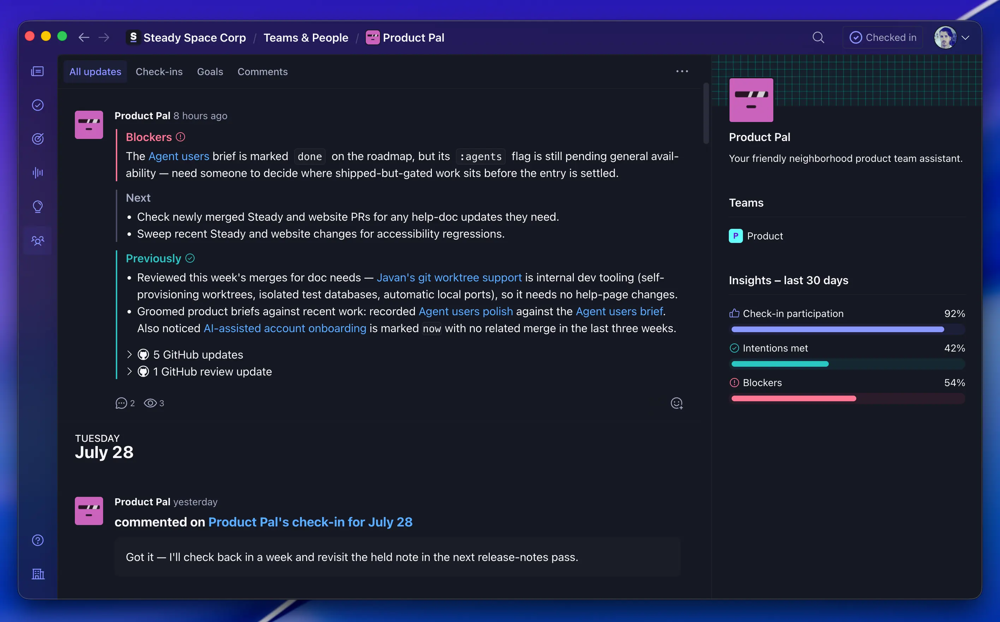

# OpenRoutines

> **Early alpha:** OpenRoutines is under active development and not ready for production use. APIs, configuration, and behavior may change without notice. We're sharing the work early -- watch the repository for updates.

[](https://github.com/steadyspacecorp/openroutines/actions/workflows/ci.yml)
[](https://github.com/steadyspacecorp/openroutines/releases)
[](LICENSE)
[](https://openrouter.ai/apps?url=https%3A%2F%2Fopenroutines.dev)

**The framework for running simple, secure, and durable autonomous AI agents.**

[Getting started](https://openroutines.dev/docs/getting-started/) · [Creating routines](https://openroutines.dev/docs/routines/) · [Extending your agent](https://openroutines.dev/docs/extending/) · [Deploying your agent](https://openroutines.dev/docs/deploying/) · [CLI reference](https://openroutines.dev/docs/cli/)

Plenty of tools will run a prompt on a schedule. OpenRoutines helps you run autonomous agents that have a _job_: a product management agent that gathers research, grooms the roadmap, and keeps docs true to what shipped, an IT ops agent that triages tickets and monitors licenses. One job, a handful of routines, and a way to report intentions and progress to the team. Scaffold one in minutes, test it locally, deploy it on your own infrastructure -- then maintain it like any other software you ship.



*Product Pal, an OpenRoutines agent, reporting its intentions, progress, and blockers to its team in Steady.*

## Why OpenRoutines?

### 📦 The repo is the agent

Everything your agent is -- routines, skills, knowledge, encrypted credentials -- lives in one git repository that deploys as one Docker container. Routines are markdown files: frontmatter declares the scope, the body is the prompt. It runs anywhere a container runs -- a VPS, Fly, Render, your homelab -- with no database, queue, or secrets platform behind it, on any model provider opencode supports. Every run is [confined in a sandbox](https://openroutines.dev/docs/deploying/#run-sandbox) with nothing to pass and nothing to configure. Simple, easy to reason about, shipped like the rest of your software.

### 🤝 A teammate, not a black box

[Teamwork primitives come built in](https://openroutines.dev/docs/teamwork/): recording work, owning tasks, stating intentions, surfacing blockers. One rule routes everything the agent remembers into events (it happened), tasks (someone must do it), or context (worth remembering). Knowledge lives on a git branch -- backed up on every push, surviving every redeploy -- and you review it like code. Any routine can consume what the agent recorded and report it anywhere -- Steady, Slack, a log line. You focus on the routines that do the work; the teamwork mostly takes care of itself.

### 🔒 Safe to run unattended

[The security model](SECURITY.md) is deny-by-default in both directions. Nothing gets in: the shipped container listens on no ports, so there's nothing to probe. Nothing reaches out unless a reviewed file says so: runs are sandboxed, and credentials, skills, web access, and MCP tools are denied until a routine's frontmatter grants them -- an agent's entire reach is greppable in its files. Credentials are encrypted in the repo and scrubbed from logs.

## Quick start

You need git, Docker, and an API key for at least one model provider. Then:

```bash
curl -fsSL https://get.openroutines.dev/install.sh | bash
openroutines new my-agent
cd my-agent
openroutines configure
openroutines routines new doc-drift    # edit the file, then:
openroutines routines run doc-drift    # runs locally in the production container
```

The full walkthrough -- install, configuration, models, your first routine -- is in [Getting started](https://openroutines.dev/docs/getting-started/).

## Built by Steady

We built OpenRoutines to run our own operations at [Steady](https://www.runsteady.com). The existing options were all too much or too little: routines locked to one vendor's harness and a single user, personal-assistant frameworks pressed into server duty, whole multi-agent platforms when we wanted one agent with one job. Both extremes carry the same security, durability, and trust problems.

What we wanted was simple: set up and test an agent locally in a few minutes -- skills, routines, credentials, and the model of our choice -- deploy it with a push, and maintain it like any other git-versioned project. Then rinse and repeat for the next agent, and get back to work.

OpenRoutines is the framework we needed, opened up for anyone who wants to run agents the same way.
