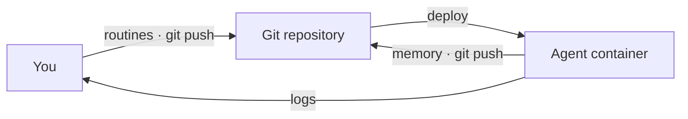

# openroutines

The framework for running simple, secure, and durable autonomous AI agents.

> **Status: alpha.** The full lifecycle works -- local development, production deployment, updates, and the filesystem sandbox -- and is exercised daily by a deployed test agent. Remaining work is tracked in [issues](../../issues); known limitations are in [SECURITY.md](SECURITY.md). While the repo is private there is no brew/curl install -- collaborators grab a binary from [Releases](../../releases).

## Background

An autonomous AI agent is software that uses AI models to fulfill a job description. It pursues objectives by working with context and running routines on its own, and it gets better at the job over time by keeping a memory of what worked and folding that back into its own context.

For example: a product management agent that gathers user research into themes, updates specifications against technical constraints, and checks that documentation hasn't drifted from what shipped. Or an IT ops agent that triages tickets, monitors licenses, and surfaces compliance issues.

openroutines is an opinionated way to generate and maintain a single autonomous agent as described above -- one job description, one runtime, and a handful of routines -- and to treat it like any other deployed software, with established lifecycle, security, and durability patterns.

## What it does

Use openroutines to generate a runnable agent in the form of a git repository with a deployable Docker container. The repository contains configuration, skills, structured memory, encrypted credentials, and a set of routines as markdown files. Under the hood, [opencode](https://opencode.ai) talks to the AI models you choose.

You work on an openroutines-generated agent (ORA) the same way you would with any software project: configure and test locally, and then deploy the project via git and Docker. If your git origin is GitHub, GitLab, or the like, you can also wire up standard CI/CD.

The heart of the agent is the markdown files that describe each routine. Using frontmatter, you explicitly scope the schedule, skills, credentials, the model, and optionally its reasoning effort. The body of the file is the prompt.

```markdown
---
schedule: "0 9 * * 1"
timeout: 15m
active: true
skills:
  - steady-updates
credentials:
  - steady_token
  - github_token
model: anthropic/claude-sonnet-5
---
Check that our product documentation hasn't drifted from what we've actually shipped. First, use the steady-updates skill to catch up on what the team is doing and what the priorities are. Then compare the docs against what has shipped since your last run -- your memory has where you left off. Record anything that's now wrong or missing in memory, and print a short drift report; it goes to the container logs.
```

Git also backs up the memory the agent generates as it works, using worktrees to keep routines and memory cleanly separate.



Every part of this design is deliberate. [DESIGN.md](DESIGN.md) records each decision and the reasoning behind it.

### Special sauce: memory primitives

Every agent's memory is born with three shared files -- the primitives any autonomous agent ends up needing, so you never have to invent them:

- **worklog.md** -- what runs accomplished, as raw facts ("reviewed PR #482, no doc update needed")
- **intentions.md** -- what the agent means to do next, and what's waiting on a human
- **blockers.md** -- what failed or needs help. Routines write their own; the supervisor adds one whenever a run dies, so even failures that never got to explain themselves are on the record

(Each routine also keeps a private ledger in `memory/ledgers/`.) Primitives hold full facts, never polished prose -- compression and voice are a reader's job. The starter check-in routine is the first reader: twice a day it turns them into a teammate-style update -- what I did, what I intend to do, where I'm blocked -- in your logs. Pointing that at Steady, Slack, or anywhere else is a two-line frontmatter change. The working files also stay lean on their own: entries older than the agent's retention window (`memory.retention`, default 30 days) are trimmed daily -- git history keeps everything forever.

### What it doesn't do

- This is not a platform for maintaining a fleet of agents. You can run as many routines as you want, but the idea is that each ORA is fulfilling a job.
- An ORA doesn't have a "gateway" interface for chatting with it as a way to develop it. You can use a coding agent _locally_ to work on it, and there is an AGENTS.md file to make that easy.
- There are no open ports or access to a deployed ORA. Individual routines may use skills to reach networked services, but in a deployment environment logs are the only way to introspect the agent.

## Creating a new agent

Prerequisites:

- **git**
- **Docker** -- routines run locally in the same container they run in when deployed
- **An API key for at least one model provider** (Anthropic, OpenAI, ...) -- `configure` encrypts it into the agent's credentials

That's the whole list. You don't install opencode or any language runtime -- everything the agent runs on ships inside the container.

Install the `openroutines` CLI:

```bash
brew install openroutines
# or
curl -fsSL https://openroutines.dev/install.sh | sh
```

Then scaffold an agent and configure it:

```bash
openroutines scaffold my-agent
cd my-agent
openroutines configure
```

`scaffold` creates a fresh git repository with the agent's skeleton:

- `agent.yaml` -- the agent's identity and defaults
- `routines/` -- a starter check-in routine, active by default (twice a day, your agent reports what it did, what it intends to do, and where it's blocked -- to the logs, until you point it somewhere better)
- `skills/` -- empty, ready for you to add to
- `AGENTS.md` -- so you can work on the agent with the coding agent of your choice
- a baseline `opencode.json` permission policy, `.gitignore`, Dockerfile, and pinned framework version

A `memory/` directory appears on first run -- a checkout of the agent's dedicated memory branch, kept out of `main`'s history.

`configure` is idempotent -- run it whenever. It fills in `agent.yaml` (name, job description, owner, timezone, default model), generates the master key for encrypted credentials, and reports anything the agent still needs.

Give the agent its first routine:

```bash
openroutines routines new doc-drift
```

Edit the generated file -- schedule and scope in the frontmatter, prompt in the body -- then run it once, locally, exactly as the supervisor would in production. And "exactly" is literal: the run executes inside the same Docker container your deployment uses, with your working copy mounted, so there is no works-locally-breaks-in-production gap.

```bash
openroutines routines run doc-drift
```

Day to day:

```bash
openroutines status                   # master key, models, routines and schedules, skills, memory sync state
openroutines routines list            # also: edit, activate, deactivate, remove
openroutines routines test <name>     # dry run: no outbound tools, no secrets, actions narrated
openroutines skills new <name|url>    # scaffold a skill, or vendor one from a git repo; also: list, remove
openroutines credentials set <name>   # add/replace one encrypted secret; also: list, remove
openroutines check                    # validate config, frontmatter, and schedules; made for CI
```

Skills follow the open [Agent Skills](https://agentskills.io/) standard, so any skill written for Claude Code, Cursor, opencode, or the rest of the ecosystem works in your agent's `skills/` directory unchanged. A routine only gets the skills its frontmatter declares. Treat a skill like the dependency it is, though: it's instructions -- and sometimes code -- that your agent will follow unattended, so review what you vendor in.

To contribute to openroutines itself, clone this repo -- see [License and contributing](#license-and-contributing).

## Deploying your agent

An ORA deploys as a plain Docker container. Anything that runs a container runs your agent -- a VPS, Fly, Render, Kamal, your homelab. There is nothing else to provision: no database, no queue, no secrets platform.

The one prerequisite is a git origin the agent can push to -- GitHub, GitLab, Gitea, even a bare repo on a VPS -- since that's where memory durably lives. (Local development needs no origin, and `openroutines check` verifies one before you deploy.)

First, give the agent its own identity for pushing memory -- a deploy key scoped to this one repository:

```bash
ssh-keygen -t ed25519 -f agent_deploy_key -N "" -C "my-agent deploy key"
gh repo deploy-key add agent_deploy_key.pub --allow-write --title "my-agent"
```

Then build and run (the agent image builds `FROM` the openroutines base image on GHCR, which carries the supervisor and opencode; while that registry is private, `docker login ghcr.io` first):

```bash
docker build -t my-agent .
docker run -d --name my-agent --restart unless-stopped --stop-timeout 30 \
  -e OPENROUTINES_MASTER_KEY=<contents of master.key> \
  -e OPENROUTINES_DEPLOY_KEY="$(cat agent_deploy_key)" \
  my-agent
```

The image contains the pinned `openroutines` binary, opencode, git, and your repo's `main` branch. The entrypoint is the supervisor: every minute it re-reads your routines' frontmatter and runs whatever is due. Two secrets arrive by environment variable, and neither is ever in the image:

- **`OPENROUTINES_MASTER_KEY`** decrypts the credentials file. Individual routines receive only the credentials their frontmatter declares.
- **`OPENROUTINES_DEPLOY_KEY`** lets the agent push its memory. On boot the supervisor fetches the `memory` branch -- creating it if it doesn't exist yet, so first boot self-heals -- and after each run it commits and pushes what the agent recorded.

A few properties fall out of the design (see [DESIGN.md](DESIGN.md) for the reasoning):

- **Run exactly one instance.** One agent, one runtime -- the agent is the sole writer to its memory branch, so there is nothing to scale horizontally. If a platform asks how many replicas, the answer is 1 -- and the supervisor enforces it with a lease, so an accidental second instance waits instead of corrupting memory.
- **Redeploys are safe.** A routine killed mid-run fires again on the next boot, and a scheduled moment that passes while the container is down runs late instead of never. Missed is recoverable; silently skipped is not.
- **Memory survives.** Code rolls back with the image; memory lives on its own branch and persists, like a database.
- **Logs are the only way in.** The container listens on no ports. Routine output and run records go to stdout -- read them with `docker logs` or your platform's log tooling.

For continuous deployment, wire the usual hooks: run `openroutines check` on every push, rebuild and redeploy the container on merge to `main`. Pushes to the `memory` branch never trigger a deploy -- that separation is by design.

## Updating your agent

Your agent pins the openroutines version it runs against in `.openroutines-version`. The deployed container installs exactly that release, so laptop, CI, and production always agree.

To update the framework:

```bash
openroutines update
```

This brings the agent up to the version of the `openroutines` binary you're running (install the newer binary first). It bumps the pin, rewrites the Dockerfile's base-image tag, and offers any other framework-owned file changes interactively with a diff. Review, commit, push -- your next deploy runs the new version. Rolling back an update is `git revert`.

Updates never touch what's yours: routines, skills, memory, and credentials belong to the agent, not the framework.

## Why

We're all familiar with agents as personal assistants, running on your machine, doing stuff for _you_. Coding, writing, summarizing, etc.

But what about _autonomous_ agents doing stuff for your team or company? Like a market research agent, a security monitoring agent, or whatever else the team needs?

Where do these things _run_? How do we maintain them? How can we _trust_ them to work with company knowledge and IP?

These were our questions when we started building agents to help run our own company. There are loads of options, but they all have drawbacks rooted in being too broad or too complex: routines tied to one vendor's harness and a single user, personal-assistant frameworks pressed into server duty, and whole multi-agent _platforms_ when all we wanted was one agent with one job. Both extremes bring the same security, durability, and trust concerns along with them.

What if you could set up and test an agent locally -- skills, routines, credentials, and the model of your choice -- in a few minutes, deploy it with a push, and maintain it like any other git-versioned software project? And rinse and repeat whenever you need a new agent?

Well, now you can.

## License and contributing

openroutines is [MIT licensed](LICENSE). Agents you scaffold with it are yours -- the license places no claim on your routines, skills, or memory.

Contributions are welcome, with one ask: read [DESIGN.md](DESIGN.md) first. Security reports: see [SECURITY.md](SECURITY.md). This is an opinionated framework, and the opinions are documented -- each decision comes with its reasoning. Bug fixes and small improvements can go straight to a pull request. For anything that touches a documented decision, open an issue and argue with the reasoning, not just the behavior; if the rationale doesn't hold up, we'll change the design.

To work on the framework itself, clone this repo -- the CLI, supervisor, and embedded agent template all live here. You'll need Go 1.25+ (install it however you like; if you use [mise](https://mise.jdx.dev), the pinned toolchain in `mise.toml` is picked up automatically). Build and test with the standard commands: `go build ./...`, `go vet ./...`, `go test ./...`.
