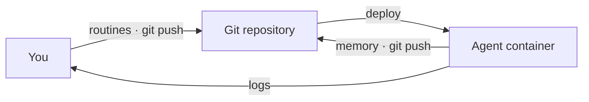

# OpenRoutines

[](https://github.com/steadyspacecorp/openroutines/actions/workflows/ci.yml)

The framework for running simple, secure, and durable autonomous AI agents.

Plenty of tools will run a prompt on a schedule. OpenRoutines runs a *job*: a product management agent that gathers research into themes and catches docs drifting from what shipped, an IT ops agent that triages tickets and monitors licenses. One job description, a handful of routines, and a way to report intentions and progress to the team -- a teammate, running unattended.

Scaffold one in minutes, test it locally, deploy it with a push -- then maintain it like any other software you ship.

## 📦 The repo is the agent

Everything your agent is -- routines, skills, memory, encrypted credentials -- lives in one git repository that deploys as one Docker container. Not agents-as-a-service: the repo *as* the agent, shipped like the rest of your software.

- **Routines are markdown files** -- frontmatter declares the scope, the body is the prompt
- **Deploys anywhere a container runs** -- a VPS, Fly, Render, your homelab
- **No database, no queue, no secrets platform** -- a git origin is the only prerequisite
- **Bring your own models** -- any provider opencode supports, chosen per routine, gateways included
- **No fleets** -- one agent holds one job; two jobs means two agents
- **No chat gateway** -- work on it locally with the coding agent of your choice

→ [Getting started](docs/getting-started.md) · [Operating in production](docs/operating.md)

## 🤝 A teammate, not a black box

Teamwork primitives come built in: recording work, owning tasks, stating intentions, surfacing blockers. You focus on the routines that do the work -- the teamwork mostly takes care of itself.

- **Structured memory, not chat history** -- one rule routes every record: events (it happened), tasks (someone must do it), context (worth remembering)
- **It lives on a git branch** -- backed up on every push, surviving every redeploy
- **Report where you want, how you want** -- any routine can consume what the agent recorded and report it anywhere: Steady, Slack, a log line
- **Everything is reviewable** -- read it with `git log`, prune it with a commit

→ [Your agent on the team](docs/teamwork.md)

## 🔒 Safe to run unattended

Built for the question every team asks first: can we trust this thing with our credentials?

- **Credentials are encrypted in the repo** -- granted per routine, scrubbed from logs
- **Short-lived tokens when you want them** -- give a credential a type, and a stored root secret (a GitHub App key, an OAuth client) becomes a fresh, expiring token for each run
- **Runs are sandboxed** -- a routine sees only what its frontmatter declares
- **Zero ingress** -- the shipped container listens on no ports
- **Failure is survivable by design** -- missed schedules run late instead of never; repeated failures cool down instead of looping

→ [The security model](SECURITY.md)

## How it works

`openroutines scaffold` generates the agent: a git repository holding configuration, skills, structured memory, encrypted credentials, and routines as markdown files. [opencode](https://opencode.ai) talks to the AI models you choose, and the whole thing deploys as a Docker container.

The heart of the agent is its routines. Frontmatter scopes the schedule, skills, credentials, model, and optionally the reasoning effort. The body is the prompt.

```markdown
---
schedule: "0 9 * * 1"
timeout: 15m
active: true
skills:
  - steady-updates
credentials:
  - steady_token
  - github_token
model: anthropic/claude-sonnet-5
---
Check that our product documentation hasn't drifted from what we've actually shipped. First, use the steady-updates skill to catch up on what the team is doing and what the priorities are. Then compare the docs against what has shipped since your last run -- your memory has where you left off. Record anything that's now wrong or missing in memory, and print a short drift report; it goes to the container logs.
```

You work on an OpenRoutines agent (ORA) like any software project: build and test locally, deploy with git and Docker, wire up standard CI/CD if your origin is GitHub, GitLab, or the like. The memory the agent builds as it works travels through git too, on its own branch.



Every part of this design is deliberate. [docs/design.md](docs/design.md) records each decision and the reasoning behind it.

## Quick start

You need git, Docker, and an API key for at least one model provider. Install the CLI (from [Releases](../../releases) while the repo is private; `brew install openroutines` once public), then:

```bash
openroutines scaffold my-agent
cd my-agent
openroutines configure
openroutines routines new doc-drift    # edit the file, then:
openroutines routines run doc-drift    # runs locally in the production container
```

The full walkthrough -- install, configuration, models, your first routine -- is in [Getting started](docs/getting-started.md).

## Why we built this

We built OpenRoutines to run our own operations at [Steady](https://www.runsteady.com). The existing options were all too much or too little: routines locked to one vendor's harness and a single user, personal-assistant frameworks pressed into server duty, whole multi-agent platforms when we wanted one agent with one job. Both extremes carry the same security, durability, and trust problems.

What we wanted was simple: set up and test an agent locally in a few minutes -- skills, routines, credentials, and the model of our choice -- deploy it with a push, and maintain it like any other git-versioned project. Then rinse and repeat for the next agent.

Well, now you can.

## Documentation

| Page | What's there |
|------|--------------|
| [Getting started](docs/getting-started.md) | Install the CLI, scaffold an agent, pick models, run your first routine |
| [Creating routines](docs/routines.md) | The frontmatter reference, schedules, triggers, testing |
| [Extending your agent](docs/extending.md) | Skills, plugins, credentials, variables |
| [Your agent on the team](docs/teamwork.md) | Check-ins, reporting, and the memory primitives behind them |
| [Operating in production](docs/operating.md) | Deploying, CI/CD, updating the framework, rollback |
| [CLI reference](docs/cli.md) | Every command |
| [Features](docs/features.md) | What OpenRoutines does and why, at a glance |
| [Design](docs/design.md) | Every decision and the reasoning behind it |
| [SECURITY.md](SECURITY.md) | Security model, properties, known limitations, reporting |

## License and contributing

OpenRoutines is [MIT licensed](LICENSE). Agents you scaffold with it are yours -- the license places no claim on your routines, skills, or memory.

Contributions are welcome -- see [CONTRIBUTING.md](CONTRIBUTING.md). This is an opinionated framework, and the opinions are documented in [docs/design.md](docs/design.md); argue with the reasoning, not just the behavior. Security reports: [SECURITY.md](SECURITY.md).
