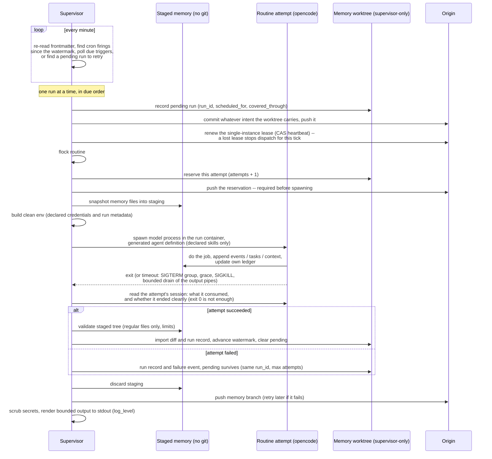

# Design

The decisions behind OpenRoutines, and why we made them. The [README](../README.md) says what the framework does; this document says why it works the way it does.

## One agent, one job description, one runtime

**Decision.** An OpenRoutines agent (ORA) is a single agent with a single mandate, defined in `openroutines.yml`. Its name and description are standing context, not repository metadata: the runtime injects both into every run before the routine-specific instructions. The description states the durable mandate; routine bodies define the individual recurring ways the agent carries it out. There is no fleet management, no orchestration graph, no agent-to-agent protocol.

**Why.** Most of the complexity -- and most of the failure modes -- in agent frameworks comes from coordination between agents. A single agent with a clear job description is easy to reason about, easy to secure, and easy to hold accountable: "what did it do?" is one log and one memory. If you need two jobs done, deploy two agents. It also makes the security model tractable: exactly one runtime means exactly one writer to memory, one credential set, one blast radius.

## The repository is the agent

**Decision.** Everything the agent is -- configuration, routines, skills, structured memory, encrypted credentials -- lives in one git repository. `openroutines scaffold` stamps out a new agent repo from the template embedded in the CLI binary (`template/` in this repo is its source, compiled in via Go's `embed`). The reviewed repository is trusted source code: whoever can change its routines, skills, configuration, or image can change the agent's behavior and authority. The security boundary isolates model-directed execution and external content from supervisor authority; it does not isolate an agent from its own source code or administrators. [SECURITY.md](../SECURITY.md) defines that threat model precisely.

The framework's configuration file is `openroutines.yml`, named for the system that reads it -- the same rule that keeps `opencode.json` the harness's file -- and spelled `.yml` like `credentials.yml.enc` beside it (#50). The earlier spellings `openroutines.yaml` and the original `agent.yaml` are still read, so a pinned agent migrates when its operator chooses; `check` nudges the rename, and `Save` writes back to whichever name the repository actually has.

**Why.** Agents-as-platform-accounts hold your agent's identity and memory hostage. Agents-as-repos get the entire mature software lifecycle for free: versioning, review, rollback, CI/CD, forking, diffing. Switching deployment platforms is `git push` and `docker run`. Changing your agent's behavior is a reviewable diff, not a click in someone's dashboard.

## Routines are markdown files

**Decision.** Each routine is one markdown file: agent-owned routines live in `routines/`, and plugin-owned routines remain grouped in `plugins/<plugin>/routines/`. Frontmatter declares the scope -- `schedule`, `trigger` (an event-driven wake-up; see Triggers below), `timeout`, `active`, `skills`, `credentials`, `webfetch`, `websearch`, `mcp`, `model`, `effort` (provider-specific reasoning effort, passed to opencode as `--variant`), `events`, `consumes` -- and the body is the prompt. Every field is optional except that at least one of `schedule` and `trigger` must be present: `active` defaults to true, `model` and `timeout` fall back to the `openroutines.yml` defaults, and `skills`, `credentials`, and web access (`webfetch`, `websearch`) default to nothing -- no grants. Deactivating a routine is therefore always an explicit `active: false`, visible in the diff. **The filename is the routine's globally unique identity** -- its containing plugin is provenance, not a namespace; scheduling state, ledgers, and run records all key on the filename. The consequence is documented rather than engineered around: renaming a routine is retiring one routine and starting another (fresh watermark, orphaned state for the old name). We tried a generated frontmatter `id` for rename-safety and removed it: one more field in every file wasn't worth insuring an occasional, understandable event.

**Why.** Prompts are the program; they belong in files, under version control, in a format both humans and models read natively. Frontmatter makes every grant explicit and greppable: what a routine can touch is declared at the top of the file that defines it, not assembled at runtime. Agent-level defaults live in `openroutines.yml`; frontmatter overrides them.

## A broken routine is one broken routine

**Decision.** A routine that does not load -- unknown frontmatter key, unterminated frontmatter, a filename two files claim -- is absent, and nothing more. The tick schedules the rest; a healthy routine's run assembles its workspace without it. Load errors are therefore attributed to the routine they concern (`routine.Error`, carrying the name and the file), and three rules follow from attribution. A name any load error is about is **dropped from the loaded set**, so what the scheduler sees is only what a run could actually assemble a workspace around -- the filename is the identity, so a file that will not parse still claims its name, and a name two files claim is ambiguous even when one of them is the broken one. The routine actually being run is the one place attribution is used to *fail*: its own unparseable file, or a name it is party to a collision on, fails the attempt with the real error, and lookups of that name report the parse failure rather than "no routine" (`routine.ErrNotFound` is reserved for a name nothing claims, so `routines new` refuses to write over a file it could not read). And absence is **recorded, not just logged**: the supervisor writes an event when a routine stops loading and another when it loads again.

**Why.** The blast radius of a typo should be the file it is in. Failing every run on any parse error is not fail-closed, it is fail-everywhere: the broken routine is already excluded from scheduling, so all the extra strictness buys is that the *healthy* routines mint pending runs, push their intent commits, and then fail at workspace assembly -- five attempts each, abandonment tasks across the board, circuit breakers tripped, and an operator reading `<healthy-routine>: <run_id> failed to start: <other-file>: frontmatter: ...`. Dropping the name is the same cascade seen from the other side: a routine the tick will mint, push, and dispatch, only for the runner to refuse the workspace, is worse than one that never ran -- so the two must agree, and the loaded set is where they agree. The transitions are events rather than human-owned tasks because a broken file heals by being edited and the next tick notices; there is nothing for a person to close. And the one error class that genuinely concerns everyone -- a directory that would not read, which could be hiding any routine -- is unattributed: it still fails every attempt, which is loud on its own. The exception to all of this is `plugin add`/`update`, which refuses to install against any load error at all: it is checking a name against the whole namespace, and a namespace with a hole in it is not a namespace.

## Scheduling: a tick loop with catch-up, not cron

**Decision.** A supervisor process in the container wakes every minute, re-reads routine frontmatter, and dispatches whatever is due. Scheduling state is durable and per-routine (keyed by the routine's filename): a **watermark** -- the latest cron occurrence fully accounted for -- plus at most one **pending run**.

Each tick, per routine: if a pending run exists, retry it -- same `run_id`, new attempt. Otherwise, find cron occurrences in `(watermark, now]`; if any exist, create a logical run with a fresh `run_id`, `scheduled_for` (earliest missed occurrence), and `covered_through` (latest -- multiple missed firings collapse into one catch-up run; an agent down for a week owes one run per routine, not seven). **The pending record is committed and pushed before the routine executes: a logical run exists durably before it is allowed to act.** The attempt is part of that record, not a consequence of it: immediately before it spawns anything, the executor *reserves* the attempt -- count incremented, time stamped -- and commits and pushes that reservation, so **no model process starts unless the attempt that spawned it is committed and pushed**. The reservation belongs to the attempt, not to the tick that scheduled it: a run still queued behind another has spent nothing, so one routine that keeps killing its container cannot drain the budget of everything else that happened to be due alongside it. A reservation that never becomes a run (shutdown interrupts the attempt, the intent commit fails) is given back. On success, the watermark advances to `covered_through` and pending clears. On failure -- crash, timeout, shutdown -- pending survives, and the same logical run retries on a later tick under the same `run_id` with a new attempt id. After a bounded number of failed attempts (default 5), the supervisor abandons the run: human-owned task recorded, watermark advanced, pending cleared -- an unattended agent must not burn model spend retrying forever. Abandonment happens at settlement when an attempt fails and reports back, at intent time when the budget is spent and nothing ever settled -- the shape a routine leaves behind when it keeps taking its container down with it -- and immediately when the failure is one **no retry can fix**. The runner classifies that last case (an unreachable consumer cursor is the first of them): it assembles the run and so knows why it could not, while the supervisor only asks whether the error it was handed is one of those and abandons on the first attempt. Five identical failures before the workspace even exists cost spend and delay and tell a person nothing the first one didn't. The bar for that classification is deliberately narrow -- the next attempt has to be *provably* the same, not merely likely to fail again -- because the alternative reading turns every stumble the environment causes into a run nobody will ever retry. If origin is unreachable, no *new* logical run starts (an identity that isn't durable is how duplicates happen); the supervisor records the condition as a human-owned task and waits, and catch-up absorbs the pause. That record is written locally while the outage lasts and published when origin returns -- see "Alerting degrades to durability when the datastore breaks".

Abandonment has a second tier: a **circuit breaker** per routine. Per-run abandonment caps one logical run at five attempts, but the schedule keeps minting new runs, so a routine failing *persistently* (dead model, revoked credential) would otherwise grind attempts -- and spend -- indefinitely. After three consecutive abandonments, the routine enters a cool-down: no new logical runs until it elapses (one hour, doubling per further abandonment, capped at 24h), with an event recorded at each trip. Any successful run resets the breaker. The watermark mechanics make recovery natural: firings missed during cool-down collapse into one catch-up run when it ends. (Found by the first production soak: an eight-hour model outage produced sixteen abandoned runs of continuous retry grind.)

`openroutines status` is the reporting surface for all of this, and it is held to reporting only what a tick will actually do. The predicate for whether a routine is scheduled at all is shared with the scan (`supervisor.Schedulable`) rather than restated; a routine in cool-down is given no next-fire time; and a pending run is labelled with what becomes of it -- backing off, in flight, due, budget spent, or held -- instead of an unconditional next-attempt time. Where the state file is genuinely ambiguous, status resolves it against the run record and takes the conservative reading when it cannot: a reserved attempt and a failed one leave the state file identical, so a run is only reported in flight when `runs.jsonl` lacks the settlement record that would have ended it, and never on the strength of a log that is missing entirely.

Every attempt runs with framework metadata in its environment: `OPENROUTINES_RUN_ID` (stable across attempts -- the idempotency key), `OPENROUTINES_ATTEMPT_ID` (diagnostics only), `OPENROUTINES_SCHEDULED_FOR`, and `OPENROUTINES_COVERED_THROUGH`.

Cron is evaluated in the agent's timezone (`timezone:` in `openroutines.yml`) -- never in the container's local zone, and never in whatever zone a persisted timestamp happens to carry. A fire time is a wall-clock promise: `0 6 * * *` for an `America/New_York` agent means 06:00 in New York on both sides of a DST transition. Mechanically, the schedule package owns the binding -- a cron expression is parsed *into* a location, and every scan normalizes its inputs into that location before asking for a firing -- so no caller can supply an unbound spec. That matters because the timestamps the scheduler scans from are persisted ones: a watermark round-trips through the state file as a fixed UTC offset (Go fabricates a zone on unmarshal whenever the offset isn't the local zone's), and an unbound cron spec is evaluated in its argument's zone. Unbound, an agent's schedule would freeze at the offset in force when its state was last written and drift an hour at the next transition, permanently, since the watermark it then writes carries the same frozen zone. The same binding computes the forward schedule injected into runs and the next-fire line in `status`, so what a routine is told and what the supervisor dispatches cannot disagree.

**Why.** Re-reading frontmatter every tick means there is no registration or compilation step anywhere -- the files are the schedule. (In production the files change only via redeploy, since they're baked into the image; the payoff of re-reading is that the supervisor carries zero derived state to invalidate, and local runs pick up edits instantly.) Catch-up semantics mean a routine whose moment passes during a redeploy or downtime fires late instead of never; for an unattended agent, "late" is recoverable and "silently skipped" is not. The consequence is **at-least-once** execution -- and at-least-once applies to *external side effects* too: discarding a failed attempt's memory writes does not unsend an email or un-open a PR.

Persist-before-act is what makes the run ID an idempotency key worth having. Without it, a container can act, crash before recording anything, restart with no knowledge of the old run, and repeat the action under a fresh identity -- the exact duplicate the key was meant to prevent. With the pending record pushed first, every retry carries the same `run_id`; routines that act on the world should use it (send it as an idempotency key where the API accepts one, or stamp it into created objects and search before acting) and record completed external actions in their ledger. Be precise about the guarantee: the run ID makes deduplication *possible*, not automatic -- an external API with no idempotency support can still see a duplicate in the window between acting and recording.

The reporting rule is there because the failure mode is specific and shipped twice: a routine four attempts into a retry, sitting out a 24h cool-down, or still holding a pending run after being deactivated, rendered exactly like a healthy one -- with a confident next time it would not honour. That is worse than saying nothing, because an operator who cannot see that a routine is held has no reason to look, and the routine stays silent for as long as the hold lasts. Sharing the schedulability predicate with the scan is what stops the two drifting apart a third time: a surface that re-derives "will this run" is a surface that will eventually be wrong, and being wrong in the reassuring direction is the whole problem.

Attempt accounting has to be durable for the same reason the identity does, and the argument is sharper: the failure a bounded retry budget exists to stop is exactly the one where the supervisor cannot narrate what went wrong. Counting an attempt only once it comes back means a routine that reliably kills its container (OOM, host loss, platform eviction -- production recovery is container *replacement*) is never observed to have attempted anything at all; the replacement materializes memory from origin, reads `attempts: 0`, and dispatches again, indefinitely. `MaxAttempts`, abandonment, and the circuit breaker would all be unreachable for the one failure mode they most need to bound. Reserving before dispatch inverts the error: a lost container costs one attempt from the budget instead of none, and the budget drains as designed. Giving back reservations that never became runs preserves the property the old ordering did get right -- a rolling deploy must not spend a run's retries.

Reserving *per attempt* rather than per tick is the other half of that argument, and it costs one small commit per dispatch to get. A tick can have several routines due at once -- catch-up after downtime makes that the common case, since every routine mints its collapsed run in the same pass -- and runs execute serially. Reserving the whole batch up front would mean a container lost during the first run charges an attempt to every routine still queued behind it, and five such losses would abandon routines that had never run at all, on the evidence of attempts they never made. The reservation therefore belongs to the executor, taken after the routine lock and immediately before the spawn.

Persist-before-act is likewise a property of the data, not of control flow. The intent writes -- pending record and attempt reservation -- are ordinary files in the memory worktree, so a commit takes whatever the worktree carries rather than only what this pass changed. The failure that motivates it: a tick writes state, its commit fails, and the next tick sees a pending run, mints nothing, and dispatches under an identity that exists only on this container's disk. Nothing in the control flow can tell that state apart from a clean tick's, but the dirty worktree can. Committing it costs nothing on the normal path, where the tree is clean and the commit no-ops. A commit that *fails* halts dispatch and is recorded as a human-owned task, the same as an unreachable origin: a supervisor that cannot record what it is about to do must not do it, and an agent that has quietly stopped running anything should not be discoverable only by tailing container logs.

## Triggers: outbound wake-ups, not ingress and not deliveries

**Decision.** A routine can declare a `trigger` alongside or instead of its `schedule`: a cheap, outbound change-detection poll that makes the routine due. `poll` names the URL; an optional `credential` must also appear in the routine's `credentials` and authenticates the request as a bearer. A raw credential is sent verbatim. A typed credential is derived fresh for each poll by the trusted supervisor, only the type's explicit bearer material is sent, and cleanup runs immediately after the request (including revoking a GitHub App installation token); the stored root secret never becomes an HTTP header. An optional `select` extracts one value from a JSON response by RFC 6901 pointer; `interval` sets the poll cadence (default 5m, floor one tick). A trigger carries no payload: when it fires, the routine runs exactly as it would from a schedule firing and pulls its actual work through its own skills. The guarantee, stated plainly: **triggers are best-effort latency reduction; the schedule remains the correctness backstop** (`check` warns on a trigger-only routine with no heartbeat schedule).

Change detection needs two declarative mechanisms and no more. Conditional GET -- the supervisor stores and replays `ETag`/`Last-Modified`; a 304 means no news -- covers services that support the web's own change-detection protocol (GitHub's notifications API is the canonical case). `select` covers the rest: nearly every API has a "latest item" query whose full response isn't byte-stable but contains one monotonic value (Slack's `conversations.history?limit=1` → `/messages/0/ts`; a Steady cursor endpoint). Without `select`, the raw body is reduced to a digest and compared. A JSON pointer is deliberately the ceiling of the power level: a static path, not a query language -- no predicates, no code execution. The framework never learns any service's schema; service-specific knowledge stays in skills, inside the sandbox. Webhook-only services with no pollable read surface are out of scope by design -- the answer there is a user-owned bridge (anything that can flip a byte at a pollable URL), never webhook ingestion in the framework.

Mechanically, triggers reuse the run machinery whole. The tick evaluates a routine's trigger only when no cron firing is due and the interval has elapsed; on change it mints a logical run through the existing pipeline -- pending record, persist-before-act intent commit (which also carries the newly observed value), retries under the same run id, abandonment, the circuit breaker, coalescing. Durable trigger state (`state/triggers/<routine>.json`: last value plus conditional-request validators) lives with the rest of supervisor-owned scheduling state; the last-poll clock is supervisor memory only, since persisting it would dirty the memory worktree on every poll. The first observation establishes a baseline and never fires -- a new trigger starts at the present, mirroring how a new consumer starts at the current commit. When a cron firing mints a run for a routine that also declares a trigger, the baseline refreshes so the same news doesn't fire a second, redundant run.

One `interval` governs polls, fires, and reply latency alike -- a poll is the only fire opportunity, so a single knob bounds request rate (courtesy to the polled service), model spend (a flapping or malicious endpoint fires at most once per interval), and responsiveness. An earlier draft split the last concern into a separate `cooldown`; it was redundant and produced inconsistent reply latency -- an agent that answers within a minute once and within five the next reads as broken, where "replies within N" is a contract someone can feel.

**Why.** Scheduled-only routines cap responsiveness: an inbox-style routine must either poll on a tight schedule (a model run per interval to mostly find nothing) or accept the interval as reply latency -- our own dogfooding paid ~96 runs a day for 15-minute replies. The trap in fixing that is letting the trigger become a message channel: payloads, signatures, ordering, replay. Defining it as a bare wake-up dissolves all of it -- a spurious fire is harmless (the routine finds nothing and exits), a missed fire is covered by the heartbeat, and no external payload can ever cross into model context via the trigger path, because there is no payload. Correctness continues to rest on the routine's own pull and ledger; the trigger only buys latency.

The genuinely new surface is that the supervisor makes an outbound call with a routine's credential -- the one place it uses one itself. It is bounded the way the rest of the design bounds things: the URL is a frontmatter grant (versioned, reviewed, greppable, no dynamic destinations), the request is a bare stdlib GET (no shell, no redirects, short timeout, capped reads), and the response is never logged raw, never interpreted beyond the bounded parse-and-extract, never shown to the model -- an opaque value, compared and stored. Typed derivation does not widen that surface: the same built-in provider code used for runs mints a bearer for one poll, identifies which derived value is safe for bearer authentication, and disposes of it before returning to the tick; generic supervisor code never selects an arbitrary injected environment value and never sends the stored root. There is no injection surface because there is no interpretation.

A **webhook receiver** was rejected -- not because receivers can't be secured, but on cost accounting. Webhooks are lossy by contract (senders retry on a budget and give up; Slack disables endpoints that fail repeatedly), and an ORA is deliberately allowed to be down -- so polling reconciliation is required anyway and the receiver is only a latency layer on top. That layer's sole purchase, sub-minute latency, doesn't cover its costs: an HTTP listener, TLS stack, and per-service signature schemes inside the process that holds the master and deploy keys; a standing untrusted payload one step from model context; and deployment prerequisites (public ingress, DNS, certificates) that break "runs anywhere a container runs" -- half our targets are NAT'd. Zero ingress is also an asset in itself: "the container listens on nothing" is a one-sentence trust story. When latency pressure genuinely arrives, the escape hatch is an **outbound stream** (`trigger: {stream: ...}`, SSE), not a port: push latency, zero ingress. It stays deferred because a tuned-down interval already covers agent-reply latency, SSE-native services are rare, and the tempting cases (Slack Socket Mode) would put proprietary protocol knowledge in the trusted binary -- if ever built, it is generic SSE only, with proprietary streams bridged outside the framework. Nothing shipped forecloses it: `trigger` taking `poll` today and `stream` someday is why it's a sub-key, and a service's poll cursor doubles as the stream's resume token.

## Overlap: kernel locks, skip-don't-queue

**Decision.** Runs are serial across routines: the tick loop marks routines due; a single executor runs them one at a time, in due order -- there is no thread pool. A routine with an attempt in flight or a pending run awaiting retry is never dispatched again in parallel -- later firings collapse into `covered_through`, per the scheduling rule above. Before spawning, the executor takes a non-blocking `flock` on a per-routine lock file; a held lock means skip and log.

**Why.** Hand-rolled lock files go stale when a process dies uncleanly, silently deadlocking the routine forever -- the worst failure mode for unattended software. `flock` locks are released by the kernel when the holder dies, however it dies; staleness is structurally impossible. Skipping (rather than queueing) keeps semantics simple: a routine that is still running *is* the current run. Serial execution extends the single-writer principle from the memory branch down to individual files: the shared memory primitives are append-only, and one-run-at-a-time makes races on them impossible by construction rather than managed. Scheduled work at minute granularity has no real need for parallelism, and catch-up semantics absorb any queuing delay a slow routine causes. The `flock` remains necessary even so -- it protects against a manual `openroutines routines run` colliding with the supervisor's own run.

## Timeouts kill the process group

**Decision.** Every run has a timeout (`openroutines.yml` default, frontmatter override). On expiry the supervisor signals the routine's entire process group -- SIGTERM, a grace period, then SIGKILL -- and records the outcome. Timeouts have a ceiling, and the ceiling belongs to the operator: `max_timeout` in `openroutines.yml`, 6 hours when unset. The ceiling is applied where attempts read the timeout, so a larger declared value is silently capped rather than honoured; `openroutines check` warns above it so the capping is visible before deploy rather than as a routine mysteriously killed in production.

A run that ends *well* gets the same treatment, minus the grace period: when the model process exits on its own, the supervisor signals the group before the pipeline reads staged memory. (Under `docker run --rm` locally the run's pid namespace already dies with the container; the kill is what production, where the model process is a child of the supervisor in the supervisor's own container, does not otherwise get.)

**Why.** A routine run spawns children (tools, shells); signalling only the direct child leaks grandchildren. Recording outcomes (`completed` / `timeout` / `crashed`, duration) into memory gives run history that survives redeploys and reads as a git log. The ceiling used to be a correctness bound -- 15 minutes, half the lease TTL, because the lease was only heartbeated between runs -- and that coupling is gone: the lease is renewed *during* runs (see "The lease is renewed per run, not per tick"), so the ceiling's remaining job is protecting the operator's wallet from a run that never ends. A spend guard belongs in user space, defaulted rather than hardcoded: nobody shopping for an agent runner expects a system that cannot run longer than 15 minutes, but everybody appreciates not discovering a 48-hour run on an invoice. It is still enforced where attempts read the timeout and not merely advised, because a warning is only as good as the operator's habit of running `check`, and a spend property should not rest on a habit. Reaping on a clean exit is not tidiness: a descendant that redirected its stdio outlives the process the supervisor waited on, and it can still write to staged memory during the window where the supervisor validates that memory and imports it. "The attempt is over" should mean nothing from that attempt is still running -- otherwise the tree being imported has an author nobody accounted for. It is one of two defences and not the argument: a descendant that leaves the process group altogether survives every signal the supervisor can aim, which is why "Every wait is bounded" bounds that case by abandoning the pipe rather than by killing the writer. So the import re-checks staging at open time and holds whether or not the reap caught everything (see "Memory syncs per run").

## Every wait is bounded

**Decision.** No wait the supervisor makes is open-ended, and every deadline ends with the process it is waiting on gone rather than with the supervisor walking away from it. Git invocations carry a two-minute deadline, and on expiry the whole git process group is signalled the way a run's is -- SIGTERM, a short grace, SIGKILL -- because git does the network through children (ssh, git-remote-https), so killing git alone would leave the stalled transport holding the pipe the supervisor is reading, and because git removes the lock files it holds on SIGTERM and cannot on SIGKILL. Underneath that backstop sit the transport's own bounds: `http.lowSpeedLimit` / `http.lowSpeedTime` on the HTTP side, `ConnectTimeout` and server keepalives on the SSH side, which abandon a transfer that goes quiet for about a minute and produce a real git error. A timed-out invocation is an ordinary git failure to everything above it: the tick reports the origin unreachable and carries on. The run side is bounded the same way -- after a run's process group is signalled and killed, the supervisor stops draining the run's output pipes five seconds later rather than waiting for EOF, and reaps what can be reaped. Local runs, where the model process is a container rather than a sandboxed child, get the equivalent: the `docker stop` call is itself bounded, and a client that does not follow its container out is killed.

**Why.** A blackholed origin -- a partition that drops packets rather than refusing them -- is the routine cloud failure, and it defeats every bound that depends on bytes moving: the connect never completes, so the no-progress watchdogs never arm, and the wait lasts as long as the TCP stack's retry schedule. That is minutes at best. A tick makes several network calls, and one unbounded call parks the entire loop silently: no runs, no failure, nothing in the logs, and a lease going stale underneath a supervisor that is very much alive -- which is exactly the state that invites a second instance to take over. The pipe drain is the same failure in a different guise: `Wait` cannot return while *anything* holds the inherited stdout, so a tool that daemonized into its own session survives the process-group kill and hangs the supervisor permanently on a run it has already terminated. Bounding it costs the tail of that run's log and leaves an orphan the group kill could not reach -- both recoverable, neither worth an agent that stops working. Two minutes is generous for git against a healthy origin (memory branches are small text files) and far below the 30-minute lease TTL; five seconds is long enough for a real flush and short enough to be invisible. What a deadline may *not* do is abandon a wait while the process is still writing: the run's log tail is read after the wait returns, so the bound has to come from ending the process, not from giving up on it. And a bound that fires is not automatically a clean outcome -- a git invocation whose output was truncated stays a failure, because the callers parse that output and half a SHA is worse than an error. The deadline is per invocation, not per tick, and deliberately so: a tick against a blackholed origin pays it once per network call (sync, lease read, lease write, the pushes a dispatch makes), so ticks fall behind while the partition lasts. That is the accepted cost -- the schedule is durable and catches up, staleness stays inside the lease TTL, and a per-tick budget would mean deciding mid-tick to skip work the at-least-once guarantee has already promised.

## Execution: headless opencode, fresh session per run

**Decision.** Routines execute via `opencode run` -- headless, model from frontmatter, a fresh session every run. `routines run` is always the real thing: the routine receives its declared credentials and tools and may act on external systems. `--no-memory` changes only settlement -- the staged memory writes and run record are discarded -- so it is useful when exercising an acting path against a scratch target without preserving the result, but it is not a dry run or a safety boundary. `check` is the non-acting validation path. There is no separate `routines test`: withholding credentials and acting tools rehearsed precisely the path least likely to fail in production and gave stronger assurance than it earned. Session continuation is never used. Permissions are layered: a committed `opencode.json` provides the baseline policy (skills denied outright, the question tool off, the session-title agent disabled), and the generated per-routine agent definitions (see "Skills are Agent Skills") write explicit rules for everything frontmatter governs -- skills, web access, MCP -- with per-agent rules overriding the baseline, and nothing using blanket auto-approval. Built-in tools, bash included, stay available to runs: the hard security boundary is credentials and the sandbox, not tool availability. Web access is part of that layering: opencode ships with webfetch allowed, so the generated definition writes an explicit rule for both web tools every run -- deny unless the routine's frontmatter opts in with `webfetch: true` / `websearch: true`. Fetched content is model context, which makes web access a prompt-injection vector -- a grant to review like a skill or credential, never a default. Opting into websearch also enables opencode's search backend for that run (Exa: keyless by default, keyed when an `exa_api_key` credential is granted). The committed baseline also disables opencode's built-in session-title agent: headless runs have no one to read a title, and generating one replays the routine's entire prompt through the model once per run.

Every attempt also **records what it consumed**. After the model process exits, the runner asks opencode for the attempt's session (`session list --format json`, then `export` -- messages live in opencode's database from 1.18 on; older pins fall back to the on-disk message files) and sums its assistant messages -- the attempt home holds exactly one session by construction, and messages persist incrementally, so a timeout still accounts for what was spent and folds `model`, `effort`, and a `tokens` object -- input, output, reasoning, cache read/write -- into the attempt's `runs.jsonl` record, alongside opencode's own cost estimate as an informational `cost_reported`. Tokens with the model and effort are the durable record; dollars derive at read time, because prices drift and recorded ones go stale. Per attempt, not per run: spend happens per attempt, and a run-level figure would double-count retries. Absence means the runtime didn't report -- never zero -- and bookkeeping never fails a run. `openroutines usage` aggregates the window per routine (`--json` for scripts and monitors; status shows the one-line total); local container runs point the container's HOME at the same disposable attempt home, which both matches production hygiene and keeps the capture surface readable after `--rm`.

**The capture step itself runs with an empty home.** It is an ordinary child of the supervisor, not the model process behind the sandbox shim, so its `HOME` must not be the attempt's own home: opencode auto-loads plugins from its config dir at startup, and that dir resolves under `HOME` when `XDG_CONFIG_HOME` is unset -- which would hand a prompt-injected routine code execution on the trusted side, in the process holding the master and deploy keys. This is verified rather than assumed (opencode 1.18.3, the pinned version): a plugin planted in `$HOME/.config/opencode/plugin` executed under both `session list` and `export`, and setting `XDG_CONFIG_HOME` to a clean directory shut the channel. Each capture exec therefore gets a fresh, supervisor-owned empty directory as `HOME` with `XDG_CONFIG_HOME` under it -- removed when the exec returns, and a `tmpfs` at `/capture-home` rather than a bind mount in the local-container variant, which keeps it outside `/work`, empty by construction, and needs no world-writable host directory for the image's agent uid. It reaches the attempt's session store through `XDG_DATA_HOME` alone: that path carries the attempt's data, never its code -- also measured, since it is what makes leaving `XDG_DATA_HOME` on an attempt-writable path safe. The same plugin under `$XDG_DATA_HOME/opencode/plugin` did not execute, and the session database (`opencode.db`) follows `XDG_DATA_HOME`, so detaching `HOME` does not orphan the store. The home is minted in `TMPDIR`, so capture **fails closed** if that ever resolves inside the workspace -- no exec at all, rather than one with a home the attempt could write.

The working directory stays the run workspace, because opencode scopes sessions to the directory they ran in. opencode also auto-loads `.opencode/plugin` from that directory and its ancestors, and mounting the workspace read-only would not help -- loading needs only that the file exist. In production this is closed by the sandbox rules: the workspace root is outside the model process's writable set, so a routine cannot plant one. Locally it is not closed, because bind-mounted workspace roots are writable by the container's uid: a prompt-injected routine can plant `/work/.opencode/plugin`, and the capture container will load it. That residual is accepted at the level local runs are already pitched at -- the code executes in a discarded container with a secret-free environment and the workspace access the routine already had, not in the supervisor -- and it is the local topology's version of the boundary, not an exception to it. Routing capture through the Landlock shim instead was considered and rejected: it would bound the blast radius of attacker code rather than keep it from running, covers only the production spawn path, and hangs sandbox rules on a bookkeeping step that must never fail a run.

One cost follows from the cold home, and it lands on **opencode plugins** -- opencode's own JavaScript extension mechanism, the `plugin` array in `opencode.json`, which has nothing to do with an OpenRoutines plugin (`plugins/<name>/`, the unit `openroutines plugin add` installs). To resolve a plugin's imports opencode installs `node_modules` into its config dir, so an agent declaring one in `opencode.json` pays that install on every capture exec instead of reusing the attempt's warmed home. Measured for a single dependency-free plugin: ~55MB of installed payload (3645 files) under `$XDG_CONFIG_HOME/opencode/node_modules`, in a transient home footprint of ~148MB once npm's own cache copy of the same packages is counted, and about four seconds against the 30s capture timeout. An agent declaring no opencode plugin does no install and costs well under a second. The failure mode stays benign -- a capture that times out records no usage and does not fail the run -- and pre-baking a warm capture config home into the runtime image is the fix if it ever bites: a populated `node_modules` makes the install a no-op even read-only, but the gate is that directory's existence alone (a stale one from a different opencode version is used silently), so any bake belongs in the layer that pins `OPENCODE_VERSION`.

The run workspace excludes the repo's `AGENTS.md` (and `CLAUDE.md`): opencode loads a project-root rules file into any session's context, and that file is written for a different audience -- humans' coding agents in development sessions. A routine's instructions come only from the generated definition and its own body, so runtime behavior never silently depends on dev-session guidance. The runtime-critical rules that once lived in both places (full facts with real links, no secrets in memory) are injected by the standing instruction.

**Why.** opencode already does the hard part -- the agentic loop, tool use, model wrangling -- and ships as a self-contained binary. Fresh sessions keep all continuity in the repo's memory directory: if it's not in the repo, the agent doesn't know it. That's what makes memory portable, inspectable, and git-backed rather than state held hostage in a session store. A committed permission policy means the agent's tool surface is reviewed like code.

## A run is completed only when its session ended cleanly

**Decision.** The model process's exit code does not decide the outcome by itself. After the process exits, the same session read that captures usage also reads how the session ended, and an attempt that exited 0 on a session that did not finish is recorded as `crashed` with the reason in its run record (`hint`) and its failure event. Two things count as evidence: an assistant message carrying an `error`, and a session whose runtime reported finish reasons but never reported a finished turn -- the shape an agent loop leaves behind when it dies mid-turn on a tool call it never came back from. Evidence is required in both directions: a session record that says nothing about how it ended -- an older opencode, a field that moves -- leaves the process's own verdict standing.

**Why.** opencode exits 0 when its agent loop dies on a rejected or failed tool call (#68): a routine denied a scratch write ended its session on the error and reported `{"outcome":"completed","exit_code":0}` with no events, no tasks, and no ledger. Locally that is a confusing no-op. In production it is the failure the scheduler exists to prevent, because `completed` advances the watermark and clears the pending record -- the work is never retried, and there is a green run record on top of it. "Silently skipped" is the one outcome at-least-once may not produce, so the success signal has to be stronger than a process's exit status: an agentic runtime's exit code reports that the *harness* ran, not that the *job* did. The session record is the right surface because it is the runtime's own account of the run, it is already read for usage (one exec, not two), and it is independent of `log_level` -- classification that changed with a logging setting would disappear exactly when an operator turned up the logs to investigate.

Failing open on an unrecognized record is deliberate and is the asymmetry that makes this safe to depend on. A capture that fails open costs at most one confusing run record, the state before this decision; one that failed closed would mark *every* run crashed the day opencode renames a field -- five attempts each, a task per routine, and a whole agent abandoned on a schema change. So the framework claims a failure only on evidence and never claims a success it cannot see, which is also why the record carries the reason: a run whose outcome was decided by something other than the exit code has to say what decided it, or the next person debugging it is back to reading transcripts.

## MCP servers are grants, remote-only

**Decision.** An MCP server is defined once in `opencode.json`'s `mcp` block -- transport, URL, auth headers, interpreted by opencode alone -- and granted per routine with `mcp: [name]` frontmatter. The generated agent definition writes one rule per configured server every run (`"<name>_*"`, opencode's tool-name prefix): deny unless granted. `check` fails a grant naming an undefined server and sanctions the `mcp` key. Auth headers reference run environment (`{env:STEADY_TOKEN}`), so reachability additionally requires the matching credential grant -- the permission rule scopes the tool surface; the credential scopes the connection. Supported reality, stated plainly: remote servers with static-token or client-credentials auth work; OAuth-interactive servers have no headless path (a refresh-token credential type is the plausible future); stdio/local servers are out of scope by design -- the runtime image ships no language runtimes, and third-party code executing inside the sandbox is the wrong trade.

**Why.** MCP is how a growing share of services publish their tool surface, and a routine author shouldn't need a hand-rolled skill for a service that already ships a server. But a connected server injects third-party tool descriptions -- the canonical MCP prompt-injection vector -- into every run that can see it, so which routines see which servers must be a reviewable grant, exactly like skills, credentials, and web access. Measured against a hand-slimmed API skill on identical tasks, MCP is token-neutral on input (tool schemas cost what the skill costs) and cheaper on output (structured calls beat composing shell commands); the preference between them is call-density and taste, not efficiency -- so the framework blesses both and privileges neither.

## Memory: a dedicated directory on its own branch

**Decision.** Agent memory lives in a dedicated directory, synced to an orphan `memory` branch that the running agent -- the branch's sole writer -- pushes with a read/write deploy key. Scheduling state and run records live there too. If the branch doesn't exist at boot, the supervisor creates and pushes it -- first boot self-heals; there is no setup step. All of this presumes a git origin: deploying an ORA requires one (any git host -- GitHub, GitLab, Gitea, a bare repo on a VPS), since that's the only durable home for memory. Local development needs no origin; `openroutines check` verifies one exists before you deploy. Which protocol that origin speaks is not the operator's problem: the deploy key is an SSH credential, so a supervisor holding one rewrites an HTTPS origin to SSH on its own git invocations, leaving `.git/config` and the built image as written. Without that, the common case -- `scaffold` adds no origin and `gh` defaults to https -- deploys an agent with no usable credential for its own repository, and the container restart-loops before it supervises anything.

**Why.** The analogy is Docker's own: `main` is the image (immutable, what you deploy), the `memory` branch is the volume (mutable, survives redeploys). Keeping memory off `main` means agent commits never trigger CI/CD, never race human pushes, and never pollute the history of human intent. One agent, one runtime → one writer → pushes fast-forward in the normal case; the rare exceptions (human curation racing a run) are handled by the defensive sync rules below, never silently. Code rolls back; memory persists -- like a database. Reviewing what your agent has learned is `git log memory`. Humans may curate the branch (pruning bad learnings is part of maintaining an agent); the agent pulls before each run. By convention -- stated in the standing instruction injected into every run -- each routine keeps a ledger file named after itself (`memory/ledgers/<routine>.md`) recording what it examined and decided, and prunes that ledger as part of its own prompt. Memory hygiene is part of the job description, not a framework feature.

Mechanically, `memory/` is a **git worktree** of the `memory` branch, ignored by `main` and created lazily by the CLI (locally) or the supervisor (in the container) -- one directory, two histories. Routine edits and memory curation are separate commits on separate branches by construction: `git status` on `main` never shows memory churn, and a human curates by committing inside the directory (`git -C memory commit && git -C memory push`). Local runs and production runs touch memory through the identical path, which is what makes local testing faithful. `openroutines status` surfaces uncommitted memory-worktree changes, since root `git status` won't. At run time the worktree is supervisor-only: routines work against a disposable staged copy (see "Memory syncs per run"), so a run can never clobber uncommitted human curation -- `routines run` imports results into the worktree and asks only that it be clean at import time, while `routines run --no-memory` discards the staged copy entirely.

Because humans can push to the branch and the agent reads it as model context, **memory is an untrusted input channel** and is handled that way. The injected standing instruction frames the primitives as *records to consult*, never instructions to obey. Sync is defensive: the supervisor pulls fast-forward-only and refuses to adopt rewritten history when the last accepted tip remains available and trustworthy (a force-pushed `memory` branch stops sync -- and dispatch -- rather than silently feeding the agent altered context); pushes are fast-forward-only, and a rejected push triggers fetch-and-rebase of the local commits -- append-only files rebase cleanly -- with conflicts stopping sync, never resolving silently. The last accepted tip is recorded as a ref on origin (`refs/openroutines/accepted`), so refusal survives repeated sync cycles and container replacement while that ref remains intact. This is defensive rewrite detection, not an integrity guarantee against an administrator or deploy-key holder able to alter both refs. Accepting a deliberate rewrite (surgical history repair) is an explicit human act: move the accepted ref to the new tip. And "one writer" is enforced for deployed supervisors, not assumed: at boot the supervisor takes a lease (a heartbeat ref pushed to origin) and renews it before every run it dispatches (see the next decision), and an instance that sees a live foreign lease -- a rolling deploy's overlap, an accidental second replica -- waits or exits instead of running routines. Release is ownership-checked (compare-and-swap, like renewal), so a stale instance shutting down cannot delete the new holder's live lease.

## The lease is renewed per run, not per tick

**Decision.** The single-instance lease is heartbeated before every run the supervisor dispatches, not once per tick -- and *during* every run, on a quarter-TTL cadence, from a goroutine that lives only while the supervisor is blocked waiting on the model process and is joined before settlement touches the worktree. The TTL -- 30 minutes -- bounds takeover latency, not run length: a run may last hours (up to the `max_timeout` ceiling, see "Timeouts kill the process group") without the lease going stale underneath it. A heartbeat younger than a quarter of the TTL is left alone, so a tick of quick routines does not push once per routine; worst-case staleness stays half a TTL no matter what is running. The tick heartbeats before it acts on the sync verdict, because a sync-blocked instance is alive and holding the lease even though it is not dispatching. A renewal that fails, or that finds a live foreign lease, stops dispatch for the rest of the tick and the next tick re-evaluates from scratch; the pause is logged on the transition, not once per tick, and unlike a sync blocker it records nothing in memory -- an instance that cannot prove it is the writer must not write. Mid-run the same principle cancels the run itself: a renewal failure inside the TTL of the last accepted heartbeat is tolerated (an origin blip passes, and until the TTL expires this instance is still provably the only writer), but past the TTL, or the moment a live foreign lease appears, the in-flight attempt is cancelled -- it settles as interrupted, the attempt is handed back, and whoever holds the lease retries it. The heartbeat carries wall-clock time, because staleness is judged against a real clock, not the tick's.

**Why.** A tick's wall time is unbounded: it executes every due routine serially to completion, so a heartbeat that only fires at the top of the tick is stale for as long as the work takes. Under the original 5-minute TTL, one ordinary 10-minute run left the lease expired for twice its TTL, and several due routines compounded it -- so an instance booting in that window (the rolling-deploy overlap the lease exists for) read an expired lease, judged itself eligible, took it, and started dispatching while the first was still executing. The per-routine `flock` cannot cover that: the lock file lives inside each container's own filesystem, and two instances share nothing but origin. Renewing between runs bounds staleness by one run; renewing during the run removes the run from the equation entirely, which is what frees the timeout ceiling to be a spend guard instead of a correctness bound. An earlier version of this decision rejected the in-run heartbeat as concurrent git inside the trusted component, and coupled the TTL to a 15-minute run ceiling instead -- that coupling made the ceiling load-bearing, and a 15-minute ceiling forecloses the most obvious use of an agent runner (an autonomous coding task is not 15 minutes of work). The concurrency turns out to be narrower than that rejection assumed: the heartbeat goroutine exists only while the supervisor is blocked on the child, so it never overlaps the supervisor's own memory commits, fetches, or imports -- it is joined before settlement begins. What it can overlap is the run's brief setup inside `runner.Execute` (the snapshot and inbox reads in the run's first seconds, long finished before the first quarter-TTL heartbeat lands), and lease operations touch only the lease ref and the object store, both safe under git's own per-ref locking -- worst case a heartbeat push fails transiently and the next one retries. The TTL is decoupled from run length precisely because it is also recovery latency -- a released lease frees instantly, but a SIGKILLed instance's lease has to expire before a replacement may run, and a TTL that scaled with a 6-hour ceiling would leave a crashed agent dead for half a day. Cancelling the run when the lease is provably gone is the mid-run form of the standing rule: an instance that cannot prove it is the only writer does not act.

Bounding the run is only half of it: the interval between heartbeats also contains git, and a stalled transfer has no natural end. So every git invocation carries stall limits (SSH keepalives, HTTP low-speed thresholds) -- without them a push into a silently dropped connection parks until the kernel gives up, which is unbounded time the lease spends expiring underneath a supervisor that is still perfectly alive. A failed push is a condition the design already handles; a hung one is not.

## Memory records events, tasks, and context

**Decision.** One semantic rule routes everything a run wants to remember. It happened → an **event** (`memory/events.md`, append-only history, including explicit NO-OPs). Someone must do it → a **task** (`memory/tasks.md`, owned by the agent or a human). It may inform future decisions but requires no action → **context** (`memory/context.md`). Only one routine needs it → that routine's private **ledger** (`memory/ledgers/<routine>.md`) -- working state, not a run log: a run that changes nothing writes nothing there. Records hold full facts, never polished prose -- "reviewed PR #482, no doc update needed" -- compression, selection, and voice are a reader's job at read time. The standing instruction carrying the rule is injected by the runtime into every run's generated agent definition, not left to routine authors; a routine opts out of recording events entirely with `events: false` frontmatter (reporting routines: checking in is not work). The opt-out is enforced at import: a staged change to `events.md` is discarded -- the worktree copy wins, the rest imports, and the discard is logged rather than failing a run whose real work already happened. Supervisor-written events about the routine (failures, abandonment) are unaffected.

A task is **one canonical record from discovery to resolution**: a stable id (`` `task-YYYYMMDD-<n>` ``), a section that names the owner (`## Agent-owned` / `## Human-owned`), and in-place transitions -- complete, cancel, transfer -- that show up as diffs on one entry. Tasks are state; events are history; a task transition is itself an observable change, so nothing gets double-recorded to make it reportable. There is no blockers file: a human handoff is a human-owned task, an undelivered notification is an unconsumed change (see Delivery below), and a genuinely blocked task names the dependency it waits on. The supervisor writes memory too, mechanically and always as single-line entries (raw multi-line tool output is flattened): a failure it observed is an event, and giving up -- an abandoned run, a tripped breaker, a sync or a commit it cannot complete -- is a human-owned task, because a run that falls over never gets to explain itself and a person is the only one who can act. A blocker is the task alone -- its creation is already an observable change, so a companion event would record the same fact twice. Recovery is symmetric: when the condition a supervisor blocker reported heals -- a later push or sync succeeds -- the supervisor completes its own stale task in place, and that transition is the record, so a three-minute outage never reads as an open blocker days later. Ids are convention, not schema: `openroutines check` warns on task entries without one, and the supervisor never rewrites model-authored memory.

**Why.** Any autonomous agent beyond the trivial invents these streams eventually; blessing them means nobody reinvents that wheel, and every consumer -- a check-in routine, a digest, a human reading the memory branch -- finds the same shape in every ORA. The previous model (worklog/intentions/blockers) worked but let physical layout leak into meaning: a human ask started life as a blocker, got reported, then was rewritten into intentions -- the same obligation with two representations and no stable identity, and "blocker" conflating a handoff, an undelivered notification, and an actual impediment. Separating what a record *means* (event, task, context) from whether anyone has *seen* it (delivery, below) dissolves all three conflations at once. Raw-facts-only keeps the division of labor clean (the same activity-stream model Steady uses): recording stays cheap and mechanical, judgment happens at read time.

The working set has a **retention window** (`memory.retention` in `openroutines.yml`, default 30 days): once a day the supervisor trims entries older than the window from the record streams -- `events.md`, `context.md`, and the run records. Nothing is lost: git history is the unlimited archive; the working files are the recent window a routine actually loads into context. Entry age comes from `git blame`, not timestamp parsing, so routines aren't forced into a date format; headers, blank lines, and uncommitted lines always survive. `tasks.md` is exempt -- it's a living list, and age doesn't make a task done -- as are the per-routine ledgers, which their routines already prune as part of the job. A still-relevant long-lived fact gets refreshed when a run reaffirms it; an untouched one ages out of the working view without leaving history.

## Alerting degrades to durability when the datastore breaks

**Decision.** The memory branch is the agent's alerting channel -- a blocker is a human-owned task, and everything that carries one outward (a check-in routine, a digest, a person reading `git log memory`) reads that branch. So the failures that break the branch are the ones where alerting has to be *defined* rather than assumed, and what it degrades to there is **durability, not delivery**: the record leaves the container and waits on origin. Two failure modes, two mechanics.

An **unreachable origin** stops the tick at the lease heartbeat, upstream of every other place the supervisor writes anything. The condition is therefore recorded where it is detected, in the sync step: a human-owned task committed to the local branch for as long as the outage lasts, resolved in place and pushed with everything else the moment origin answers again. Nothing reaches a person mid-outage -- there is no channel to reach them through -- and until origin answers the record is only in the container, because origin *is* the durable store and it is the thing that is down. What the mechanic buys is that the outage survives the supervisor process and arrives intact when the datastore does; a container replaced mid-outage still loses it, and nothing short of a second datastore would change that.

A **blocked sync** (rewritten history, a conflict) is the narrower case: origin is reachable, and the memory branch is precisely what the supervisor is refusing to write. Memory goes to a supervisor-owned ref instead, `refs/openroutines/blocked`, force-updated -- the branch on origin stays exactly as the human left it, so publishing there resolves nothing and hides nothing. What lands on the ref is a **parentless snapshot of the memory tree, never the supervisor's own tip**: the tip drags its lineage with it, and when a rewrite is what blocked sync, that lineage is the history a human just rewrote away -- so pushing it would restore, under a ref nobody thinks to look at, whatever the rewrite was performed to remove. The snapshot carries the record without republishing history. `openroutines sync` names the ref and dates the snapshot when it reports the same refusal, and the one thing the ref is *not* is a merge queue: the supervisor that stranded it puts that state on the branch through the ordinary push once a human repairs the history, and then deletes the ref. A snapshot this instance did not strand is never deleted (it is the only copy of some earlier container's blocker) and never migrated either -- if the container that wrote it is gone, it is a record to read, and a person applies from it what they want.

**Why.** Every unattended agent has to answer what happens when the alerting channel is itself the failure, and the two tempting answers are both wrong. Pushing the blocker onto the branch anyway would resolve the thing this design refuses to resolve silently: while sync is blocked, local history is by construction not a fast-forward of origin's tip, so the push is either rejected -- accomplishing nothing -- or, in the one case where it succeeds, origin was force-pushed *backward* and the agent's own history would overwrite a human's rollback. The only case where "just push it" does something is the case where what it does is damage. Adding a second channel -- SMTP, a webhook -- would put an outbound integration, its credentials, and its own failure modes inside the trusted component, exercised only in the situation where least is working. The ref is neither: same origin, same deploy key, same push, aimed at a name nothing else writes. Aimed there as a snapshot rather than a tip, its force-update is a property instead of a hazard -- a later blocked container supersedes an earlier snapshot, where pushing tips would have orphaned commits only that earlier container had. It buys the property that was actually missing -- the blocker outlives the container -- and it is honest about the rest. A blocked sync halts dispatch, so no reporting routine runs and nobody is told anything until they look; notification while the datastore is healthy is a routine's job (see Delivery), and notification while it is not is deliberately out of scope. "The record is on origin and says what happened" is the contract in its place.

## Delivery: the memory branch is the change feed

**Decision.** Reporting is a per-destination view over changes to memory, and the memory branch's own commits are the change stream -- no report queues, no draining. A routine that reports declares `consumes: memory` in frontmatter. Before its run, the runtime fixes a boundary at the memory branch's current commit, walks every commit between the consumer's **cursor** and that boundary, and injects the additions and transitions as a read-only `inbox.md` in the run workspace. When the routine's work has covered the whole inbox, it creates a `CONSUMED` marker file inside its staged memory directory -- the one workspace path the filesystem sandbox leaves writable. The marker is a receipt for the runtime, never memory content: import strips it, and after a successful import the runtime advances the cursor through the fixed boundary, in the same completion commit that carries the run's results. No marker, no advance: completing a run never implies consuming its inbox, so a check-in that finds nothing due exits normally and the same changes return next time. Consumption is all-or-nothing -- selective delivery would need item-level receipts, deliberately out of scope.

Cursors are per-consumer and framework-managed: JSON under the supervisor-owned `state/` directory on the memory branch -- inspectable and repairable like the rest of scheduling state, never staged into a run (a consumer cannot edit its own bookkeeping, and never reacts to cursor commits). A new consumer starts at the current commit: replaying an agent's entire past into a fresh adapter would be a surprise, not a feature. A cursor that stops naming a commit on the branch is a person's to fix and nothing else's: the range cannot be walked, so the run is abandoned on its first attempt with a task naming the cursor file (see "Scheduling", above), never retried against a range that is not there. `openroutines status` says the same thing beside the consumer, because a stuck cursor and a caught-up one are otherwise indistinguishable there. The usual cause is the framework's own doing rather than a bad hand edit: sync rebases local commits when origin has diverged -- human curation racing a run -- and that rewrites any commit a cursor was written against but not yet pushed. Repairing it automatically is tempting and wrong. Nothing records what the rewrite mapped to, so the only recovery a machine can compute is the merge-base, and resetting a cursor there re-delivers everything since: an adapter re-posting weeks of history is a worse failure than a stopped one, and it is the same replay that starting a new consumer at the current commit exists to refuse. Only a person knows what was already posted. The feed walks **commit by commit, never a net endpoint diff**: an event added and later pruned by retention still reaches a consumer that hasn't seen it, which is what lets retention keep the working files small without a second grooming policy. The trim commit itself is **not delivered** -- the supervisor marks it with a trailer (`Openroutines-Retention-Trim: true`) and the feed skips every commit carrying one. Pruning is bookkeeping, not a memory change: a consumer already past those entries would otherwise be handed a block of removals for history it consumed weeks ago, once a day, forever, and the removals it does need -- a task completed or cancelled in place -- are ordinary commits and still arrive. Because that commit is skipped whole, it is scoped to the files retention rewrites: every other commit on the branch is whatever the worktree carries, but a maintenance commit that swept up work merely dirty when it fired would delete it from the feed with no trace anywhere. Framework bookkeeping (`state/`, run records) and routine-private ledgers are excluded from the feed. The marker is a file, not a CLI command, by necessity as much as taste: the model process runs in the runtime container, which carries no `openroutines` binary -- and a file in the discarded workspace fits the staging invariant (models write files; the supervisor does git).

**Why.** The old check-in drained the shared files destructively, which quietly gave the queues exactly one consumer: Steady could be *replaced* by Slack, but the two could not independently report the same facts. Cursor-per-consumer fixes that with machinery the design already had -- every run already leaves an intent commit and a completion commit, so the transaction boundaries exist; delivery just reads them. The failure mode is honest: cursor advancement and an external post are not atomic, so a crash between posting and consuming re-presents the change set -- at-least-once, same as run execution, and the same answer applies (destinations with idempotency keys or searchable artifacts dedupe; others tolerate a rare duplicate). What OpenRoutines promises is only that an unconsumed change remains available. Duplicate prevention belongs to the adapter that knows its destination. (Model and problem statement: Adam's work-primitives brief, product-pal repo.)

## The forward schedule is injected, never derived

**Decision.** Every run workspace receives a read-only `schedule.md`, rendered by the runtime with the same cron parser the supervisor schedules with: each active routine's next fires (`events: false` routines listed separately -- their fires are facts, not forecast work), and, when the running routine is scheduled, its **window** -- now through its first fire on its next fire-day, same-day retry slots skipped -- with the other routines split in-window/out. The standing instruction names the file and forbids deriving fire times from `routines/` frontmatter. A routine without a schedule gets the facts without a window.

**Why.** Reporting routines must forecast -- "what happens before I report again" is half of any check-in -- and models cannot be trusted to compute it: in a 13-run, four-model probe matrix (product-pal's routine-schedule skill, this feature's proving ground), cron arithmetic and window membership were the dominant instruction-following failures, and became a 12/12 pass the moment the computation was handed over as text. The inbox answers "what happened since I last reported"; `schedule.md` is its forward twin. Baking it in also ends the double bookkeeping: the scheduler was already the sole authority on fire times, and now nothing else ever computes them.

## Every agent checks in

**Decision.** The template ships a check-in routine, active by default, scheduled twice daily -- 6am and 6pm agent time. It is the first delivery consumer (`consumes: memory`): it reads its injected inbox plus its injected `schedule.md`, composes a plain check-in -- what I did, what I intend to do, where I need a human -- writes it to the logs, and consumes the change set. It declares no skills and no credentials; pointing it at Steady, Slack, or anywhere else is a frontmatter diff that adds a skill and a credential. It carries `events: false`: checking in is reporting, not work.

**Why.** An unattended agent whose only interface is logs needs a heartbeat a human can read on a human cadence -- morning and evening. Shipping it default-on makes every ORA observable from day one with zero configuration and zero external dependencies, exercises the memory primitives immediately (so their value is visible in the very first deploy), and makes the upgrade to a real reporting destination a two-line diff instead of a design exercise.

## Run output is rendered, bounded, and leveled

**Decision.** The run log is the framework's rendering of the model process's event stream, never the raw transcript. The runner invokes opencode with `--format json` and renders bounded lines: the routine's own text prints whole (it is what a person reads, and it is token-bounded anyway); each tool call becomes one summary line -- tool, title, exit -- plus the scrubbed last 2KB of its output, where results and errors land; events the framework does not recognize pass through truncated -- degrade, never fail the run. Verbosity is one agent-wide `log_level` in `openroutines.yml` (`debug`, `info`, `warn`, `error`; omitted means `info`), overridable per process with `OPENROUTINES_LOG_LEVEL` because config edits reach production only on redeploy. `debug` restores the raw formatted transcript plus opencode's own diagnostics; `warn` and `error` keep the run stream out of the log entirely and gate the supervisor's own lines to degraded-but-running conditions and failures respectively. One rule escapes the gate: a failed attempt prints its scrubbed output tail at every level -- a failure's last lines are the diagnostic payload, not chatter. And scrubbing always happens before truncation: a truncation boundary must never split a secret past the exact-value matcher.

**Why.** "Logs are the only way in" makes log volume an observability property, not cosmetics (#62): one `gh run view --log-failed` inside a routine dumped a complete CI job log -- potentially megabytes -- into `docker logs`, burying the check-ins and supervisor lines a person actually tails. Rendering beats a raw byte cap because a cap must choose between cutting the interesting end and keeping the noisy start, while rendering keeps what a reader needs -- the routine's words, what each tool did, where a failure points -- at a fixed cost per event, and makes the routine's own output visually distinct from the tool transcript (the other half of #62). The coupling to opencode's event schema is accepted on the same terms as usage capture: the framework reads a small slice of it, and anything that does not parse degrades to bounded passthrough instead of failing a run. Four level names rather than the three that carry substance here, because every log platform assumes the standard ladder; `warn` versus `error` costs one comparison.

## Credentials: encrypted in the repo, scoped per routine

**Decision.** Secrets ship encrypted in the repository, Rails-style: one encrypted file, one master key kept out of the repo (a gitignored file locally, preferably a mounted file in production). Environment delivery remains available for platforms that cannot mount secrets, with a weaker process-exposure posture -- and the supervisor warns at boot when that is what it got, since a deployment that chose it once is otherwise never told again. A routine's process environment receives only the credentials its frontmatter declares (`slack_webhook` → `SLACK_WEBHOOK`), decrypted in memory at spawn time -- never written to disk. Three rules make the scoping real:

1. **Routine environments are built from scratch, never inherited.** The supervisor holds the master and deploy keys (as file paths, preferably -- see "Runs are sandboxed"); children get a minimal constructed env (PATH, HOME, TZ, declared credentials, and framework-injected metadata like `OPENROUTINES_RUN_ID`) and nothing else. The `OPENROUTINES_*` prefix is reserved for that framework metadata -- never for secrets, and `openroutines check` rejects credential names that collide.
2. **Model provider keys auto-inject by provider.** They live in the same encrypted file under reserved names; a routine declaring `model: anthropic/...` receives `ANTHROPIC_API_KEY` and no other provider's key, with no frontmatter boilerplate.
3. **Injected secrets are scrubbed from logs.** The supervisor knows every value it injected and redacts them from the routine's log stream (the GitHub Actions trick). This is defense in depth, not a guarantee -- exact-value matching can't catch an encoded or split secret -- but it turns the common accident (a routine echoing `$SLACK_WEBHOOK`) into a non-event. The real protections are the scoping rules above: a secret that was never injected can't leak by any encoding. The same redaction runs at the memory append seam, not at the call sites that write entries: what the supervisor records in `events.md` and `tasks.md` is committed and pushed, so a git error quoting key material would be a durable, published record rather than a log line, and a seam every entry passes through is the only place that covers the paths nobody remembered. Be precise about that seam's reach -- it redacts the supervisor's *own* secrets (master key, deploy key) from the entries the supervisor writes. A routine's own credentials are not in that set, and memory the model wrote arrives by import rather than through the seam: those are the model's to leak within its declared authority, which is the scoping argument above, not a redaction one.

**Why.** The Rails model is battle-tested and requires no secrets platform -- the repo stays self-contained without containing a usable secret on its own. Per-routine scoping is the substantive security claim: most frameworks hand every tool every secret; here a routine does not receive the deploy key or undeclared routine credentials, and the grant is visible in the diff that adds it. The clean-env rule is what makes that claim true rather than decorative -- an inherited environment would hand every routine the master key, which unlocks everything. Log scrubbing is defense in depth: it turns the common accident of echoing an exact injected value into a non-event, but it is not a data-loss-prevention boundary.

## Credentials have types: derived, not just injected

**Decision.** A `credentials:` entry in `openroutines.yml` may declare how a stored credential is materialized into a run. No entry means `raw` -- injected verbatim under its uppercase name, the default and the entire behavior until now. A typed entry (`github_app_private_key: { type: github_app, app_id: "..." }`) makes the trusted runner transform the stored root secret at spawn: the routine's frontmatter grant is unchanged, but its environment receives the type's derived surface and never the root secret. A derived type defines its injected environment, its scrub values, and its cleanup; it is minted fresh per attempt and revoked at attempt end. Providers are built into the framework -- agent repositories cannot supply derivation code, which would be a privileged plugin boundary on the trusted side. The first type is `github_app`: sign the App JWT, discover the App's single installation (plurality is refused), mint an unscoped installation token that inherits the installation's repository selection and permissions, resolve the bot identity, and inject `GITHUB_TOKEN`/`GH_TOKEN`, `GITHUB_APP_SLUG`, and Git author/committer identity. The second is `oauth2_client`: the stored value is an OAuth2 client's secret, exchanged at spawn via the client-credentials grant (form-encoded POST to the entry's `token_url` with its `client_id`) for a bearer injected under the entry's `inject_as` name (uppercased into the run environment -- the standard name mapping) -- the server-to-server flow at most OAuth2-fronted SaaS. It has no cleanup: client-credentials bearers are typically non-revocable and simply expire, an asymmetry with `github_app` stated rather than hidden. Type names follow one convention: name the thing the stored secret belongs to (`github_app`, `oauth2_client`), never the protocol ceremony. Access is per-agent, not per-routine: the App installation states the agent's whole GitHub reach, exactly as a person's own access does. There is no narrowing vocabulary; an agent whose access feels too broad should be two agents.

**Why.** Injecting an App private key as an ordinary credential hands every declaring routine a long-lived, installation-wide signing key that unrestricted egress cannot keep in the box -- exfiltrated once, it mints tokens until rotated. Deriving supervisor-side makes the routine's authority what it actually needs: a scoped token that expires in an hour and is revoked when the attempt ends -- and the supervisor finally knows the token, so scrubbing covers it. Modeling this as a credential *type* rather than a parallel grant system keeps the vocabulary small: frontmatter is untouched, `check` keeps one namespace, and absence-of-metadata *is* the migration story. Per-routine narrowing is rejected deliberately -- agents are modeled after people, whose access is also not re-scoped per task -- and one installation per App is required because, with no configured installation ID, plurality would make the grant ambiguous.

## Variables: non-secret configuration in openroutines.yml

**Decision.** Non-secret configuration lives in a `variables:` map in `openroutines.yml` -- the GitHub secrets-vs-variables split. Every run receives every variable in its environment under the same name mapping credentials use (`product_repo` → `PRODUCT_REPO`), and the standing instruction lists the available names so the model uses them instead of hardcoding values. There is no per-routine scoping and no CLI: `openroutines.yml` is hand-edited, versioned, and reviewed like any other config. Names follow the credential rules (lowercase snake_case, no reserved `openroutines` prefix) plus one more: they must not shadow the env vars the framework constructs (`TZ`, `PATH`, `HOME`, `TMPDIR`). On a name collision with a stored credential the credential wins, and `openroutines check` fails the repo until one is renamed.

**Why.** The interface is deliberately identical to credentials -- a prompt or skill says `$STEADY_TOKEN` and `$PRODUCT_REPO` the same way -- so the only question a value ever raises is "is this secret?", and the answer decides where it lives. Scoping would be ceremony rather than security: `openroutines.yml` travels into every run workspace, so a routine can already read every variable; withholding them from the environment would protect nothing. And a CLI would be ceremony too -- the whole point of plaintext config in a versioned file is that editing the file *is* the interface.

## No application ingress

**Decision.** The shipped ORA runtime listens on no network port. There is no admin UI, webhook receiver, or chat gateway. Routines may reach *out* to networked services through their skills. Operators still control the agent through its repository, Git origin, container host, and deployment platform.

**Why.** An agent that holds credentials and acts unattended should add no application-level inbound attack surface. Anything that needs to supply work or context does so through systems the routines call or through trusted repository changes, not an OpenRoutines network service -- and anything the agent needs to hear about, it polls for (see Triggers, including why a webhook receiver was rejected). Interactive development happens locally, with your own coding agent, against `AGENTS.md`. Normal host, Git, and deployment access controls remain the operator's responsibility.

## The supervisor is a small Go binary

**Decision.** The supervisor -- tick loop, locks, timeouts, spawn, git sync -- is written in Go, with a dependency tree you can list from memory: a cron-expression parser, a YAML parser, terminal input for credential prompts, and Landlock bindings.

**Why.** The supervisor is the trusted component: it holds the master key and the deploy key, so its dependency tree is its attack surface. Go's stdlib covers processes, signals, and locking natively, compiles to a static binary, and keeps the image minimal (supervisor + opencode + git, distroless-friendly). It is also the lingua franca of exactly this genre of infrastructure -- the audience that runs containers expects the runner to be a small static binary they can read in one sitting. TypeScript would have meant an npm tree inside the trust boundary; Rust buys safety this program doesn't need at a contribution cost it would feel.

## The CLI rejects flags it doesn't recognize, and `--help` always works

**Decision.** Every subcommand parses its own arguments through a shared helper (`internal/cli/flags.go`) that splits positional arguments from flags, fails on anything flag-shaped it doesn't know about, and recognizes `--help`/`-h` anywhere in the arguments before validating anything else. `configure` additionally refuses to run against a non-interactive stdin that runs out mid-prompt (EOF before every field is answered) unless `--yes` is passed -- the same instinct `plugin add` and `plugin update` already had for a bundle install, extended to the command that generates the master key and writes the credentials store.

**Why.** An unrecognized flag used to be silently ignored -- `openroutines status --bogus` printed status as if `--bogus` had never been typed -- and `--help` wasn't handled by any subcommand, so `openroutines check --help` ran the check instead of describing it (issue #67). Silently ignoring a flag someone typed is worse than an error: they believe it took effect. The sharper case is `configure`: typed against an unfamiliar command (`configure --help`, before `--help` was recognized) with piped or EOF stdin, every prompt silently accepted its default, generating a master key and writing `credentials.yml.enc` with no confirmation -- harmless against an empty store, but a real risk against an agent that already has credentials. A fully piped set of real answers (the pattern `bin/smoke` uses, and the documented way to script `configure`) still works without `--yes`: the guard triggers on stdin actually running dry, not merely on stdin being a pipe.

## Framework code is versioned out of the agent repo

**Decision.** All framework logic lives in one released Go binary -- `openroutines` -- whose subcommands include the supervisor (`openroutines supervise`, the container entrypoint) as well as `scaffold`, `configure`, `status`, `routines`, `skills`, `credentials`, and `update`. An agent repo carries only a version pin (`.openroutines-version`) and a Dockerfile that installs the pinned release. Locally you install `openroutines` once (installer script or Homebrew); the binary reads the repo's pin and warns on mismatch (Bundler-style re-exec of the pinned version is a possible later upgrade). There are no `bin/` shims. `openroutines update` bumps the pin, applies template changes to framework-owned files interactively (`rails app:update`-style), and leaves a single reviewable commit. Framework-owned means files users shouldn't hand-edit (the Dockerfile, ignore files, `AGENTS.md`). `opencode.json` is not among them and update never rewrites it (an early update offered to clobber a user's provider config). The config boundary follows interpretation: `opencode.json` holds what only the harness reads -- permissions and custom provider endpoints -- while model *choice* stays in `openroutines.yml` and frontmatter, which the framework resolves per routine and keys credential injection off. `check` warns on model config in `opencode.json` and on a provider no model references.

Deployment distributes the framework as **released binaries behind a public installer**: a pushed tag runs goreleaser in CI, which attaches cross-compiled binaries and checksums to the GitHub release, and the pages workflow republishes them -- with `install.sh` and a `version.txt` -- to GitHub Pages, which stays public even while the repository is private. The agent's Dockerfile is entirely its own: a root-installed `base` (debian + git/gh/jq/ssh + pinned opencode, all in system paths the agent user cannot write), a `runtime` stage that drops to the agent user for local runs, and an `agent` stage that installs the pinned release via the installer, copies the repo to `/agent`, and sets `openroutines supervise` as the entrypoint. `openroutines update` keeps the Dockerfile's `ARG OPENROUTINES_VERSION` in sync with the version pin. This replaces the earlier GHCR base image, which made every deploy path authenticate against a private registry -- flyctl's builders cannot, forcing a build-push-deploy workaround -- while the installer's checksum verification does the same integrity job and a self-contained Dockerfile lets standard platform deploys work unmodified.

**Why.** Template repos rot: agent repos are born from `template/` and immediately diverge, so shipping framework *code* into them strands every existing agent on the version it was scaffolded with -- and fork-and-merge from upstream conflicts the moment a user touches anything. Shipping a version *pin* instead makes drift structurally impossible for the whole binary surface; only the Dockerfile (a file users rarely edit) ever needs a guided merge. The container is where the pin is enforced -- the Dockerfile installs that exact release, so deployed behavior is reproducible; locally the binary checks the pin and complains about skew. Updating is one commit; rolling back an update is `git revert`. The costs: a one-time local install step (no clone-and-run), and maintaining tagged releases with prebuilt binaries, which a small release script makes cheap.

## CLAUDE.md is a symlink to AGENTS.md

**Decision.** `scaffold` creates `CLAUDE.md` as a relative symlink to `AGENTS.md`. `AGENTS.md` stays the single source of truth and the only rules file on the framework-owned list; `update` never touches the link, because rewrites of the target flow through it. The link is minted by scaffold code rather than shipped in `template/` because `go:embed` refuses symlinks. No Windows accommodation is carried: released binaries target darwin and linux only, and an agent repo checked out where symlinks degrade to plain files loses convenience, not correctness.

**Why.** "The coding agent of your choice" has to include Claude Code, which reads `CLAUDE.md` and not `AGENTS.md` -- its documentation recommends exactly this symlink. A copy would drift: the first `update` that rewrote `AGENTS.md` would leave `CLAUDE.md` giving stale, actively wrong guidance, and preventing that would mean adding the copy to the framework-owned list -- bookkeeping the symlink makes unnecessary. Nothing about the runtime changes: the run workspace is built by allow-list, so `CLAUDE.md` is excluded from runs by construction, exactly as `AGENTS.md` already is.

## Skills are Agent Skills, enforced by opencode

**Decision.** Skills follow the open [Agent Skills](https://agentskills.io/) standard -- a folder with a `SKILL.md` (name + description frontmatter, instructions in the body, optional scripts and references). Agent-owned skills live in the agent repo's `skills/` directory; plugin-owned skills remain grouped in `plugins/<plugin>/skills/`. Skill names are globally unique because routine grants name them without a path. OpenRoutines copies only a routine's declared skills from either source into opencode's skill-discovery path for its run. Scoping is enforced by opencode, not the supervisor: for each routine, `openroutines` generates an opencode agent definition whose permission block denies all skills by default and allows exactly the ones the routine's `skills:` frontmatter declares (web access and MCP tools get explicit rules the same way; built-in tools are not denied -- see "Execution: headless opencode, fresh session per run"), and the supervisor spawns `opencode run --agent <routine>`. Generated definitions are derived from routine frontmatter and gitignored -- frontmatter stays the single reviewable source of truth. Permission values are only ever `allow` or `deny`, never `ask`: an unattended agent has no one to ask.

**Why.** Adopting the standard means any skill written for Claude Code, Cursor, opencode, or the rest of the ecosystem drops into an ORA unchanged -- skills are the part of an agent worth sharing, and a proprietary format would orphan them. The flip side: a skill is an executable dependency -- instructions and sometimes scripts your agent will follow unattended. Vendoring one into `skills/` is importing code; review it like code, and pin where it came from. Enforcement belongs in the layer that executes tools: only opencode can actually stop a run from using bash or loading a skill, and its `deny` semantics *hide* undeclared skills from the model rather than merely refusing them -- no context leak, no supervisor code to write. The supervisor stays what it should be: a dumb, auditable scheduler.

Verified by spike against opencode 1.17.12: per-agent permission blocks compose with skill patterns -- a denied skill is absent from the model's system-prompt skill listing, refused on a by-name load, and the wildcard deny also suppresses machine-global skills (`~/.claude/skills/` etc.), making local runs reproducible. Implementation notes: rule order is significant (emit `"*": deny` before specific allows -- last match wins), and `opencode agent list` statically validates a generated definition, which `openroutines check` uses.

Be honest about the boundary: skill permissions gate the skill *tool*, not the filesystem -- a routine with read or bash access can still open an undeclared skill's `SKILL.md` directly. Skill scoping is context and capability hygiene, not a sandbox. The hard security boundary is credentials: an undeclared secret isn't hidden from a routine, it does not exist in its process environment.

## Plugins: grouped, vendored, and updateable

**Decision.** A plugin is a git repository (or a contained subdirectory of one, `--path`) whose layout mirrors a slice of the agent: a `PLUGIN.md` manifest plus any non-empty subset of `routines/`, `skills/`, and `memory/ledgers/` stubs. The manifest's strictly decoded frontmatter declares `name`, `description`, a `credentials:` block naming the credentials the bundle needs -- names, a per-credential description, and for typed credentials the `openroutines.yml` metadata to add; never values -- a `variables:` block naming required non-secret configuration the same way, and an `mcp:` block declaring each MCP server the bundle's routines grant: description, URL, and the manifest credential its auth header references. The MCP block is a declaration of need, never configuration -- an MCP entry is an endpoint plus auth headers, exactly what a plugin must not author -- and every `mcp:` grant in a plugin routine must be declared there, so the grant summary tells the whole story (strict like credentials, not lenient like skills). At install, each declared server is offered one at a time as an interactive consent showing the exact JSON that would land in `opencode.json`; only a live `y` writes it, `--yes` and non-interactive installs only print the snippet as a next step, an already-defined name is never overwritten, and `plugin update` never writes `opencode.json` at all -- an update can propose an endpoint change in its summary but never effect one. The body is the plugin's README, shown at install. Plugin names are bare domain names (`steady`, `slack`, `github-docs`) -- the context always supplies the noun -- and a repo hosting one standalone plugin is named `openroutines-plugin-<name>`, the Terraform convention, so the artifact type is unambiguous. Reference plugins live in the [openroutines-plugins](https://github.com/steadyspacecorp/openroutines-plugins) repository, not in this one -- one canonical copy, so the framework repo and the plugin catalog cannot drift. The smoke test exercises the install contract against synthetic fixtures in `testdata/plugins/`, which cover the feature matrix -- a consumer routine with a bundled skill, raw credential, and declared MCP server; a routine-only bundle with a typed credential, required variable, and ledger stub; a skills-only bundle -- so framework CI never depends on a real plugin's contents.

`openroutines plugin add <repo>` clones with the same hardening as `skills add` (no ext transport, argument-terminated URL, regular files only, no nested `.git`), validates the whole payload before touching anything, and prints a **grant summary** -- every routine with its schedule, trigger poll URL, model, credentials, skills, MCP servers, and web access. The summary is an authority overview, not review of executable behavior: routine bodies and every shipped skill file remain supply-chain input that the person must review. An interactive install copies only after confirmation; a non-interactive install refuses unless the caller passes `--yes`. The payload is allow-listed, and violation is refusal, not a skipped file: a plugin shipping `opencode.json`, `openroutines.yml`, a Dockerfile, nested git metadata, or executable install hooks of any kind is rejected outright. Install is rollback-safe and places the complete reviewed payload under `plugins/<name>/`, alongside framework-written `.openroutines-source.yaml` provenance containing the normalized git source, optional subdirectory, and full commit revision. Agent-owned content remains in top-level `routines/` and `skills/`; plugin-owned content stays visibly grouped in its plugin directory. The framework discovers both locations, while routine and skill names remain globally unique and continue to be the flat logical identities used by schedules, grants, ledgers, locks, and commands. Ledger stubs are seeds, not managed dependencies: they are copied into an existing memory worktree only at install, otherwise listed as follow-up, and neither add nor update ever replaces live memory.

Every installed routine is forced to `active: false`, regardless of the plugin's requested setting, so review, configuration, and explicit `routines activate` happen before the supervisor can execute it. Internal consistency is required: a skill a plugin routine declares must ship in the plugin or already exist in the agent. `openroutines plugin list` reports installed provenance. `openroutines plugin update <name>` fetches the recorded source, validates the new payload before modifying the agent, shows the revision change, file changes, and new grant summary, and requires the same confirmation discipline as add. Updates use the recorded upstream revision as the merge base, the locally committed vendored tree as ours, and the new upstream revision as theirs. A clean three-way merge preserves local edits and activation choices; conflicts are left for ordinary review and resolution without advancing the recorded revision. A newly added routine is always forced inactive. An upstream deletion removes an unchanged file but conflicts with a locally edited one. The provenance revision advances only after a clean, rollback-safe update. There is no automatic adoption of files installed by the earlier copy-in implementation: top-level files remain agent-owned, and the few alpha agents using it are migrated manually.

**Why.** The capabilities worth sharing between agents -- a Steady check-in, a Slack reporter -- are exactly one or more routines, their skills, and the names of the credentials to fill in; without a bundle format that trio gets copy-pasted between agent repos and drifts. Grouping the vendored source makes ownership and provenance evident from browsing the repository, while keeping it ordinary reviewed code with no runtime fetch, special privilege, or nested repository. A plugin is enforced by the same `check`, frontmatter grants, and sandbox as agent-owned files. It is still executable supply-chain material: a routine holding a credential can direct its ordinary tools to send that credential somewhere the summary cannot infer, so activation and every update wait for review of the actual diff. The grant summary makes declared authority prominent, especially where the supervisor sends a bearer credential for a trigger poll; `--yes` makes bypassing the interactive pause an explicit automation decision rather than an ambient property of redirected stdin. The refusals carry the boundaries already drawn elsewhere: config files stay out because each config file belongs to the system that interprets it (and a plugin writing `opencode.json` would let it grant itself permissions); derivation code stays out because credential types are framework code on the trusted side -- plugins may only reference a supported type; install hooks stay out because install-time code execution would make plugin management itself the attack surface, and a bundle that needs a hook is a bundle hiding work the diff should show. Recording one source revision inside each grouped subtree supplies enough state for reproducible provenance and a standard three-way merge without turning the agent into a package-manager database. A plugin without routines remains legitimate (a skills-only plugin whose routines you write yourself); the value over `skills add` is the bundle, credential wiring, provenance, and grant summary, not the routine count.

## Memory syncs per run, atomically -- through staging, never the worktree

**Decision.** Routines never touch the real memory worktree. Before each attempt, the supervisor snapshots the memory files into a plain, disposable **staging directory** -- no git metadata anywhere in it -- and that staging copy is what the routine sees and writes as `memory/`. After a successful attempt, the supervisor validates the staged tree and imports the diff into the supervisor-only worktree, adds the run record, commits, and pushes. A failed attempt's staging is discarded whole -- cleanup is deleting a directory, not surgery on a worktree.

Validation rejects the entire run if staged memory contains anything but regular files under the expected layout: no symlinks or hard links, no git control files (`.git`, `.gitattributes`, `.gitmodules`, hooks), no edits to supervisor-owned state (run records, scheduling state), and enforced limits on file sizes, counts, and path depth. Validation is a walk over a directory the supervisor does not own, so it is not the last word: the import re-applies the same policy to what it actually opens -- inside a root that confines every path component to the staging tree, deciding on the descriptor it reads from that the source is an ordinary file with no second name, and bounding the copy by the same size cap. A path that was a regular file when validation walked it and is a symlink, a hard link, or a supervisor-owned path when the import opens it fails the run at the open, not silently at the read. Because that rejection lands mid-tree, the copy is assembled beside the worktree and promoted into it only once every staged file has passed: a rejected import leaves the worktree exactly as it found it, so the failure is atomic rather than partial. The supervisor invokes git with pinned, hermetic configuration (`GIT_CONFIG_NOSYSTEM=1`, global config disabled, hooks path empty, the `file` transport confined to same-user paths), an environment constructed from a small allowlist rather than inherited (see "Runs are sandboxed"), and argument-safe invocation -- never through a shell.

Import has one precondition, enforced: the human-curated memory files must be clean in the worktree. Uncommitted curation has no reflog to recover from, so a run that would import over it fails instead (its staged writes are discarded with the rest of the workspace) -- commit or discard the edits and re-run. (Supervisor-owned paths are exempt: they carry the attempt's own in-flight bookkeeping.) The precondition protects local `routines run`, which is where a person actually edits memory. Under a supervisor it rarely triggers, because the tick commits whatever the worktree carries before dispatching: curation left uncommitted inside a running container is committed and pushed rather than refused. That is the intended trade -- persist-before-act cannot be conditional on the tree being clean, and a commit is recoverable in a way an uncommitted edit is not.

Each attempt therefore produces two commits: a small **intent commit** immediately before it starts (the attempt's reservation) and a **completion commit** after (imported writes plus run record on success; run record plus failure event on failure). A tick's own scheduling bookkeeping -- newly minted pending records, refreshed trigger baselines, abandonments -- commits once per tick, ahead of any dispatch. A failed push never blocks the agent: commits accumulate locally and the next successful push carries them, subject to the origin rule in Scheduling (no *new* logical runs while origin is unreachable). Be precise about the durability boundary: locally accumulated commits survive process restarts but **not container replacement** -- which is exactly why a *blocked* sync (rewritten history, conflict) halts dispatch entirely rather than letting routines act on identities that exist only in the local container, waiting to be lost and re-run as duplicates.

**Why.** One invariant carries this whole section: **model-directed processes never write to a git worktree or git metadata -- they write to disposable staging that the supervisor validates and imports.** That buys memory atomicity (the branch only ever contains validated output of completed runs, so a half-finished attempt can never corrupt the context future runs read), crash safety (recovery is always "discard staging, retry the pending run"), a collapsed attack surface (a routine cannot plant hooks, attributes, or symlinks in a tree where the deploy-key-holding supervisor runs git), and safe curation (the model can never clobber a human's uncommitted memory edits, because it never sees the real worktree). Two commits per attempt is less tidy than one; correct crash recovery beats an aesthetically pure log. Checking staging and copying it are one operation for the same reason the reservation is durable before the run: anything the supervisor learns about a directory the model process could still be writing is a fact about the past. A validating walk followed by a trusting copy is two answers to the same question, and only the copy's answer decides what enters the branch -- so the copy asks.

## Shutdown: terminate fast, lean on at-least-once

**Decision.** On SIGTERM the supervisor stops launching routines, signals in-flight routine process groups (the same SIGTERM → grace → SIGKILL as a timeout), discards their staged memory copies, records the interrupted attempts and gives back their reservations so a redeploy costs no retries, makes a final memory commit-and-push, and exits. There is no drain mode. Recommended `docker stop` timeout: 30 seconds.

**Why.** Draining would hold every deploy hostage to the longest in-flight routine for a benefit the design already provides two other ways: an interrupted attempt leaves its pending run intact, so the same logical run retries on the next boot under the same run ID, and staged memory means it left nothing half-written behind. Fast shutdown keeps redeploys boring -- seconds, not routine-timeout minutes -- at the cost of occasionally redoing work, which at-least-once semantics already told routine authors to tolerate.

## Runs are sandboxed -- and local runs use the production container

**Decision.** In production, every model process is filesystem-sandboxed with Landlock (Linux kernel 5.13+, V2 preferred with V1 fallback): the supervisor spawns it through a re-exec shim (`openroutines sandbox-exec`) that applies the rules to itself and then execs opencode -- rules bind to a process and its descendants, which is exactly what exec preserves. The ruleset grants read on the run workspace, the OS paths needed by the runtime (including `/proc`), and the opencode installation; write on staged memory, the run tmp dir, a **disposable per-attempt HOME** inside the workspace, and `/dev`. Landlock rules are additive -- a grant on a parent subsumes everything beneath it -- so the rule set must never contain an ancestor of the workspace: an early version granted `/tmp` wholesale, which silently made the entire workspace (the run's temp directory lives there) writable. The per-attempt HOME exists because a *shared* writable opencode home is a cross-routine channel: opencode persists session state and auto-loads global plugins from its config dir (measured, not assumed -- see "Execution: headless opencode" on the usage capture), so one prompt-injected routine could plant state a later, more privileged routine would execute. Each attempt now starts with a fresh HOME that dies with its workspace. **The `/dev` grant is the same shape, still open**: `/dev/shm` is a tmpfs mounted inside a directory granted read-write, Landlock resolves a path up through mount points, so the grant reaches across it and one attempt reads and rewrites what an earlier one left there. The integration test below probes it and asserts `allowed` -- the current behavior recorded as an executable fact, which flips to `denied` the day the channel closes. It stays open because closing it is a design choice not yet made (narrow `/dev` to a device list, or give each attempt a private `/dev/shm`), and it is a lesser channel than the shared HOME was: no auto-load path executes what it finds there, so it is a place two attempts can pass data, not a place one can plant code. See open questions. `/proc` stays readable -- `/dev/fd` resolves through it and node reads its own cgroup files -- while the supervisor marks itself **non-dumpable** at boot, so same-UID reads of its `/proc/<pid>/environ` and ptrace attach fail the kernel's access check. Non-dumpable does not survive `execve`, so the flag alone protects only the supervisor's own pid: every child it spawns -- git above all, which runs on the lease heartbeat roughly once a minute -- is given a **constructed, secret-free environment** rather than an inherited one, or its `/proc/<pid>/environ` would republish whatever the supervisor's did. The recommended file-based production key delivery (`OPENROUTINES_MASTER_KEY_FILE` / `OPENROUTINES_DEPLOY_KEY_FILE`) keeps key values out of the process environment and points to files outside the sandbox rule set. **The sandbox fails closed at boot, not mid-run**: `supervise` probes Landlock at startup (via `openroutines sandbox-probe`) and refuses to start on a host that can't confine -- the deliberately ugly `OPENROUTINES_UNSAFE_NO_SANDBOX=1` overrides. The rule set is verified by a Linux-gated integration test that applies the production rules on a real kernel and asserts each boundary from a confined child, workspace-not-writable and supervisor-environ-not-readable included. Outside production the shim is unnecessary: local runs confine the model process in the per-run container, and `OPENROUTINES_NATIVE=1` dev mode is an explicit unconfined opt-in. (A `check`-side pre-deploy probe of the image remains on the hardening backlog.)

Locally, the container boundary separates the model-directed process from the host. opencode and everything it spawns execute inside the image's *runtime stage* (debian + git + pinned opencode; no `openroutines` binary needed) with the git-free run workspace mounted, and the container is discarded after the run. In production the topology is different, and it's worth being precise: the model process is a *child of the supervisor in the same container*, and the barriers between them are Landlock, the non-dumpable supervisor, file-based key delivery, and clean-env construction -- not a container boundary. Running the production model process under its own UID is the remaining step that would make the separation structural rather than layered; it is tracked in the hardening backlog. In both topologies, repository content outside the assembled workspace is absent or filesystem-denied, and undeclared skills are not merely permission-denied -- only declared skills are copied into the workspace, so they do not exist there. These properties assume the documented deployment and trusted-repository boundary in SECURITY.md. Docker is therefore a prerequisite for `routines run` -- but not for `scaffold`, `configure`, `check`, or `routines new`, which stay native and instant. Contributors with opencode installed can bypass the container with `OPENROUTINES_NATIVE=1`.

**Why.** Skill-permission gating (see above) is context hygiene, not a wall -- a routine with bash can `cat` any file it can reach. Landlock turns the declare-or-it-doesn't-exist principle into kernel enforcement, the same way clean-env construction does for credentials: a third enforcement point, built from scratch per run. Local container execution supplies the same runtime image, opencode version, constructed run environment, and assembled workspace used in production, while the outer isolation mechanism differs: a disposable container locally, Landlock inside the deployed container. The volume mount keeps the dev loop fast (no rebuild per routine edit) and writes memory into the local worktree, where it stays until pushed. What sandboxing still doesn't cover: network egress. Be precise about the consequence: a prompt-injected routine can exfiltrate anything it *legitimately holds* -- its declared credentials, the memory it can read, the files in its sandbox -- to any host it can reach. Scoping caps what a routine holds; nothing yet caps where it can send. That's why grants are **authority, not configuration**: declaring a skill or credential is handing the routine power to act and to leak, and should be reviewed with exactly that gravity. Per-routine egress control (Landlock's TCP scoping landed in kernel 6.7; a proxy-based allowlist is the fuller answer) is the highest-value future tier -- see open questions.

## The name: OpenRoutines in prose, `openroutines` in code

**Decision.** The project is **OpenRoutines** in prose and `openroutines` in code, commands, package names, URLs, and other machine identifiers. Never "Open Routines". The repo, the domain, the Homebrew formula, the image, the environment-variable prefix, and the binary all stay the lowercase token; ORA is unchanged.

**Why.** One token still means the thing you type is the thing it's called -- the brand-to-binary mapping is capitalization, not a different name. The spaced form still collides with the product's own domain language ("routines" are the files; "open routines" mid-sentence is ordinary English), which is exactly why the joined name stays unambiguous. The prose casing follows the upstream precedent as it now stands: OpenCode uses **OpenCode** for the product and `opencode` for the command, and the two names sit side by side throughout these docs, where matching styles read as kinship -- it also ends the awkwardness of a lowercase word opening a sentence. And yes, we know about OpenRouter -- the names share a prefix and an audience. We're keeping ours anyway, deliberately: different layer entirely (they route model requests; we run agents).

## Appendix: one run, end to end

## Open questions

Hardening backlog -- known gaps between the design above and a fully defensible production posture, roughly in priority order. (This section holds the reasoning; execution is tracked in the repo's GitHub issues.)

- **Threat model document.** A trust-boundary inventory: what we trust (the `main` branch, the container host, opencode, the model provider) versus what we don't (memory content, skill content, model output, fetched web content), and what each enforcement layer is responsible for.
- **Per-routine network egress control.** The largest remaining exfiltration channel. Candidates: Landlock TCP scoping (kernel 6.7+) for port-level rules, or an in-container proxy with per-routine destination allowlists for host-level ones.
- **`/dev/shm` is a cross-attempt channel.** The sandbox grants `/dev` read-write and Landlock reaches across the tmpfs mounted at `/dev/shm`, so attempts can pass data through a path that outlives any one workspace (measured, not assumed -- see "Runs are sandboxed"). The two candidate fixes are narrowing the grant to the device files the runtime actually opens, or giving each attempt a private `/dev/shm`; which one depends on what node and opencode need from `/dev`, which is why this is a design decision rather than a patch.
- **Container hardening contract.** The template Dockerfile and docs should specify: non-root user, read-only root filesystem, dropped capabilities, no-new-privileges, memory/CPU/disk limits, and an explicit prohibition on mounting the Docker socket.
- **Secret lifecycle specifics.** Cipher and format for the credentials file (authenticated encryption, versioned header), master-key generation entropy, rotation story for both master key and individual credentials, and deploy-key delivery (file-based secret preferred over env var where the platform allows).
- **Supply-chain posture.** Signed releases and checksums for the binary and install script, pinned opencode version and base-image digest in the template Dockerfile, and provenance guidance for vendored skills.
- **Schema versioning.** A version marker in `openroutines.yml`, frontmatter, the credentials file, and run records, so `openroutines update` can migrate them deliberately.
- **Scheduling edge cases.** DST gaps and repeats (which zone cron evaluates in is settled above; what a 02:30 firing should do on spring-forward day is the cron library's behavior, inherited rather than chosen), changing an agent's `timezone:` mid-life, clock rollback, garbage-collecting deleted routines' scheduling state, and validation rules for names (case-folding, env-var collisions, path traversal).
- **Observability contract.** A stable log schema (run IDs, outcomes, durations, token/cost figures where opencode reports them) so log-scraping monitors have something dependable to scrape.
