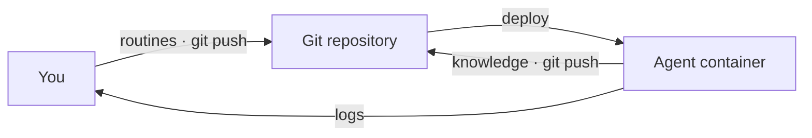

# Operating in production

An ORA deploys as a plain Docker container -- a VPS, Fly, Render, Kamal, your homelab -- with nothing else to provision: no database, no queue, no secrets platform. Every run is confined in a sandbox, and the supervisor builds the strongest one your host permits, working that out by probing at boot rather than making you configure it. A platform that only takes a Dockerfile needs nothing from you; a platform that lets you pass runtime flags can give runs a stronger boundary in exchange for weakening the container's own. See [run confinement](#run-confinement) below.

The deployment prerequisites are a `repo` value in `openroutines.yml` and a deploy key that can push to it, since that's where knowledge durably lives.
Local development needs neither; `openroutines check` reports a missing `repo` before you deploy.



## Deploying

First, set `repo` in `openroutines.yml` to the published repository, then give the agent its own identity for pushing knowledge -- a deploy key scoped to that repository.
Generate it *outside* the agent repo (a private key must never enter Git or the image):

```bash
ssh-keygen -t ed25519 -f ~/.keys/my-agent_deploy_key -N "" -C "my-agent deploy key"
gh repo deploy-key add ~/.keys/my-agent_deploy_key.pub --allow-write --title "my-agent"
```

The agent image is self-contained: the Dockerfile installs the pinned `openroutines` release, checksum-verified, from the public download site. No registry login or token is needed, so your platform's build-from-Dockerfile deploy (`fly deploy`, Render, Kamal) works unmodified. Build and run:

```bash
docker build -t my-agent .
OPENROUTINES_MASTER_KEY="$(cat master.key)" \
OPENROUTINES_DEPLOY_KEY="$(cat ~/.keys/my-agent_deploy_key)" \
docker run -d --name my-agent --restart unless-stopped --stop-timeout 30 \
  -e OPENROUTINES_MASTER_KEY \
  -e OPENROUTINES_DEPLOY_KEY \
  my-agent
```

### Run confinement

Each run executes inside its own sandbox, which is what keeps two concurrently running routines from reading each other's credentials -- and keeps both away from your master key and deploy key. Your routines are code you wrote and reviewed, so this is not about defending against them; it is about bounding what one costs you when it gets prompt-injected by something it fetched, or simply goes wrong.

There are two mechanisms, and the supervisor takes the strongest one your host permits rather than making you choose. There is nothing to configure and nothing to decide: it logs which one it took at boot and gets on with it. It **refuses to start** only if it can build no sandbox at all, rather than running your routines unconfined without telling you.

**What you get by default asks for nothing.** Before the supervisor execs a model process it puts that process in a [Landlock](https://docs.kernel.org/userspace-api/landlock.html) domain granting the read-only OS, the run's own writable disposable workspace, and nothing else -- no runtime flag, no capability, no privilege, so there is nothing to configure unless you want the stronger mechanism. That is what lets an agent deploy unmodified to a platform whose whole interface is a repository with a Dockerfile. Its one requirement is Landlock in the kernel: Linux 5.13 or newer, compiled in, which current distribution kernels have. What Landlock can deny has grown by kernel version -- the boot log names the ABI it negotiated, and [SECURITY.md](../SECURITY.md#the-confinement-rungs) records what older ABIs cannot restrict.

Bubblewrap is the stronger mechanism, and it does cost something: it needs unprivileged user namespaces, which three separate things can deny. All three are host or runtime configuration rather than anything about your agent.

| What denies it | How you grant it | Where it applies |
|---|---|---|
| The runtime's default **seccomp** profile refuses the namespace-creating syscalls | `--security-opt seccomp=unconfined` | always, on Docker and Podman |
| The runtime's default **AppArmor** profile contains a bare `deny mount,`, which stops the sandbox's first mount | `--security-opt apparmor=unconfined` | wherever AppArmor is loaded -- Ubuntu, and Debian since 10 |
| The **host** restricts unprivileged user namespaces through AppArmor, so creating one costs `CAP_SYS_ADMIN` | `sysctl -w kernel.apparmor_restrict_unprivileged_userns=0` **on the host**, or an AppArmor profile granting `userns` for `/usr/bin/bwrap` | Ubuntu 24.04 and later, where it is the default |

The third one surprises people, so state it plainly: **no `docker run` flag lifts it.** The restriction applies to the container's processes too, so both `unconfined` flags succeed and the sandbox still fails. On such a host that sysctl is the setting to change -- and if you would rather not, nothing above touches the Landlock rung, which creates no namespace to be restricted. A host that boots the image in a microVM has neither profile nor sysctl in the way, and reaches the strongest configuration with nothing passed at all.

The two are not equivalent. What Landlock gives up:

| | bubblewrap | Landlock |
|---|---|---|
| A run can read a peer run's or the supervisor's credentials, memory, or files | no | no |
| A run can signal or ptrace a peer or the supervisor | no | ptrace no; signals no from Linux 6.12, **yes** below it |
| An ungranted path is *absent* rather than permission-denied | yes | **no** |
| A run can see that a peer exists, and read its command line | no (unless `/proc` stays masked, below) | **yes** |
| `/tmp` and `/dev/shm` are the run's own | yes | **no** -- withheld rather than shared |
| Killing a run collapses its whole process tree | yes | **no** |
| Needs a permissive container runtime | yes | no |

The first line is the one that matters most, and it is the one that does not differ. [SECURITY.md](../SECURITY.md#the-confinement-rungs) has the rest of the detail, including what the lost process-tree collapse costs.

To take the stronger one, add what your platform allows:

```bash
docker run ... \
  --security-opt seccomp=unconfined \
  --security-opt apparmor=unconfined \
  --security-opt systempaths=unconfined \
  my-agent
```

Of those three, `systempaths=unconfined` is the only optional one: without it the kernel refuses the sandbox a `/proc` of its own, so a run can see that a peer exists and read its command line. That is a metadata leak between routines and not a credential leak -- reading another run's environment fails across a user-namespace boundary even at the same uid. The supervisor works this out by itself. Take the upgrade if your platform offers it; do not block a deployment on it.

If neither mechanism works on your host -- an old or unusual kernel with no Landlock, on a runtime that also denies user namespaces -- the supervisor will not start, and its boot log records what every mechanism reported. Fix the host if you can. If you cannot, and you would rather run your agent unconfined than not at all, that is your call to make:

```bash
docker run -e OPENROUTINES_DISABLE_SANDBOX=1 ... my-agent
```

What it costs: runs then share a user and a filesystem with each other and with the supervisor, so one routine can read another's credentials, your key files, and the agent repository. The supervisor notes the setting once at boot. Unsetting it puts the sandbox back.

The image contains the pinned `openroutines` binary, opencode, git, `gh` (can authenticate via `GH_TOKEN`/`GITHUB_TOKEN`; the typed `github_app` credential injects `GH_TOKEN`), `jq`, and your repo's `main` branch. The entrypoint is the supervisor: every minute it re-reads your routines' frontmatter -- from the copy of the repo baked into the image -- and runs whatever is due. Two secrets arrive at boot, and neither is ever in the image:

- **The master key** (a copy of `master.key`) decrypts the credentials file. Routines receive only the credentials their frontmatter declares.
- **The deploy key** lets the agent push its knowledge. On boot the supervisor fetches the `knowledge` branch -- creating it if it doesn't exist yet, so first boot self-heals -- and after each run it commits and pushes what the agent recorded.

For each secret, a direct `OPENROUTINES_MASTER_KEY` / `OPENROUTINES_DEPLOY_KEY` value wins; otherwise OpenRoutines reads the path in `OPENROUTINES_MASTER_KEY_FILE` / `OPENROUTINES_DEPLOY_KEY_FILE`, then falls back to `master.key` / `deploy.key` in the agent root.
The command above passes the values to Docker by variable name, so the secret text does not appear in its command arguments.
On a deployment platform, set those same two variables as secrets in the service environment.
The supervisor constructs every child environment from scratch, so neither value is passed to routines or Git subprocesses.
Platforms that mount secrets as files can instead mount them at the conventional `/agent/master.key` and `/agent/deploy.key` paths with no environment variables, or point the file environment variables at other paths.
All three delivery forms are supported production configurations.
The conventional `/agent` paths are outside the routine filesystem, and the run workspace is assembled from an allow-list that excludes both files.
If your platform mounts them elsewhere and you use the file environment variables, choose somewhere like `/run/secrets`, outside the OS paths every run's sandbox grants: a run holds the supervisor's own user, so a key file inside one of those is readable by your routines whatever its permissions are.
The sandbox grants `/usr`, `/bin`, `/sbin`, `/lib`, `/lib64`, `/opt`, and a named list of `/etc` entries -- not `/etc` as a whole, precisely because that is where several platforms mount secret files, so a platform default like `/etc/secrets` is fine.
You do not have to work this out: the supervisor resolves both selected paths at boot and refuses to start rather than run with a readable key, naming the file to move and the variable to set.

## Operational properties

A few properties fall out of the design (see [docs/design.md](design.md) for the reasoning):

- **Run exactly one instance.** One agent, one runtime -- the agent is the sole writer to its knowledge branch, so there is nothing to scale horizontally. If a platform asks how many replicas, the answer is 1, and the supervisor enforces it with a lease: an accidental second instance waits instead of corrupting knowledge. The lease is released on a clean shutdown, so an ordinary redeploy hands over immediately; an instance killed without SIGTERM leaves its lease to expire, and the replacement waits out the 30-minute TTL before it dispatches anything.
- **Redeploys are safe.** A routine killed mid-run fires again on the next boot, and a scheduled moment that passes while the container is down runs late instead of never. Missed is recoverable; silently skipped is not.
- **Changes arrive by redeploy.** The only branch a running agent exchanges with origin is `knowledge`. Everything else -- routines, skills, credentials, config -- is read from the copy of the repo baked into the image, so a push to `main` changes nothing in production until the image is rebuilt and redeployed. (Locally the boundary doesn't exist: the supervisor reads your working tree, and an edit lands on the next tick.)
- **One broken routine is one broken routine.** A frontmatter typo takes out the routine whose file it is in, not the agent: the others keep their schedules. The supervisor records an event naming the file, so the gap is visible in knowledge and not only in the log.
- **Knowledge survives.** Code rolls back with the image; knowledge lives on its own branch and persists, like a database, but versioned.
- **No application ingress.** The shipped container listens on no ports. The supervisor's log goes to stderr -- read it with `docker logs` or your platform's log tooling -- and session history persists as files when `OPENROUTINES_SESSION_DIR` designates storage (see below). This does not replace normal host and deployment access controls.

## Logs

The log carries the supervisor's records plus opencode's own diagnostics, passed through into the same stream. Lines are [logfmt](https://brandur.org/logfmt) -- every part of the record is a `key=value` pair, so a line can be filtered by field instead of matched by shape:

```
time=2026-07-31T14:52:07.450-04:00 level=INFO msg="attempt starting" routine=check-in run_id=run_abc attempt=attempt_01
timestamp=2026-07-31T18:52:08.104Z level=INFO run=c613738c message="creating instance" directory=/work routine=check-in run_id=run_abc
time=2026-07-31T14:52:31.902-04:00 level=ERROR msg="attempt failed -- will retry" routine=check-in run_id=run_abc detail="exit status 1"
```

Filter by `level=`, by `routine=`, or by `run_id=` to follow one logical run across its retries -- opencode's lines land with the same identity fields appended, so a run's diagnostics travel with the supervisor's records about it, and each run is asked for the process's own level. opencode's lines otherwise keep their own shape (`message=` rather than `msg=`, UTC timestamps): they are opencode's records, decorated rather than rewritten. The supervisor's timestamps are RFC3339 in the agent's timezone, so a log line and a cron expression can be compared without arithmetic. Your platform will usually add its own ingest timestamp alongside; the one in the line is when the event actually happened.

Run output never flows through the log; `openroutines routines run` streams it directly to your terminal.
A failed attempt still emits opencode's diagnostics under the run's identity, plus a classified reason (`hint`) when one was recognized.

Set `OPENROUTINES_LOG_LEVEL` to change how much of the log survives -- unset means `info` in the deployed container and `warn` for local commands, where the run output streaming to your terminal is the point. The log lands on stderr, so a manual run's output on stdout pipes and redirects clean of diagnostics (`2>run.log` splits them):

- `info` -- the container default: lifecycle records (attempt starting, run completed, registered) and everything below.
- `warn` -- the local default: degraded-but-running conditions (unreachable origin, a routine that stopped loading, a disabled sandbox) and everything `error` shows.
- `error` -- failed and abandoned runs, held dispatch, and nothing else.

`debug` adds the supervisor's working-out -- tick planning, skipped routines, and trigger and knowledge details too noisy for normal operation. Sandbox probe results stay at `info` because they describe the boundary actually in force. The environment variable is the only level knob -- there is no configuration-file setting -- so quieting or opening up a live container is an environment change, never a redeploy.

## Session history

Set `OPENROUTINES_SESSION_DIR` to persist each attempt's sessions, whatever its outcome, as owner-only `<UTC timestamp>_<routine>_<run_id>_<session_id>.json` files.
Leave it unset and nothing is written.

Exports are verbatim and may contain credentials; retention is the operator's responsibility.
Export failures warn without failing the run.

## Continuous deployment

For continuous deployment, wire the usual hooks: run `openroutines check` on every push, rebuild and redeploy on merge to `main`. The redeploy is not just delivery hygiene -- it is the only way routine changes reach a running agent. Pushes to the `knowledge` branch never trigger a deploy; that separation is by design.

## Updating the framework

Your agent pins the OpenRoutines version it runs against in `.openroutines/version`. The deployed container installs exactly that release, so laptop, CI, and production always agree.

To update the framework:

```bash
openroutines update
```

This brings the agent up to the version of the `openroutines` binary you're running (install the newer binary first). It bumps the pin, rewrites the Dockerfile's base-image tag, and offers any other framework-owned file changes interactively with a diff. Review, commit, push -- your next deploy runs the new version. Rolling back an update is `git revert`.

Updates never touch what's yours: routines, skills, knowledge, and credentials belong to the agent, not the framework.
