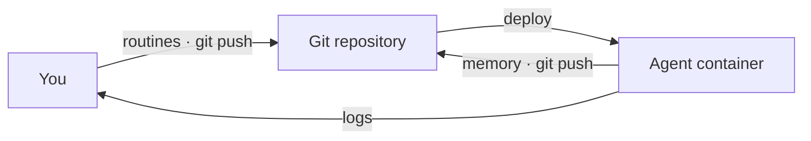

# Operating in production

An ORA deploys as a plain Docker container. There is nothing else to provision: no database, no queue, no secrets platform. Most container hosts use the default per-attempt UID isolation profile; capability-restricted hosts such as Render require the explicit Landlock profile described below.

The one prerequisite is a git origin the agent can push to -- GitHub, GitLab, Gitea, even a bare repo on a VPS -- since that's where memory durably lives. (Local development needs no origin, and `openroutines check` verifies one before you deploy.)



## Deploying

First, give the agent its own identity for pushing memory -- a deploy key scoped to this one repository. Generate it *outside* the agent repo (a private key must never sit in the repo or its image):

```bash
ssh-keygen -t ed25519 -f ~/.keys/my-agent_deploy_key -N "" -C "my-agent deploy key"
gh repo deploy-key add ~/.keys/my-agent_deploy_key.pub --allow-write --title "my-agent"
```

The agent image is self-contained: the Dockerfile installs the pinned `openroutines` release, checksum-verified, from the public download site. No registry login or token is needed, so your platform can build it directly from its Dockerfile. Build and run:

```bash
docker build -t my-agent .
docker run -d --name my-agent --restart unless-stopped --stop-timeout 30 \
  -v ~/.keys/my-agent-master.key:/run/secrets/master.key:ro \
  -v ~/.keys/my-agent_deploy_key:/run/secrets/deploy_key:ro \
  -e OPENROUTINES_MASTER_KEY_FILE=/run/secrets/master.key \
  -e OPENROUTINES_DEPLOY_KEY_FILE=/run/secrets/deploy_key \
  my-agent
```

The image contains the pinned `openroutines` binary, opencode, git, `gh` (can authenticate via `GH_TOKEN`/`GITHUB_TOKEN`; the typed `github_app` credential injects `GH_TOKEN`), `jq`, and your repo's `main` branch. The entrypoint is the supervisor: every minute it re-reads your routines' frontmatter -- from the copy of the repo baked into the image -- and runs whatever is due. Two secrets arrive at boot, and neither is ever in the image:

- **The master key** (a copy of `master.key`) decrypts the credentials file. Routines receive only the credentials their frontmatter declares.
- **The deploy key** lets the agent push its memory. On boot the supervisor fetches the `memory` branch -- creating it if it doesn't exist yet, so first boot self-heals -- and after each run it commits and pushes what the agent recorded.

Mount them as files and point `OPENROUTINES_MASTER_KEY_FILE` / `OPENROUTINES_DEPLOY_KEY_FILE` at the paths, as above -- file delivery keeps key material out of the process environment. On platforms where mounting a file is awkward, the values can arrive directly in `OPENROUTINES_MASTER_KEY` / `OPENROUTINES_DEPLOY_KEY` instead, but environment delivery has a weaker process-exposure posture and is not the recommended production configuration. When the master key value is in its environment the supervisor logs a warning once at boot, so a deployment that chose env delivery years ago is told rather than left to remember -- if you see it after moving to file delivery, the old `OPENROUTINES_MASTER_KEY` is still set and should be unset.

## Isolation profiles

Production has two explicit isolation profiles:

| `isolation_profile` | Required boundary | Concurrency | Use when |
| --- | --- | --- | --- |
| `uid` (default when omitted) | A separate Unix identity per attempt; Landlock when available | Up to 32 | The container host permits the generated binary's `CAP_SETUID`, `CAP_SETGID`, and `CAP_KILL` file capabilities |
| `landlock` | Mandatory Landlock filesystem confinement; attempts share the non-root `agent` identity | Exactly 1 | A capability-restricted host such as Render rejects the default image |

The `landlock` profile retains the filesystem boundary around the repository, canonical memory, master key, and deploy key. A small inherited seccomp rule prevents attempts from leaving their process group, allowing the ordinary group reap to end every descendant. Process isolation is still weaker because same-UID model code may be able to disrupt supervisor-owned processes. The profile is never selected automatically.

To deploy on Render, commit this configuration before Render builds the Dockerfile:

```yaml
isolation_profile: landlock
concurrency: 1
```

The Dockerfile reads that committed setting and leaves the supervisor binary capless. At boot, the supervisor requires working Landlock and process-group confinement probes, then logs the reduced profile. `openroutines check` rejects any concurrency other than 1 and warns about the tradeoff. The unsafe Landlock override does not apply to this profile.

## Operational properties

A few properties fall out of the design (see [docs/design.md](design.md) for the reasoning):

- **Run exactly one instance.** One agent, one runtime -- the agent is the sole writer to its memory branch, so there is nothing to scale horizontally. If a platform asks how many replicas, the answer is 1, and the supervisor enforces it with a lease: an accidental second instance waits instead of corrupting memory. The lease is released on a clean shutdown, so an ordinary redeploy hands over immediately; an instance killed without SIGTERM leaves its lease to expire, and the replacement waits out the 30-minute TTL before it dispatches anything.
- **Redeploys are safe.** A routine killed mid-run fires again on the next boot, and a scheduled moment that passes while the container is down runs late instead of never. Missed is recoverable; silently skipped is not.
- **Changes arrive by redeploy.** The only branch a running agent exchanges with origin is `memory`. Everything else -- routines, skills, credentials, config -- is read from the copy of the repo baked into the image, so a push to `main` changes nothing in production until the image is rebuilt and redeployed. (Locally the boundary doesn't exist: the supervisor reads your working tree, and an edit lands on the next tick.)
- **One broken routine is one broken routine.** A frontmatter typo takes out the routine whose file it is in, not the agent: the others keep their schedules. The supervisor records an event naming the file, so the gap is visible in memory and not only in the log.
- **Memory survives.** Code rolls back with the image; memory lives on its own branch and persists, like a database, but versioned.
- **No application ingress.** The shipped container listens on no ports. The supervisor's log goes to stdout -- read it with `docker logs` or your platform's log tooling -- and session history persists as files when `OPENROUTINES_SESSION_DIR` designates storage (see below). This does not replace normal host and deployment access controls.

## Logs and session history

The log carries the supervisor's records plus opencode's own diagnostics, passed through into the same stream. Lines are [logfmt](https://brandur.org/logfmt) -- every part of the record is a `key=value` pair, so a line can be filtered by field instead of matched by shape:

```
time=2026-07-31T14:52:07.450-04:00 level=INFO msg="attempt starting" routine=check-in run_id=run_abc attempt=attempt_01
timestamp=2026-07-31T18:52:08.104Z level=INFO run=c613738c message="creating instance" directory=/work routine=check-in run_id=run_abc
time=2026-07-31T14:52:31.902-04:00 level=ERROR msg="attempt failed -- will retry" routine=check-in run_id=run_abc detail="exit status 1" sessions=/data/run_abc.attempt_01
```

Filter by `level=`, by `routine=`, or by `run_id=` to follow one logical run across its retries -- opencode's lines land with the same identity fields appended, so a run's diagnostics travel with the supervisor's records about it, and each run is asked for the process's own `log_level`. opencode's lines otherwise keep their own shape (`message=` rather than `msg=`, UTC timestamps): they are opencode's records, decorated rather than rewritten. The supervisor's timestamps are RFC3339 in the agent's timezone, so a log line and a cron expression can be compared without arithmetic. Your platform will usually add its own ingest timestamp alongside; the one in the line is when the event actually happened.

Run output never flows through the log. Storing session history is an opt-in: point `OPENROUTINES_SESSION_DIR` at a directory and each of the attempt's sessions is exported (`opencode export`, the session's replayable form) to `<dir>/<run_id>.<attempt_id>/<session_id>.json` when the attempt ends, whatever the outcome. The `run completed` and `attempt failed` records name the directory (`sessions=...`). Leave the variable unset and nothing is written.

The exports are verbatim -- exactly what opencode renders, not passed through the secret scrubber, because rewriting stored history would falsify the record (the log and the manual echo are scrubbed). Retention is yours too: nothing is pruned. Treat the directory as sensitively as the credentials your routines can see -- what lands there is written owner-only.

A failed attempt never fails invisibly, session dir or not: opencode's own diagnostics are already in the log under the run's identity, and the failure record carries the classified reason (`hint`) when one was recognized. An export that fails partway -- a full volume, say -- still names the directory holding whatever landed, with a warning in the log; an export that lands nothing names no directory at all. A retry reuses the failed attempt's directory name and replaces it, so what you read there is always one attempt. Run output reaches you in exactly one place: `openroutines routines run` streams it to your terminal as it runs.

Set `log_level` in `openroutines.yml` to change how much of the supervisor's log survives -- omitted means `info`:

- `info` -- the default: lifecycle records (attempt starting, run completed, registered) and everything below.
- `warn` -- degraded-but-running conditions (unreachable origin, a routine that stopped loading, sandbox warnings) and everything `error` shows.
- `error` -- failed and abandoned runs, held dispatch, and nothing else.

`debug` is accepted for the standard ladder's sake and currently adds nothing beyond `info`. `OPENROUTINES_LOG_LEVEL` overrides the configured value for one process, which is how you quiet or open up a live container without a redeploy (config changes only reach production on redeploy).

## Continuous deployment

For continuous deployment, wire the usual hooks: run `openroutines check` on every push, rebuild and redeploy on merge to `main`. The redeploy is not just delivery hygiene -- it is the only way routine changes reach a running agent. Pushes to the `memory` branch never trigger a deploy; that separation is by design.

## Updating the framework

Your agent pins the OpenRoutines version it runs against in `.openroutines-version`. The deployed container installs exactly that release, so laptop, CI, and production always agree.

To update the framework:

```bash
openroutines update
```

This brings the agent up to the version of the `openroutines` binary you're running (install the newer binary first). It bumps the pin, rewrites the Dockerfile's base-image tag, and offers any other framework-owned file changes interactively with a diff. Review, commit, push -- your next deploy runs the new version. Rolling back an update is `git revert`.

Updates never touch what's yours: routines, skills, memory, and credentials belong to the agent, not the framework.
