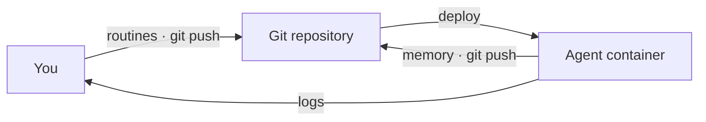

# Operating in production

An ORA deploys as a plain Docker container. Anything that runs a container runs your agent -- a VPS, Fly, Render, Kamal, your homelab. There is nothing else to provision: no database, no queue, no secrets platform.

The one prerequisite is a git origin the agent can push to -- GitHub, GitLab, Gitea, even a bare repo on a VPS -- since that's where memory durably lives. (Local development needs no origin, and `openroutines check` verifies one before you deploy.)



## Deploying

First, give the agent its own identity for pushing memory -- a deploy key scoped to this one repository. Generate it *outside* the agent repo (a private key must never sit in the repo or its image):

```bash
ssh-keygen -t ed25519 -f ~/.keys/my-agent_deploy_key -N "" -C "my-agent deploy key"
gh repo deploy-key add ~/.keys/my-agent_deploy_key.pub --allow-write --title "my-agent"
```

The agent image builds `FROM` the OpenRoutines base image on GHCR, which carries the supervisor and opencode. While that registry is private, you need a GitHub token carrying the `read:packages` scope -- `docker login` succeeds with any valid token, so a missing scope doesn't surface until the pull, as a bare `denied`:

```bash
gh auth refresh -h github.com -s read:packages
gh auth token | docker login ghcr.io -u <your-github-username> --password-stdin
```

Then build and run:

```bash
docker build -t my-agent .
docker run -d --name my-agent --restart unless-stopped --stop-timeout 30 \
  -v ~/.keys/my-agent-master.key:/run/secrets/master.key:ro \
  -v ~/.keys/my-agent_deploy_key:/run/secrets/deploy_key:ro \
  -e OPENROUTINES_MASTER_KEY_FILE=/run/secrets/master.key \
  -e OPENROUTINES_DEPLOY_KEY_FILE=/run/secrets/deploy_key \
  my-agent
```

The image contains the pinned `openroutines` binary, opencode, git, `gh` (can authenticate via `GH_TOKEN`/`GITHUB_TOKEN`; the typed `github_app` credential injects `GH_TOKEN`), `jq`, and your repo's `main` branch. The entrypoint is the supervisor: every minute it re-reads your routines' frontmatter and runs whatever is due. Two secrets arrive at boot, and neither is ever in the image:

- **The master key** (a copy of `master.key`) decrypts the credentials file. Routines receive only the credentials their frontmatter declares.
- **The deploy key** lets the agent push its memory. On boot the supervisor fetches the `memory` branch -- creating it if it doesn't exist yet, so first boot self-heals -- and after each run it commits and pushes what the agent recorded.

Mount them as files and point `OPENROUTINES_MASTER_KEY_FILE` / `OPENROUTINES_DEPLOY_KEY_FILE` at the paths, as above -- file delivery keeps key material out of the process environment. On platforms where mounting a file is awkward, the values can arrive directly in `OPENROUTINES_MASTER_KEY` / `OPENROUTINES_DEPLOY_KEY` instead, but environment delivery has a weaker process-exposure posture and is not the recommended production configuration.

## Operational properties

A few properties fall out of the design (see [docs/design.md](design.md) for the reasoning):

- **Run exactly one instance.** One agent, one runtime -- the agent is the sole writer to its memory branch, so there is nothing to scale horizontally. If a platform asks how many replicas, the answer is 1, and the supervisor enforces it with a lease: an accidental second instance waits instead of corrupting memory. The lease is released on a clean shutdown, so an ordinary redeploy hands over immediately; an instance killed without SIGTERM leaves its lease to expire, and the replacement waits out the 30-minute TTL before it dispatches anything.
- **Redeploys are safe.** A routine killed mid-run fires again on the next boot, and a scheduled moment that passes while the container is down runs late instead of never. Missed is recoverable; silently skipped is not.
- **One broken routine is one broken routine.** A frontmatter typo takes out the routine whose file it is in, not the agent: the others keep their schedules. The supervisor records an event naming the file, so the gap is visible in memory and not only in the log.
- **Memory survives.** Code rolls back with the image; memory lives on its own branch and persists, like a database, but versioned.
- **No application ingress.** The shipped container listens on no ports. Routine output and run records go to stdout -- read them with `docker logs` or your platform's log tooling. This does not replace normal host and deployment access controls.

## Continuous deployment

For continuous deployment, wire the usual hooks: run `openroutines check` on every push, rebuild and redeploy on merge to `main`. Pushes to the `memory` branch never trigger a deploy -- that separation is by design.

## Updating the framework

Your agent pins the OpenRoutines version it runs against in `.openroutines-version`. The deployed container installs exactly that release, so laptop, CI, and production always agree.

To update the framework:

```bash
openroutines update
```

This brings the agent up to the version of the `openroutines` binary you're running (install the newer binary first). It bumps the pin, rewrites the Dockerfile's base-image tag, and offers any other framework-owned file changes interactively with a diff. Review, commit, push -- your next deploy runs the new version. Rolling back an update is `git revert`.

Updates never touch what's yours: routines, skills, memory, and credentials belong to the agent, not the framework.
